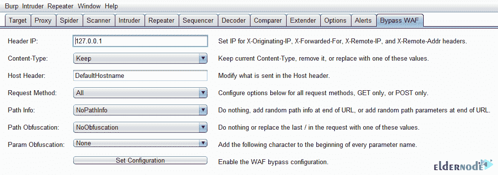

# 在 Burp Suite - Eldernode 博客上介绍和安装 Bypass WAF

> 原文：<https://blog.eldernode.com/install-bypass-waf-on-burp-suite/>


WAF 代表 Web 应用防火墙。它是对抗 web 应用程序攻击的流行工具。WAF 保护 web 应用程序免受各种应用层攻击，如跨站点脚本(XSS)、SQL 注入和 cookie 中毒。因此，使用 WAF 可以通过检查和过滤每个 web 应用程序和互联网之间的流量来帮助您保护公司的 web 应用程序。本文介绍了**在 Burp 套件**上的介绍和安装 Bypass WAF。要购买完全托管的 [VPS](https://eldernode.com/vps/) ，您可以依靠我们的技术团队，并在 [Eldernode](https://eldernode.com/) 主机上订购您认为合适的套餐。

## **旁路晶片介绍**

WAF 保护您的在线业务，因为它能够安全地处理私人客户数据。如果你准备开一家公司来提供商务网站、在线金融服务或任何其他类型的基于网络的产品，了解你可能面临的威胁是至关重要的。由于 WAFs 可以抵御不同类型的威胁，因此选择正确的威胁非常重要。

WAF 对于涉及与客户或商业伙伴交互的服务尤其有益。因为它增加了一些保护措施，帮助您维护公司的声誉和市场地位。作为管理员，您需要 WAf 提供必要的应用可见性，以证明符合 PCI、HIPAA 和 GDPR 等监管标准。WAF 为已经很强大的应用程序安全程序增加了一层重要的额外防御。此外，作为一名[安全](https://blog.eldernode.com/tag/security/)专业人员，您可以利用 web 应用程序防火墙，通过接收违反预先确定的准则和规则的活动警报来监控可能正在进行的攻击。您可以使用 WAF 作为应用程序的可信防线。以下是最常见的应用程序漏洞列表:

1-注入攻击

2-身份验证失败

3-敏感数据暴露

4- XML 外部实体(XXE)

5-破坏访问控制

6-安全错误配置

7-跨站点脚本(XSS)

8-不安全的反序列化

此外，您可以**向所有 Burp 请求添加标题**以绕过一些 WAF 产品。该扩展自动将下列标题添加到所有请求中。让我们看看下面的列表:

```
X-Originating-IP: 127.0.0.1
```

```
X-Forwarded-For: 127.0.0.1
```

```
X-Remote-IP: 127.0.0.1
```

```
X-Remote-Addr: 127.0.0.1
```

```
X-Client-IP: 127.0.0.1
```

### **晶圆部署**

根据您的应用程序的部署位置、所需的服务、您希望如何管理它们，以及您需要的架构灵活性和性能水平，WAF 可以通过多种方式进行部署。晶圆部署有四种模式:

1-基于云+完全作为服务进行管理

2-基于云+自我管理

3-基于云+自动调配

4-内部高级 WAF(虚拟或硬件设备)

## **如何在打嗝套件上安装旁路晶片**

之前，你已经了解了[打嗝组曲](https://blog.eldernode.com/tag/burp-suite/)。在本文中，您将回顾 Bypass WAF 在其上的安装。一个开源的 Burp Suite 扩展可以用来评估或绕过 WAF 解决方案，它使用了本次演讲中讨论的一些技术。Web 应用程序防火墙解决方案对于防止常见或自动攻击非常有用。WAF 是可信，因为如果存在特定的报头，许多 WAF 设备会被欺骗而相信请求来自其自身。

### **晶圆旁路技术**

让我们看看什么是使用 HTTP 标准和 Web 服务器行为的 WAF 旁路技术。在这一节中，您将了解许多创造性的技术，这些技术使用 web 服务器的奇怪行为和特性(如请求编码或 HTTP 管道)来走私和改造 HTTP 请求。这些方法说明了为什么开发人员不应该仅仅依赖 WAFs 作为防御机制，但是什么时候可以使用这些方法呢？

1-作为一个渗透测试者，你可以用它来测试一个 WAF 背后的网站，以避免戏剧和痛苦。

2-辩护团队可以使用这种方法来设计适当的缓解技术。

### **如何使用打嗝插件绕过一些 WAF 设备**

下载 **Python 版本**的插件，Java 版本的插件，或者 Java 源码并编译。然后，你可以使用这个插件添加必要的标题。安装插件后，请遵循以下路径:

1-启动打嗝。

2-导航至“**扩展器** > > **扩展**”。

3-点击**添加**按钮。

4-选择扩展类型“ **Java** ”。

***注意* :** 选择一个扩展类型“Java”，如果使用 Java 插件，或者“Python”，如果使用 Python 版本，然后导航到扩展路径。


如下所示，插件将被添加:


要继续，请再次遵循以下路径:

1-导航至“**选项** > > **会话**”。

2-点击“**会话处理规则**”的**添加**按钮。


接下来，您需要为规则命名。在“**规则动作**部分，点击**添加**按钮。最后，选择**调用一个打嗝分机**。


如下图所示，您应该能够在下拉框中选择“ **Bypass WAF** ”:


在此步骤中，您必须点击**确定**并选择**范围**选项卡。现在，您可以启用扩展范围内的所有工具，然后设置范围。要启用**所有工具**并将请求的范围限制为那些已经添加到套件范围的请求，请执行如下所示的操作:


Bypass WAF 包含以下功能:



## 结论

在本文中，向您介绍了 Bypass WAF，您了解了如何在 Burp Suite 上安装 Bypass WAF。