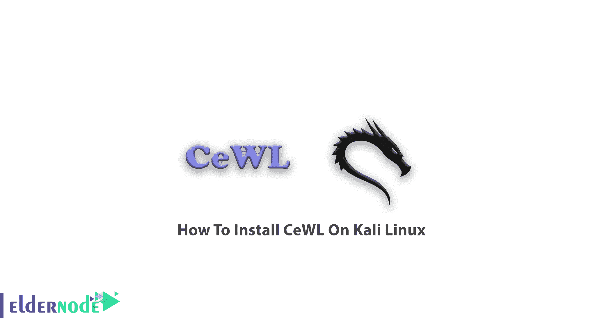
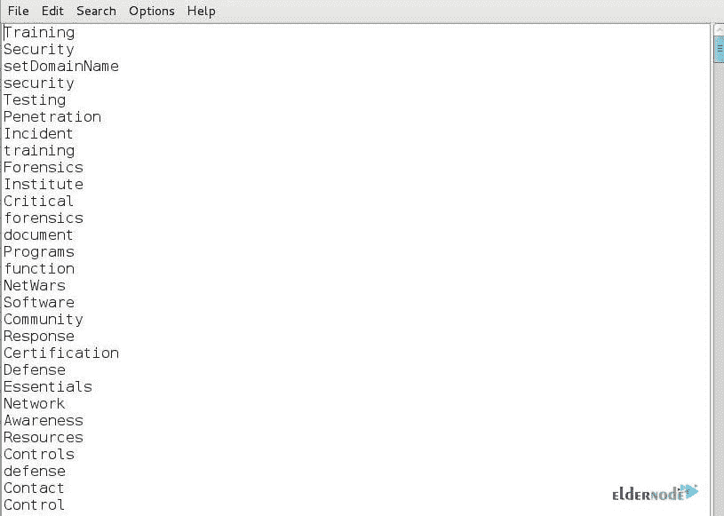

# 如何在 Kali Linux[安全] - Eldernode 博客上安装 CeWL

> 原文：<https://blog.eldernode.com/install-cewl-on-kali-linux/>



一步步学习如何在 Kali Linux 上安装 C **eWL。CeWL 是 kali 中预装的工具，在本指南中，您将熟悉 CeWL 并学习如何在 Kali Linux 上安装它。首先，选择并购买您自己的 [Linux VPS](https://eldernode.com/linux-vps/) 包，以便更好地使用本指南。**

### 什么是 CeWL？

一个 Kali 工具，有了这个 [ruby](https://blog.eldernode.com/install-ruby-centos8/) 应用程序，你可以在网页上抓取单词，并建立一个单词字典。CeWL 可以将一个给定的 URL(学校、学院、企业)爬行到指定的深度，可选地跟随外部链接，并返回一个单词列表，该列表可用于密码破解程序，如 John the Ripper(一个可用于许多操作系统的开源密码安全审计和密码恢复工具)。**F**files**A**l ready**B**agged(FAB)是 CeWL 的相关命令行，它使用相同的元数据提取技术从已经下载的内容中创建作者/创建者列表。CeWL 在安全测试和取证调查中很有用，发音很“酷”。

Recommended Article: [Russia VPS Server](https://blog.eldernode.com/russia-vps-server/)

## 如何在 Kali Linux 上配置 CeWL

对于检测阶段的每个渗透阶段，必须创建一个密码配置文件。使用 **Cewl 工具**创建密码配置文件有助于我们组合组织人员的用户名和密码中可能使用的单词。您将学习如何使用 CeWL 工具生成应用程序使用的单词列表，以及如何创建密码配置文件，并保存这些单词，以便我们以后在必要时可以使用它们来强行登录应用程序。当您**生成一个列表**时，这意味着您已经根据参数中提供的网站上找到的表达式创建了字典。它还允许用户定义网站搜索的深度，即组成密码的最少字符数。此外，该应用程序可以收集在网站上找到的电子邮件地址，因为它是一个爬虫/蜘蛛工具。

## 教程在 Kali Linux 上安装 CeWL

它将通过运行以下命令来安装:

```
apt-get install cewl
```

要查看 cewl 的选项和几个参数，请打开终端窗口，并键入以下命令:

```
cewl -h
```

此外，您可以使用下面的命令对网站进行爬网:

```
cewl -d 2 http://192.168.35.15/forums/
```

*注*:然后，你可以看到单词表正在生成，你可以用它来攻击。

## 如何用 CeWL 创建自定义单词表

CeWL 的主要工作是为特定的公司或行业开发特定的单词表。该工具旨在从该公司的网站上抓取单词，以创建特定于该公司的单词列表，从而破解该公司用户的密码。

**第一步:**

启动 Kali，打开终端，输入“cewl”命令

```
kali > cewl --help
```

**第二步:**

要构建客户单词列表，您需要将 CeWL 设置为抓取单词。您可以使用[Sans.org](https://www.sans.org/)(我们正在抓取的网站)并运行以下命令:

```
kali > cewl -w customwordlist.txt -d 5 -m 7
```

*注 1* :由于公司密码的最小长度，没有必要抓取短词，您可以将最小长度设置为 7 个字母。

**-d** :深度

**-m** :最小字长

**-w customwordlist.ext** :写入后面的文件名

*注 2* :这些话是 SANS 研究所所在行业的反映；信息安全。

然后，您将看到如下文件:



## 学习在 Kali Linux 上安装 CeWL

### **CeWL** **例子**

下面是一个将这个工具用作黑客程序的例子。

```
cewl -w log -m 3 -d 1 http://ADDRESS/
```

*注*:

**-m 3** :要加入字典的单词的最小长度。

**-d 1** :搜索穿透深度。

### 如何清理单词表

很明显，CeWL 是生成单词表的强大工具。但是当你对每个目标都有多个单词表(最喜欢的乐队、电影、节目等)时，应该怎么做呢？您可以轻松地将几个文本文件连接成一个文本文件，只需一个命令:

```
cat file1.txt file2.txt file3.txt file4.txt > merged.txt
```

当你成功地将所有的单词列表合并在一起，并从列表中删除所有重复的单词时，开始清理合并的列表(建议按字母顺序排列)。

```
sort wordlist.txt | uniq -u > cleaned_wordlist.txt
```

## 结论

在本文中，您了解了如何在 [Kali Linux](https://blog.eldernode.com/introduction-kali-linux-server-and-its-applications/) 上安装 CeWL。尝试使用这个强大的工具来生成一个自定义的单词表，享受强大的针对性攻击。Combinator 和 Crunch 是可以用于同一目标的两个工具。如果你有兴趣了解更多，可以找到我们关于[如何在 Kali Linux](https://blog.eldernode.com/install-wpscan-on-kali-linux/) 上安装 wpscan 的文章。