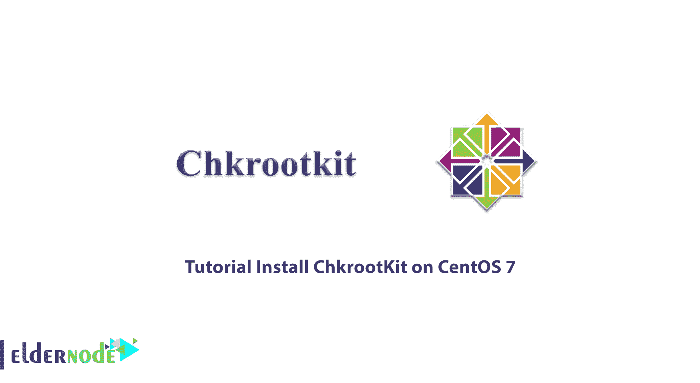

# 教程在 Centos 7 - Eldernode 博客上安装 ChkrootKit

> 原文：<https://blog.eldernode.com/install-chkrootkit-on-centos-7/>



ChkrootKit 是一个工具，帮助管理员检查他们的系统，并找出系统是否感染了 rootKit 恶意软件。您可以使用 chkrootkit 来检测 rootkit。在本文中，我们将教你如何在 Centos 7 上安装 ChkrootKit。此外，如果你想购买一个 [**Centos VPS**](https://eldernode.com/centos-vps/) 主机，你可以访问 [Eldernode](https://eldernode.com/) 中的软件包。

## **如何在 CentOS 7 | CentOS 8** 上安装 ChkrootKit

### **rootKit 简介**

rootKit 是最危险的恶意软件和特洛伊木马之一，是 Linux 操作系统上的一种恶意程序，很难被发现和删除。rootKit 具有很强的隐蔽性，可以隐藏在文件、注册表设置或进程中，窃取用户的信息。rootKits 让攻击者远程控制，并保持隐藏很长一段时间。rootKit 最明显的迹象是系统变慢，这表明有恶意代理在后台运行。

### **什么是 chkrootKit？**

chkrootkit 是一个常见和流行的基于 Unix 的程序和安全扫描程序，用于检测 rootkit 和恶意软件。chkrootkit 帮助服务器管理员检查他们的系统是否有已知的 rootkit，并保护服务器。chkrootkit 可用于查找与 rootkit 相关的文件和进程。您可以保护您的系统免受已知 rootkits 的攻击，并确保所有程序和软件都已更新，并且系统免受所有已知漏洞的攻击。

## **在 CentOS 7** 上安装 CkrootKit

CentOS 7 存储库包中没有 chkrootKit。在做任何事情之前，您应该通过输入以下命令来更新软件包:

```
yum update -y
```

chkrootkit 有 C 程序。你可以通过**安装 C/C++编译器**和 **glibc-static** 包来避免这个过程中的任何错误。为此，请运行以下命令:

```
yum install wget gcc-c++ glibc-static
```

现在，您应该访问 chkrootkit 官方网站并**下载最新的 chkrootkit** :

```
wget -c ftp://ftp.pangeia.com.br/pub/seg/pac/chkrootkit.tar.gz
```

那么您应该检查 chkrootkit 下载没有被篡改或损坏。为此，您可以使用以下命令**下载与 chkrootkit 下载相关的 md5 散列文件**:

```
wget ftp://ftp.pangeia.com.br/pub/seg/pac/chkrootkit.md5  md5sum -c chkrootkit.md5  chkrootkit.tar.gz: OK
```

下载完成后，您应该转到下载文件夹并提取下载的文件。然后将提取的内容移动到一个单独的文件夹，如下所示，并安装它。您也可以在相同的路径中提取它，并将 chkrootkit 二进制文件移动到 **/usr/bin** 文件夹中。

```
tar –xzf chkrootkit.tar.gz
```

```
mkdir /usr/local/chkrootkit
```

```
mv chkrootkit-0.52/* /usr/local/chkrootkit
```

```
cd /usr/local/chkrootkit
```

```
make sense
```

接下来，您应该通过运行 chkrootkit 来扫描服务器:

```
/usr/local/chkrootkit/chkrootkit
```

现在，您可以通过添加 cron 条目来启用自动服务器扫描。扫描报告将发送到您的电子邮件地址。您应该创建以下条目并将其添加到**/etc/cron . daily/chkrootkit . sh**:

```
#!/bin/sh  (  /usr/local/chkrootkit/chkrootkit  ) | /bin/mail -s 'CHROOTKIT Daily Run (ServerName)' [[email protected]](/cdn-cgi/l/email-protection)
```

Chkrootkit 有一个名为 chkrootkit 的 shell 脚本和几个 C 程序。chkrootkit shell 脚本扫描所有系统二进制文件以查找任何 rootkit 更改，C 程序执行各种安全检查，包括:

*   **ifpromisc.c:** 检查网络接口是否处于混杂模式。
*   检查最后日志删除。
*   chkwtmp.c: 检查 wtmp 删除。
*   检查 LKM 木马的迹象。
*   检查 LKM 木马的迹象。
*   **strings.c:** 执行快速的脏字符串替换。
*   **chkutmp.c:** 检查 utmp 删除。

### **使用 chkrootkit 的目的是什么？**

您可以简单地使用 chkrootkit 命令作为 root 运行这个工具，它将完成所有任务。执行此命令时，您可以使用下面列出的选项来选择特定选项:

*   **-h:显示简短的帮助信息并退出。**

```
# chkrootkit -h  Usage: /usr/sbin/chkrootkit [options] [test ...]  Options:  -h show this help and exit  -V show version information and exit  -l show available tests and exit  -d debug  -q quiet mode  -x expert mode  -e exclude known false positive files/dirs, quoted,  space separated, READ WARNING IN README  -r dir use dir as the root directory  -p dir1:dir2:dirN path for the external commands used by chkrootkit  -n skip NFS mounted dirs
```

**-V:显示版本信息并退出。**

```
# chkrootkit -V  chkrootkit version 0.52
```

I:显示可用的测试并退出。

```
# chkrootkit -l  /usr/sbin/chkrootkit: tests: aliens asp bindshell lkm rexedcs sniffer w55808 wted scalper slapper z2 chkutmp OSX_RSPLUG amd basename biff chfn chsh cron crontab date du dirname echo egrep env find fingerd gpm grep hdparm su ifconfig inetd inetdconf identd init killall ldsopreload login ls lsof mail mingetty netstat named passwd pidof pop2 pop3 ps pstree rpcinfo rlogind rshd slogin sendmail sshd syslogd tar tcpd tcpdump top telnetd timed traceroute vdir w write
```

**-d:进入调试模式。**

**-x:进入专家模式。**

**-e:排除已知的误报文件/目录，加引号，空格分隔。**

**-q:进入静音模式。在安静模式下，仅显示带有受感染状态的输出消息。**

```
# chkrootkit -q  Checking `tcpd'... INFECTED    /lib/modules/4.15.0-20-generic/vdso/.build-id /lib/modules/4.15.0-23-generic/vdso/.build-id  /lib/modules/4.15.0-20-generic/vdso/.build-id /lib/modules/4.15.0-23-generic/vdso/.build-id  not tested  INFECTED PORTS: ( 465)  eth0: PACKET SNIFFER(/lib/systemd/systemd-networkd[536])  not tested
```

**-r dir:使用 dir 作为根目录。**

```
# chkrootkit -r /mnt/ ; This will check all files under this specified directory.
```

**-p dir1:使用此选项添加更多二进制路径的能力。**

```
# ./chkrootkit -p /cdrom/bin:/floppy/mybin
```

**-n:跳过 NFS 挂载的目录。**

## 结论

在本文中，您了解了如何在 Centos 7 上安装 chkrootkit。您应该检查服务器，防止任何可疑的攻击或入侵。Chkrootkit 工具通过执行定期安全检查来保护服务器免受任何入侵。我希望这篇教程对你有用。