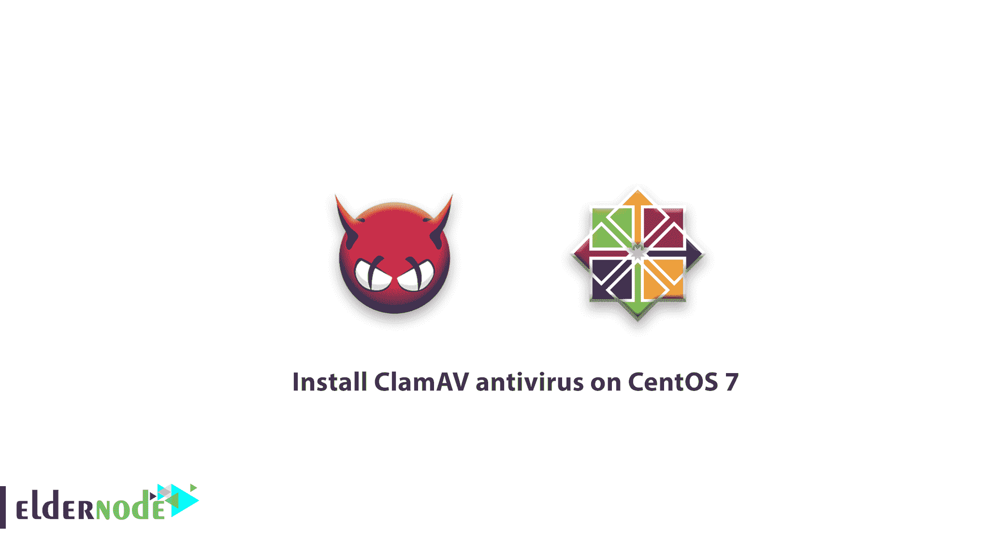

# 在 CentOS 7 - centos 防病毒软件上安装 ClamAV 防病毒软件

> 原文：<https://blog.eldernode.com/install-clamav-antivirus-centos-7/>



之前，我们已经说过关于 [Linux 安全](https://eldernode.com/linux-security-tips-and-tricks/)，在本文中，我们将学习如何在 CentOS 7 上安装 ClamAV 防病毒软件，以获得更好的服务器保护。

## 在 CentOS 7 上安装 ClamAV 杀毒

首先，我们要知道为什么要安装杀毒软件。虽然 Linux 是最安全的系统之一，但如果你需要保护你的 [Linux VPS](https://eldernode.com/linux-vps/) 或服务器，最好安装一个杀毒软件。在所有可用选项中，推荐您使用 [ClamaAV](https://en.wikipedia.org/wiki/Clam_AntiVirus) 。因为它是一个开源的反病毒软件，可以成功抵御特洛伊木马、恶意软件和其他安全威胁。

### 一步一步引导

**在开始**时，确保您以 root 用户身份访问了 CentOS 7 服务器或 VPS。

**注意:** 你需要知道如何使用 [Putty](https://eldernode.com/what-is-putty-and-what-does-it-do/) 来建立 SSH 连接。

1.默认情况下，ClamAV 没有预先打包在 CentOs 中，因此您需要通过运行 **yum** 命令来添加存储库。

```
yum install -y epel-release
```

2.连接到终端后，输入以下命令下载安装必备组件。

```
yum install -y clamav
```

3.过一会儿，ClamAV 防病毒软件就安装在您的 CentOS Linux 上，并准备运行了。

4.在扫描和使用 ClamAV 防病毒软件之前，请对其进行更新。

**注:**ClamAV 杀毒，有一个数据库需要不时更新。

```
freshclam
```

### 一些对 ClamAV 杀毒有用的命令

1.使用以下命令立即扫描主要分支。

```
clamscan
```

2.您可以使用-r 开关来扫描特定的文件夹。例如，我们想要扫描/ home 目录。

```
clamscan -r /home
```

3.要完全扫描根分支，请输入以下命令。

```
clamscan -r /
```

4.如果你想显示病毒文件，使用 **-i** 开关。

```
clamscan -r -i /home
```

5.要删除病毒，使用**-删除**开关。

```
clamscan -r -remove /home
```

6.使用 help 参数了解 ClamAV 防病毒软件的其他开关和其他功能。

```
clamscan --help
```

#### 结论

并且，在本文的最后，我们建议面临几次**攻击**或频繁未知文件交易的用户，在 CentOS 上安装 ClamAV 防病毒软件，以防止在检测到恶意软件时立即传播。

亲爱的用户，我们希望您喜欢本教程，您可以在评论区提出关于本次培训的问题，或者解决[老年节点培训](https://eldernode.com/blog/)领域的其他问题，请参考[提问页面](https://eldernode.com/ask)部分并在其中提出您的问题。