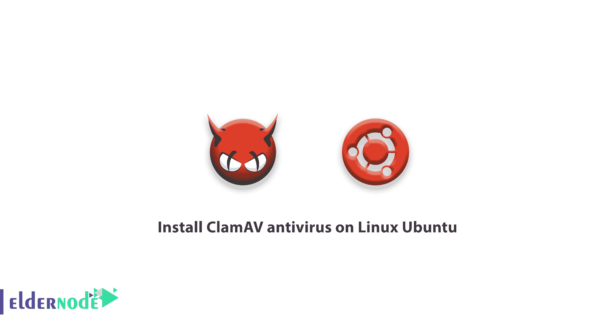

# 在 Linux Ubuntu - Eldernode 上安装 ClamAV 防病毒软件

> 原文：<https://blog.eldernode.com/install-clamav-antivirus-on-ubuntu/>



你应该已经熟悉了 [Linux 安全](https://eldernode.com/linux-security-tips-and-tricks/)并且最近在 [CentOS 7](https://eldernode.com/install-clamav-antivirus-centos-7/) 上安装了 ClamAV 杀毒。今天我们将学习在 Linux Ubuntu 上安装 ClamAV 杀毒软件。

## 在 Linux Ubuntu 上安装 ClamAV 杀毒

所有的操作系统都需要杀毒软件。尽管所有的程序员总是为 Linux 发行版开发更少的病毒和恶意软件，但是安装防病毒软件的重要性永远不应该被忘记。 [ClamAV](https://www.clamav.net/) 防止恶意软件和 rootkits 攻击，帮助您的服务器安全。 **ClamAV** 是一款免费的开源反病毒软件，可以检测并杀死特洛伊木马、恶意软件、病毒、编解码器和 rootkits。

### 如何在 Ubuntu 上安装 ClamAV

1-首先连接到你的 Ubuntu 终端。

2-通过输入以下命令更新您的 Ubuntu Linux 软件包。

```
sudo apt-get update
```

3-更新后，输入以下命令下载并安装 ClamAV 防病毒软件。

```
sudo apt-get install clamav
```

4-过一会儿，ClamAV 杀毒软件会被安装到你的 U Linux Ubuntu 上并准备运行。

5-在 ClamAV antivirus 运行命令和扫描之前，更新其数据库。

```
freshclam
```

**注**:杀毒安装和数据库更新到此结束，下面我们将介绍一些在 Ubuntu 上 ClamAV 杀毒最常用的命令。

需要一台 Linux VPS？加入我们 [这里](https://eldernode.com/linux-vps/)

### ClamAV 杀毒命令

1-对于主分支的即时扫描(快速扫描)，请使用以下命令。

```
clamscan
```

2-使用 **-r** 开关扫描特定文件夹。

例如，我们想扫描/tmp 目录。

```
clamscan -r /tmp
```

3-输入以下命令进行完全根分支扫描。

```
clamscan -r /
```

4-如果您想在搜索后显示病毒文件，请使用 **-i** 开关。

```
clamscan -r -i /tmp
```

5-使用**-删除**开关，在搜索后自动删除病毒。

```
clamscan -r -remove /tmp 
```

6-使用**帮助**参数来熟悉 ClamAV 的其他开关和防病毒能力。

```
clamscan --help 
```

#### 结论

在本文的最后，我们建议面临几次**攻击**或频繁未知文件交易的用户，在 Ubuntu 上安装 ClamAV 杀毒，防止一旦检测到恶意软件就立即传播。

亲爱的用户，我们希望你能喜欢在 Linux Ubuntu 上安装 ClamAV 杀毒软件的教程，你可以在评论区提出关于这个培训的问题，或者要解决[Eldernode.com](https://bit.ly/2Y5rVUu)领域的其他问题，请参考[提问页面](https://eldernode.com/ask)部分并在里面提出你的问题。