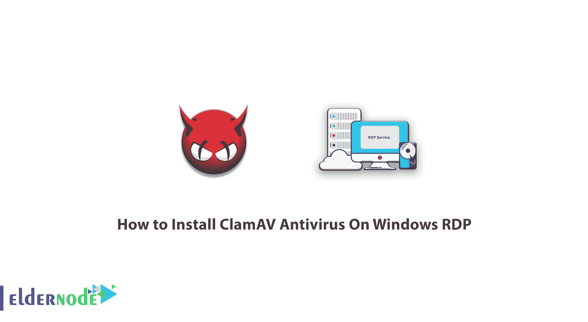
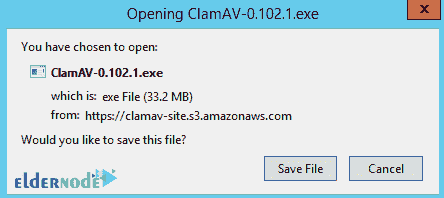
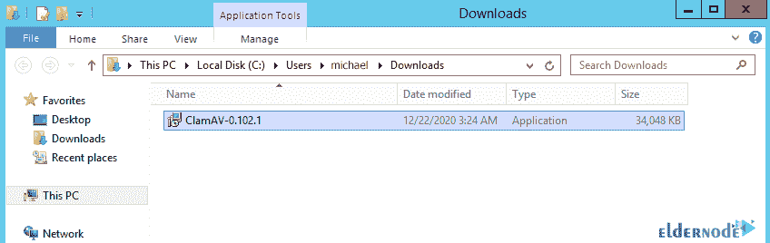
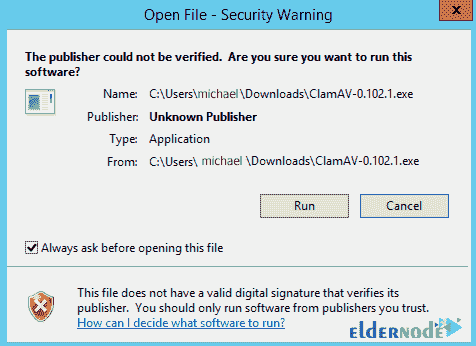
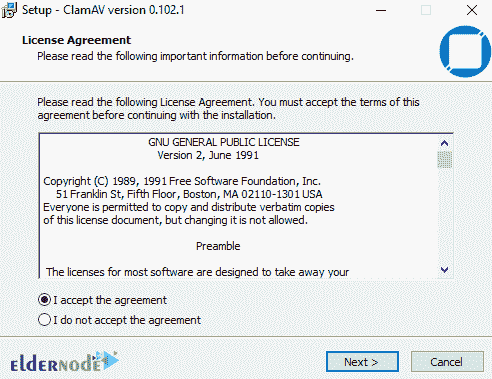
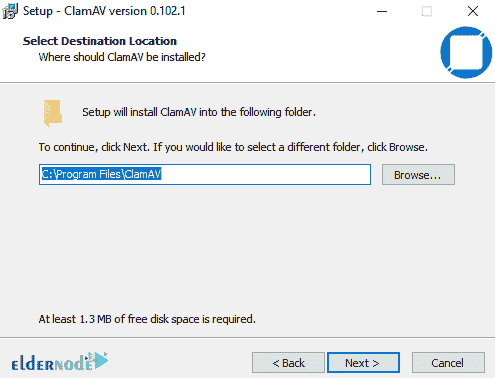
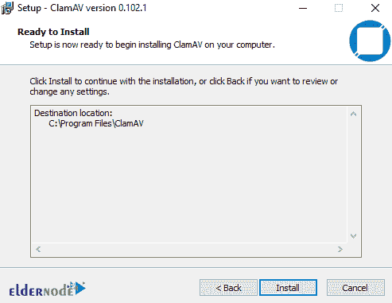
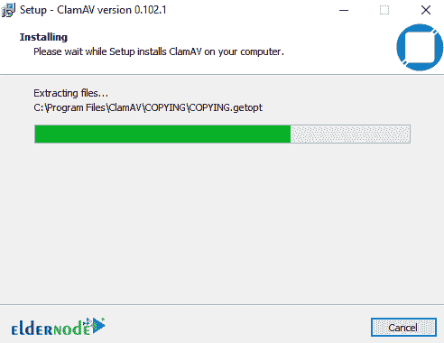
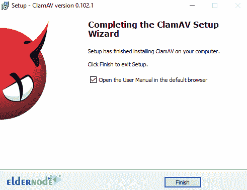

# 如何在 Windows RDP - Eldernode 博客上安装 ClamAV 杀毒软件

> 原文：<https://blog.eldernode.com/install-clamav-antivirus-on-windows-rdp/>



如今，计算机恶意软件已经蔓延到如此程度，如果不安装杀毒软件，主机就会感染各种恶意软件，包括病毒、木马、勒索软件等等。由于 Windows 在社区和用户之间的高度脆弱性，黑客和攻击者将更多的注意力放在 Windows 操作系统上。还有，Windows 的恶意软件数量远高于 Linux 和 Mac，但它们也有自己的恶意软件，如果不使用杀毒，无疑会受到严重的损害。在这篇文章中，我们试图学习你如何安装 ClamAV 杀毒软件在 Windows **RDP。**你可以访问 [Eldernode](https://eldernode.com/) 提供的套装来购买 [Admin RDP](https://eldernode.com/buy-rdp/) 服务器。

## **教程在 Windows 服务器上安装 ClamAV 杀毒软件**

安全专家经常忽略的一件事是安装服务器防病毒软件。 [ClamAV](https://blog.eldernode.com/install-clamav-antivirus-centos-7/) Antivirus 是用 C 和 C ++编写的免费开源杀毒软件。这款杀毒软件由思科于 2013 年首次向全球推出，可在各种平台和操作系统上使用。

ClamAV Antivirus 是 GPL 认证的，这使得世界各地的许多公司将这种防病毒软件个性化，并将其转变为专有的防病毒软件。这款杀毒软件的优势之一是，当服务器管理员将它安装在服务器上时，共享服务器用户可以在他们的 [Cpanel](https://blog.eldernode.com/tag/cpanel/) 或其他管理面板的高级部分看到 ClamAV 选项。所以他们可以分别浏览他们的网站和内容。请按照本教程安装 ClamAV 反病毒软件的 Windows RDP。

## **在 Windows RDP 服务器上安装 ClamAV 杀毒软件**

要入门，首先要[下载 ClamAV 杀毒](http://www.clamav.net/downloads/production/ClamAV-0.102.1.exe)。

然后在下一步，点击**保存文件**开始下载程序。



转到下载安装文件的位置，开始安装过程。



双击安装文件，弹出以下窗口。然后点击**运行**。



下一步，**接受**许可协议，并点击**下一步**。



现在您需要在这一步中指定一个路径来安装 ClamAV。



你现在已经准备好安装 ClamAV 了，只需点击**安装**。



请稍等片刻，等待安装完成。



最后你必须点击**完成**。你会看到 ClamAV [杀毒软件在 Windows RDP](https://blog.eldernode.com/how-to-install-and-configure-antivirus-on-rdp-admin/) 上的安装成功完成。



安装过程成功完成后，您必须按下 Windows 按钮并搜索 **PowerShell** 。然后你必须右击 PowerShell 并运行**以管理员身份运行**。此外，如果问题“是否允许此应用程序更改您的设备？”你将被要求点击**是**。

现在，您应该确认 PowerShell 窗口中的请求如下:

```
PS  C:\WINDOWS\system32>
```

要能够访问 ClamAV 安装目录，您必须在管理员 PowerShell 窗口中输入以下命令:

```
cd  "c:\program files\clamav"
```

## 结论

通过安装 ClamAV 防病毒软件，您将可以使用非常强大的工具，如命令级别的扫描仪。使用此功能，您可以扫描您的服务器，而不需要任何图形环境，只需使用您的工具命令。下一项是自动更新防病毒数据库的能力。如果数据库公司检测到最新的病毒，扫描程序将会更新。也有能力安装一个多平台，允许您在 Windows 上安装这个防病毒软件。它也用作电子邮件软件的网关扫描器。在这篇文章中，我们试图学习你如何安装 ClamAV 反病毒在 Windows RDP。