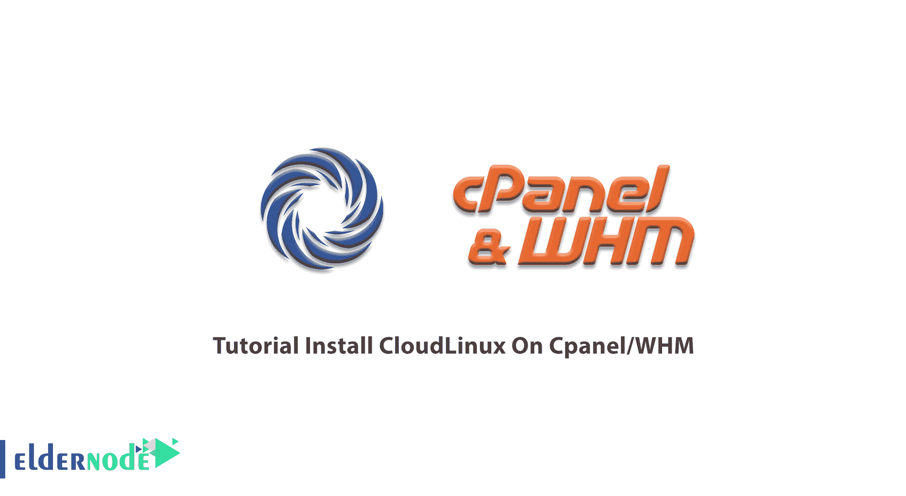

# 教程在 Cpanel/WHM - Eldernode 上安装 CloudLinux

> 原文：<https://blog.eldernode.com/install-cloudlinux-on-cpanel/>



作为一名管理员，您可能会面临一些问题，例如突然的资源使用高峰、流量增加和黑客攻击。所有这些问题都会给你的企业带来成本。此外，它需要金钱、时间和客户信任。因此，您可以选择更改底层操作系统的解决方案来消除这些成本。当你关心稳定性、安全性和虚拟主机时，CloudLinux 将是你的选择。CloudLinux 已经针对共享主机进行了优化。这对您来说是有意义的，因为使用 CloudLinux 可以为您提供更长的正常运行时间，显著提高密度。本文将向您展示在 Cpanel/WHM 上安装 CloudLinux 的教程。不要错过 2021 年 [Eldernode](https://eldernode.com/) 的新优惠和折扣，购买自己的 [Linux VPS](https://eldernode.com/linux-vps/) 。

## 如何在 Cpanel/WHM 上安装 cloud Linux

加入我们的指南，当我们推荐你使用 CouldLinux 时，请相信我们，因为如果你是一个共享主机或代表客户托管网站的设计公司，它将是你的朋友。CloudLinux 专门为运行 [Cpanel](https://blog.eldernode.com/tag/cpanel/) 控制面板的 web 主机制作了多个账户。由于 CloudLinux 可以与 [CentOS](https://blog.eldernode.com/tag/centos/) 互换，任何系统管理员都会有宾至如归的感觉。

### **cloud Linux 与 Cpanel 整合的结果**

1-通过限制任何单个用户可以消耗的资源来提高稳定性

2-高级服务器安全性

3-提高服务器效率

4-多个 PHP 版本

5 硬化内核

cPanel 和 WHM 软件中的管理界面可轻松管理帐户使用

## **在 Cpanel/WHM** 上安装 cloud Linux

在下文中，您将了解如何使用 Cpanel 转换 CentOS 服务器。使用 Cpanel 在 CentOS server 上安装 CloudLinux OS 非常简单。

要开始该过程，您只需一个软件激活密钥或基于 IP 的许可证。如果您已经准备了许可证密钥，可以在 [CLN](https://cln.cloudlinux.com/) 或您的欢迎电子邮件中找到。

然后，使用您首选的 SSH 控制台应用程序打开到您的服务器的 SSH 连接，以安装 CloudLinux。

**注意**:不要忘记拥有[根级](https://blog.eldernode.com/sudoers-configurations-setting-sudo/)访问权限。

现在，您可以使用以下语法来执行转换过程:

```
wget https://repo.cloudlinux.com/cloudlinux/sources/cln/cldeploy
```

```
sh cldeploy -k <activation_key> # if you have activation key
```

运筹学

```
sh cldeploy -i # if you have IP based license
```

```
reboot
```

### **安装说明**

由于 CloudLinux OS 安装脚本是智能的，它可以检测环境、虚拟化类型、控制面板、可能需要额外安装驱动程序的特定硬件等等。

完成安装过程后，重新启动服务器。要用内核引导服务器，这是专门为 LVE 支持和限制操作而设计的，您应该注意这一要求。

如果您希望确保服务器正常运行，请再次通过 SSH 访问服务器并执行“uname -a”命令。此外，您将能够看到名称中包含“lve”的 CloudLinux 内核。它显示服务器正在使用正确的内核运行。

最后，您应该检查 WHM 接口。LVE 管理器插件已在转换过程中安装。

## 结论

在本文中，向您展示了在 Cpanel/WHM 上安装 CloudLinux 教程。带有 cPanel 的 CentOS 服务器已成功转换为 CloudLinux 操作系统。正如您所了解的，您可以为每个客户提供一套个人的服务器资源。因此，网站将保持稳定，服务器保持安全，最后，你的客户会很高兴。CloudLinux 是一个很好的营销助手和你的销售辅助工具。通过使用 it 和所有营销和销售工具来发展您的业务。如果您有兴趣了解更多关于 Linux 的知识，可以在 Eldernode 博客上找到更多文章，并在 [Eldernode 社区](https://community.eldernode.com/)上与初学者和高级用户讨论。