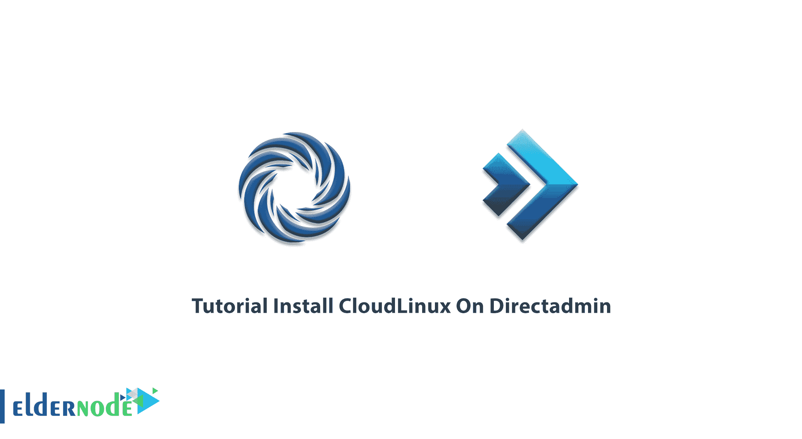

# Directadmin - Eldernode 博客上的安装 CloudLinux 教程

> 原文：<https://blog.eldernode.com/install-cloudlinux-on-directadmin/>



CloudLinux 是基于 CentOS Linux 发行版的操作系统。云 Linux 被用在虚拟主机上，因为它就是为此而设计的。托管公司使用 CloudLinux 来提高效率、安全性和向每个主机分配资源的能力。在本文中，我们试图一步一步地向您介绍在 Directadmin 上安装 CloudLinux 的教程**。您还可以访问 [Eldernode](https://eldernode.com/) 中的套装，购买一个 [VPS 主机](https://eldernode.com/vps-hosting/)。**

## **如何在 Directadmin** 上安装 cloud Linux

可以用不同的方式安装 CloudLinux。安装包有 **ISO** 文件，也有 **SSH** 下的包。您可以随意使用这些软件包中的任何一个。由于 CloudLinux 操作系统是有成本的，所以您必须在安装它之前获得一个许可密钥。在下一节中，我们将提到 CloudLinux 的特性。然后我们将学习如何在 [Directadmin](https://blog.eldernode.com/tag/direct-admin/) 上安装 CloudLinux。和我们在一起。

### **CloudLinux 功能**

在本节中，我们将介绍 CloudLinux 的一些最重要的特性:

1.能够通过 LVE 管理器工具为每个客户分配完全专用的资源

2.使用 SecureLinks 增强操作系统[的安全性](https://blog.eldernode.com/tag/security/)以防止符号链接

3.通过 CageFS 工具提高账户的安全性

4.能够使用 PHP 选择器工具在服务器上使用多个版本的 PHP

5.Mod_lsapi 工具对内存的低消耗

6.能够使用 Ruby 选择器和 Python 选择器工具

7.能够使用 MySQL 调控工具

8.能够通过 HardenedPHP 工具使用过时版本的 PHP

关注本文，了解如何在 Directadmin 上安装 CloudLinux。

### **在 Directadmin** 上安装 cloud Linux

要在有 [Directadmin](https://blog.eldernode.com/how-to-connect-to-directadmin/) 控制面板的服务器上安装这个内核，您必须遵循下面的步骤。第一步，您需要通过 **ssh** 连接到您的服务器，并执行以下命令:

```
wget http://repo.cloudlinux.com/cloudlinux/sources/cln/centos2cl
```

然后，您必须运行以下命令。请注意，您应该使用您提供的 CloudLinux 许可证激活密钥，而不是 **< activation_key >** 短语。

```
sh centos2cl -k <activation_key>
```

现在，您需要**重启**服务器一次，以应用更改:

```
reboot
```

在重新加载服务器并通过 **ssh** 访问它之后，您可以输入以下命令来通过 CloudLinux 保护 Directadmin 服务器。通过这样做，您可以分别定义所需的策略和限制。

```
yum install liblve-devel
```

```
cd /usr/local/directadmin/custombuild
```

```
./build update
```

```
./build set cloudlinux yes
```

```
./build apache
```

```
./build suphp
```

## 结论

CloudLinux 是一种内核级技术，可以创建更稳定的环境。这项技术可以防止邻近或附近的 VPS 的攻击和恶意影响，并防止安装在 CloudLinux 服务器上的站点崩溃。由于这个问题的重要性，在本文中，我们试图向您介绍在 Directadmin 上安装 CloudLinux 的教程。