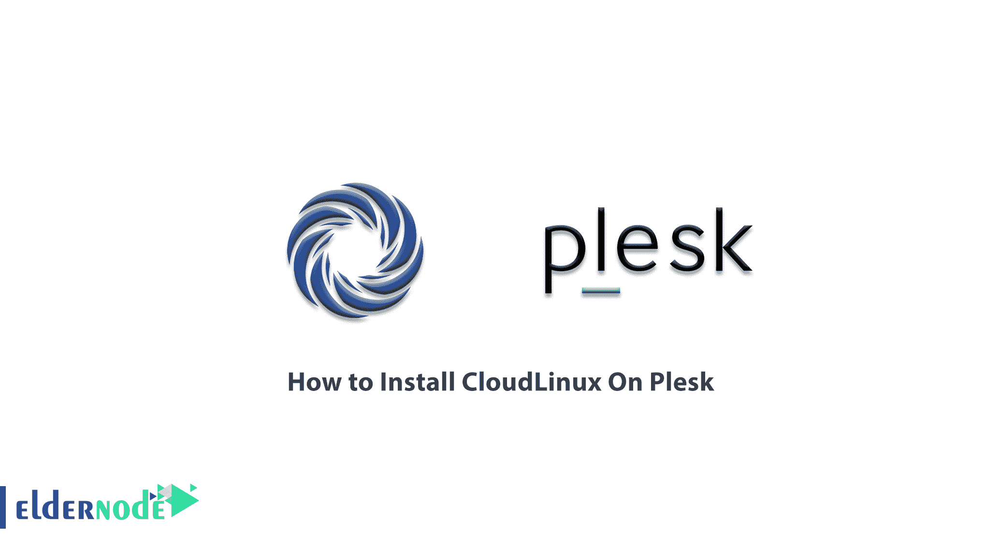

# 如何在 Plesk - Eldernode 博客上安装 CloudLinux

> 原文：<https://blog.eldernode.com/install-cloudlinux-on-plesk/>



使用 Cloudlinux，您将能够识别每个用户使用的资源，并使您的服务器更加稳定。通过为每个用户分配特定的资源，您可以防止其他用户降低网站速度。您还可以将一定数量的硬件分配给用户，并限制用户使用这些资源。因此，如果处理需要更高的资源，将不会使用其他订户的资源，但是用户任务将使用分配的资源来完成。这样，一个用户将无法使用您所有的服务器资源。这就是为什么在这篇文章中，我们试图学习如何在 Plesk 上安装 CloudLinux。你可以访问 [Eldernode](https://eldernode.com/) 提供的包来购买 [VPS 托管](https://eldernode.com/vps-hosting/)服务器。

## **教程在 Plesk 上安装 cloud Linux**

安装 Cloudlinux 或将一个 [Linux VPS 服务器](https://eldernode.com/linux-vps/)转换为 Cloudlinux 将帮助你拥有一个适合 web 托管的个性化操作系统。该操作系统具有管理共享主机的特殊功能。它还特别限制每个用户使用的资源，以防止其他用户由于一个用户过度使用资源而变慢。拥有大量站点和用户的托管公司或人员经常使用 Cloudlinux。下面，我们将学习如何在 [Plesk](https://blog.eldernode.com/tag/plesk/) 上安装 Clodlinux。请加入我们。

### **多种方式使用 Cloudlinux**

使用 Cloudlinux 有两种方式:

**1。在服务器上直接安装 cloud Linux:**在这种情况下，您要么必须从头开始在您的服务器上安装这个操作系统，要么当您需要它时，在新的服务器上安装它并移动主机。

**2。将 Linux 转换为 Cloudlinux:** 当你已经设置好服务器，现在需要使用 Cloudlinux 时，不需要让站点不可访问来转移；相反，你可以毫无问题地将你当前的操作系统转换成 Cloudlinux，该操作系统有一个 [cPanel](https://blog.eldernode.com/tag/cpanel/) 、 [DirectAdmin](https://blog.eldernode.com/tag/directadmin/) 或 Plesk 控制面板。应当注意，该操作系统的安装程序脚本根据服务器的资源、虚拟化、操作系统和控制面板智能地运行，并且将安装所需的包。在本文的后续部分，加入我们学习如何在 Plesk 上安装 Cloudlinux。

### **在 Plesk** 上安装 cloud Linux

在本节中，我们将讨论如何在 Plesk 上安装 CloudLinux。在这里，您将了解如何将基于 Plesk 的服务器从 [CentOS](https://blog.eldernode.com/tag/centos/) 转换到 CloudLinux。为此，您必须遵循本节中的步骤。

第一步是获得软件激活密钥或基于 IP 的许可证。通过访问 [CloudLinux 网站](http://trial.cloudlinux.com/overview/?_ga=2.172174627.1665383487.1612855239-433242938.1612855239)请求 [CLN](https://cln.cloudlinux.com/?_ga=2.172174627.1665383487.1612855239-433242938.1612855239) 端口，可以免费获得 30 天试用密钥。请注意，如果您有付费许可证密钥，您可以在 CLN 或您的电子邮件中找到它。

要在 Plesk 服务器上安装 CloudLinux，您必须使用 SSH 控制台应用程序打开到服务器的 SSH 连接。请注意，您必须拥有 root 访问权限。

在下一步中，您必须按顺序执行以下命令:

```
wget https://repo.cloudlinux.com/cloudlinux/sources/cln/cldeploy
```

```
sh cldeploy -k <activation_key> # if you have activation key
```

或者

```
sh cldeploy -i # if you have IP based license
```

最后，您必须使用以下命令重新引导系统以应用更改:

```
reboot
```

引导服务器后，您可以运行以下命令来确保操作系统使用 Cloudlinux 内核进行引导:

```
uname -a
```

## 结论

CloudLinux 是适合托管的 Linux 发行版之一。大多数人过去使用 Debian 和 centos 发行版进行托管。但是这些发行版存在一些问题，这些问题在 CloudLinux 中已经得到了解决。在 CloudLinux 中，资源可以在所有用户之间平等共享，从而防止服务器崩溃。在本文中，我们试图教你如何在 Plesk 上安装 CloudLinux。如果想在 DirectAdmin 上安装 CloudLinux，可以参考[教程在 Directadmin 上安装 cloud Linux](https://blog.eldernode.com/install-cloudlinux-on-directadmin/)。