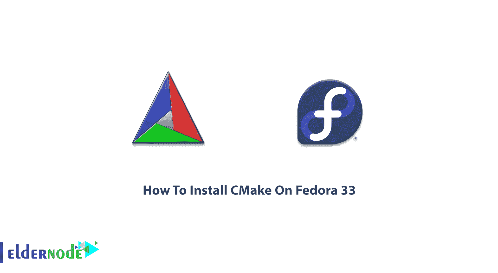

# 如何在 Fedora 33 - Eldernode 博客上安装 CMake

> 原文：<https://blog.eldernode.com/install-cmake-on-fedora/>



CMake 是一个开源的、可扩展的软件，使用独立于编译器的方法来构建自动化、测试和打包。它管理操作系统中的构建过程。CMake 与其他跨平台系统不太相似，因为它可以与本机构建环境结合使用。它还支持复杂的目录层次结构和依赖于多个库的应用程序。在下面的 CMake 教程中，在本文中，你将学习**如何在 Fedora 33 Linux** 上安装 CMake。在 [Eldernode](https://eldernode.com/) 上选择您喜欢的软件包，以最优惠的价格和支持购买一台 [Linux VPS](https://eldernode.com/linux-vps/) 。

## **教程在 Fedora 33 上一步步安装 CMake**

CMake 受 BSD-3 条款许可的约束。为了构建一个项目，CMake 使用 C 或 C++编译器并使。您可以在调用 **CMakeLists.txt** 文件并用于生成标准构建文件的每个源目录中找到示例配置文件。

**点**:您可以通过运行以下命令创建一个简单的 CMakeLists.txt 文件:

```
cmake /path/to/CMakeLists.txt
```

CMake 支持来自单个源代码树的多个构建，因为它可以支持就地和非就地构建。CMake 可以轻松安装在 Windows 和 Linux 操作系统上。和我们一起学习如何在 Fedora 33 上安装 CMake。要准备最新版本的 CMake，请访问 [Cmake 下载](https://cmake.org/download/)页面。预编译的二进制文件可用于某些 UNIX 平台，您也可以从源代码下载并构建 CMake。

### **CMake 特性:**

下面简单解释一下 CMake 的好处。

1-不管代码在什么位置，它都会编译代码

2-管理依赖性的能力

3-它在不同的操作系统上编译代码

4-为不同系统生成 make 文件和为不同 ide 生成项目的能力

5-它标识文件和库的位置

### 在 Fedora Linux 上进行安装

cmake-fedora 由一组脚本和 cmake 模块组成，它们只是向 RHEL 和 fedora 发布软件包。

要安装 CMake，您只需运行:

```
sudo dnf install cmake
```

您可以使用以下命令来安装 cmake-fedora Git

```
git clone https://pagure.io/cmake-fedora.git
```

此外，您可以将 cmake-fedora 安装为 fedora/EPEL 包。因此，键入:

```
yum -y install cmake-fedora
```

### **使用 Snap** 在 Fedora 上安装并配置 CMake

正如您在以前的文章中了解到的，快照是打包了所有依赖项的应用程序，可以在所有流行的 Linux 发行版上运行。要使用 snap 在 Fedora 上安装 CMake，首先需要在其上启用 snap。

要在 Fedora 上安装 snap，请运行以下命令:

```
sudo dnf install snapd
```

然后，确保快照的路径更新是否正确。因此，注销并再次登录。

现在，输入以下内容，在***/var/lib/snapd/snap***和 ***/snap*** 之间创建一个符号链接，以启用经典 snap 支持。

```
sudo ln -s /var/lib/snapd/snap /snap
```

最后，运行下面的命令来安装 CMake。

```
sudo snap install cmake --classic
```

## 结论

在本文中，您了解了如何在 Fedora 33 上安装 CMake。如果你有兴趣了解更多，可以找到我们关于如何在 Ubuntu 和 Debian 上安装 CMake 的相关文章。