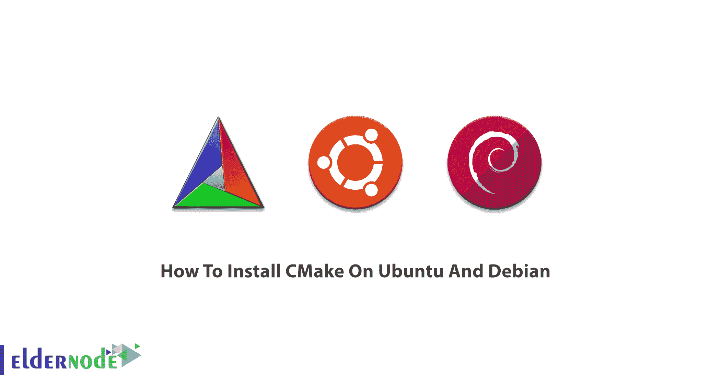
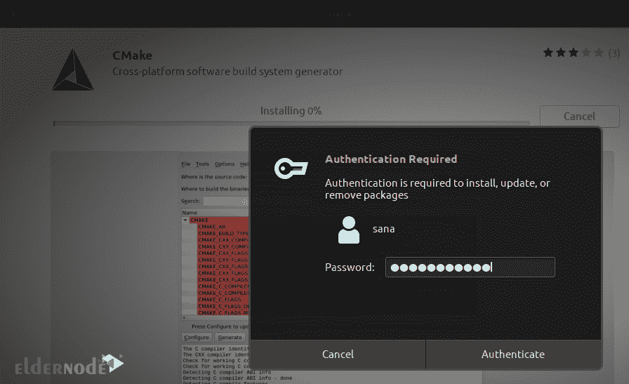
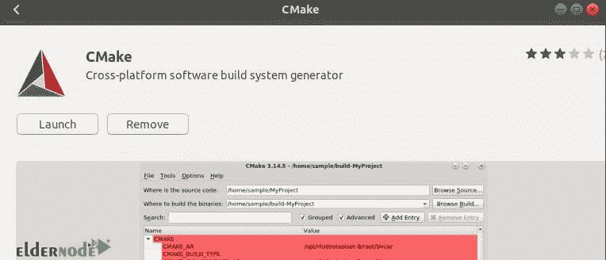
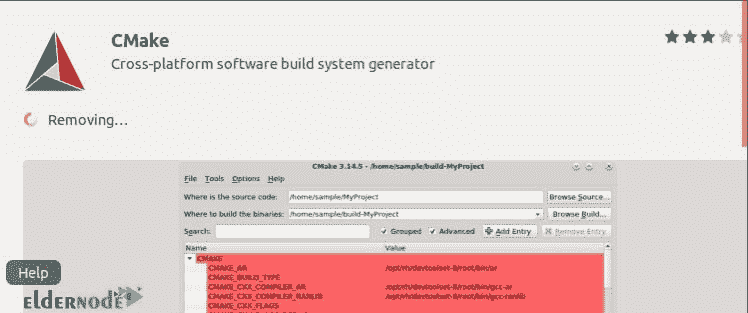

# 如何在 Ubuntu 和 Debian - Eldernode 博客上安装 CMake

> 原文：<https://blog.eldernode.com/install-cmake-on-ubuntu-and-debian/>



之前给大家介绍过 [CMake](https://blog.eldernode.com/cmake-for-windows-and-linux/) 。为了控制软件的编译过程，这个开源软件使用一个简单的平台和独立于编译器的配置文件。通过这种方式，可以生成本机 makefiles 和工作区，以便在选择的编译器环境中使用。加入我们这篇文章，学习如何**在 Ubuntu 和 Debian** 上安装 CMake。不要错过 2021 年 [Eldernode](https://eldernode.com/) 上的优惠活动，购买您自己的 [Linux VPS](https://eldernode.com/linux-vps/) 。

## **教程在 Ubuntu 和 Debian 上安装 CMake**

准备最新版本的 CMake，可在[cmake.org/download/](https://cmake.org/download/)和 Snap Store 上获得。此外，预编译的二进制文件可用于某些 UNIX 平台，您也可以从源代码下载并构建 CMake。在本文中，我们将解释如何通过 Ubuntu & Debian 软件管理器安装它。

为了让本教程更好地发挥作用，请考虑以下**先决条件**:

拥有 sudo 权限的非 root 用户。

要进行设置，请遵循我们在 Ubuntu 20.04 上的[初始服务器设置](https://blog.eldernode.com/initial-server-setup-on-ubuntu-20/) & [在 Debian 10 上的初始服务器设置](https://blog.eldernode.com/initial-setup-with-debian-10/)。

### **如何在 Ubuntu 上安装 CMake**

这里，我们将描述如何通过 **UI** 和**命令行**将 CMake 安装到你的 [Ubuntu](https://eldernode.com/linux-vps/) 中。如果你不想经常打开命令行，你可以通过 UI 安装 Ubuntu 库中的软件。

### **如何通过 UI 安装 CMake**

*第一步:*

**首先**，点击你的 Ubuntu 桌面活动工具栏上的 Ubuntu 软件图标。

然后，如果您在搜索栏中搜索“CMake ”,列出的第一个包就是 Snap Store 维护的包。单击 CMake 条目打开以下页面:

*第二步:*

要开始安装过程，请单击“安装”按钮。因为只有一个授权用户能够在 Ubuntu 上安装软件，所以将会显示认证细节。因此，输入您的密码，让安装过程开始。



*第三步:*

跟踪安装如下图所示:

*第四步:*

一旦安装了 CMake，您将收到以下消息。因此，您可以选择直接启动 CMake，也可以删除它。

**如何通过 Ubuntu 命令行安装 CMake**

正如我们提到的，您可以通过命令行安装 CMake。从 CMake 官方网站下载源代码，编译后通过它安装 CMake。可以通过运行以下命令来安装相同的版本:

要下载源代码，请键入:

下载文件后，使用以下命令提取文件:

### 要移动到提取的文件夹，请运行:

接下来，使用以下命令编译并安装 CMake。

```
sudo apt update  sudo apt upgrade  sudo snap install cmake
```

现在，您可以使用下面的命令来创建它:

```
wget https://github.com/Kitware/CMake/releases/download/v3.15.2/cmake-3.15.2.tar.gz
```

要安装它，请键入:

```
tar -zxvf cmake-3.15.2.tar.gz
```

安装完成后，您可以验证其安装并检查安装版本的正确性。所以，运行:

```
cd cmake-3.15.2
```

当您检查最新版本时，您也可以使用 CLI 来处理您的软件代码。

```
./bootstrap
```

***注意*** :如果你已经使用 Ubuntu 软件包管理器安装了 CMake，使用下面的命令将其移除。

```
make
```

**如何使用 Ubuntu 软件卸载 CMake**

```
sudo make install
```

当您决定使用图形用户界面从系统中删除 CMake 时，这并不困难。让我们来看一下这一部分的步骤。

```
cmake --version
```

*第一步:*

在上面的搜索栏中搜索“CMake”。然后，单击 CMake 应用程序。应显示以下窗口。

```
sudo apt remove --purge cmake  hash -r
```

## 

*第二步:*

要从你的 Ubuntu 系统中卸载 CMake，点击“移除”按钮。



**如何在 Debian 上安装 CMake**

Debian 的存储库不包括任何最新版本的 CMake。所以，你需要先下载。按照下面的步骤学习如何在 Debian 上进行安装。

*第一步:*

当你打开你的终端时(使用 ctrl+Alt+T ),在你的系统中下载 CMake。运行下面的命令并等待继续。

*第二步:*

### 然后，您应该提取下载的文件。因此，键入:

现在，在提取控制器后使用 cd 命令。

此时，您可以运行下面的命令，因为您已经到达了 CMake 目录。等待一段时间，看看 CMake 将被引导。

*第三步:*

```
wget https://github.com/Kitware/CMake/releases/download/v3.15.2/cmake-3.15.2.tar.gz
```

当 CMake 启动时，您将执行此步骤。因此，在终端窗口中运行 make 命令。make 的处理需要时间，所以不要退出终端窗口，让它 100%完成。

最后，要安装 CMake，请键入:

```
tar -zxvf cmake-3.15.2.tar.gz$
```

如果您愿意，可以使用以下命令验证 CMake 的安装过程:

查看版本后，您可以确保安装得到确认。否则，请再次检查步骤或将收到的错误发送给我们。

```
./bootstrap
```

**启用 Debian 上的快照并安装 CMake**

同样在 Debian 上，您可以使用 snaps 来安装 CMake。快照是打包了所有依赖项的应用程序。Snapes 可以在一个版本的所有 Linux 发行版上运行。 [Snap Store](https://snapcraft.io/store) 是你可以安装 Snap 的最好地方。

```
make
```

要直接从命令行安装 snap，请运行:

```
sudo make install
```

然后，使用以下命令在您的 Debian 服务器上安装 CMake:

```
cmake --version
```

结论

### 在本文中，您了解了如何在 Ubuntu 和 Debian 上安装 CMake。为 Ubuntu 和 Debian 提供了两种安装 CMake 的方法。如果您有兴趣了解更多信息，请找到关于如何在 Windows Server 上安装 CMake 的相关文章[。](https://blog.eldernode.com/install-cmake-on-windows-server/)

Also on Debian, you can use snaps to install CMake. Snaps are applications packaged with all their dependencies. Snapes could be run on all Linux distributions from a single build. [Snap Store](https://snapcraft.io/store) is the best place you can install snaps.

To install snap directly from the command line, run:

```
sudo apt update
```

```
sudo apt install snapd
```

```
sudo snap install core
```

Then, use the following commands to install CMake on your Debian Server:

```
sudo snap install cmake --classic
```

## Conclusion

In this article, you learned How To Install CMake On Ubuntu And Debian. Two methods of installing CMake was presented to you for both Ubuntu and Debian. In case you are interested in learning more, find the related article on [How To Install CMake On Windows Server](https://blog.eldernode.com/install-cmake-on-windows-server/).