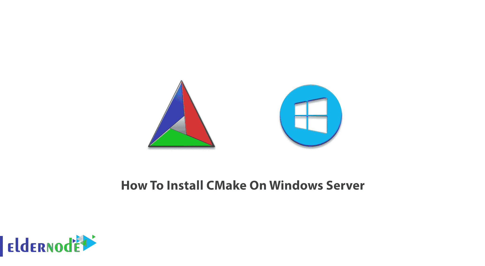

# 如何在 Windows Server - Eldernode 博客上安装 CMake

> 原文：<https://blog.eldernode.com/install-cmake-on-windows-server/>



CMake 是一个开源的、跨平台的软件开发工具系列。使用 CMake 可以构建、测试和打包软件。它可以在您选择的编译器环境中使用，适合于使用简单的平台和编译器独立的配置文件来控制软件编译过程，并生成本机 makefiles 和工作区。CMake 是 Kitware 集合的一部分，在本文中，您将学习如何在 Windows 服务器上安装 CMake。为了根据您的需求提供完美的套装，请访问 [Eldernode](https://eldernode.com/) 并购买您自己的 [Windows VPS](https://eldernode.com/windows-vps/) 。

## **教程在 Windows 服务器上安装 CMake**

### **Windows 上的 CMake**

CMake 在操作系统中以独立于编译器的方式管理构建过程。如果你在 [Windows](https://blog.eldernode.com/tag/windows/) 上从源码树构建 CMake，你应该先安装最新的 Cmake 二进制版本。安装时，在 CMake 上运行二进制文件。换句话说，当您选择 CMake 作为源目录时，您就为生成的可执行文件选择了一个二进制目录。

### **在 Windows Server 上一步一步进行安装**。

第一步:

在 CMake 下载页面上，预编译的二进制文件以 MSI 包和 ZIP 文件的形式提供给 Windows。和往常一样，建议您下载最新稳定版或之前版本的二进制文件或源代码档案，或者通过 Git 访问当前的开发发行版。于是，打开 [CMake 官网](https://cmake.org/)，点击**下载**标签。


第二步:

然后，根据你的相关平台下载文件。一旦 *cmake-*。exe* 安装程序被下载，**运行**它，点击下一步。


第三步:

要接受**许可协议**的条款，请点击我同意。


第四步:

此时，您需要在**安装选项**中做出选择。如果您想让 CMake 进入路径，请选中它们。另外，勾选*创建 CMake 桌面图标*在桌面上创建图标。


**注意:**如上图所示，如果您设置了“将 CMake 添加到所有用户的系统路径”复选框，则可以通过终端访问 CMake。

第五步:

接下来，你需要选择**安装路径**。如果您想同时安装几个版本，请在版本后面加上后缀。


第六步:

如果您希望在**开始菜单文件夹**中找到该程序的快捷方式:


第七步:

这样，安装将从**开始**。


第八步:

通过点击**完成**，CMake 将被安装到您的计算机上。


第九步:

桌面图标现在应该已经创建好了。


如果在步骤 4 中，您没有选择“将 CMake 添加到所有用户的系统路径”,您需要将 *…\bin* 添加到 PATH 环境变量:

结论

在本文中，您了解了如何在 Windows Server 上安装 CMake。您可以安装 CMake 来使用它出色的功能。请继续关注更多 CMake 教程。

The **Desktop icon** should have been created now.


If in step 4, you did not choose ”Add CMake to the system PATH for all users” you need to add *…\bin* to PATH environment variable:

```
> where cmake  C:\soft\develop\cmake\3.4.1\bin\cmake.exe
```

```
> where cmake-gui  C:\soft\develop\cmake\3.4.1\bin\cmake-gui.exe
```

```
> cmake --version  cmake version 3.4.1
```

```
CMake suite maintained and supported by Kitware (kitware.com/cmake).
```

## Conclusion

In this article, you learned How To Install CMake On Windows Server. You can install CMake to use its brilliant features. Stay tuned for more CMake tutorials.