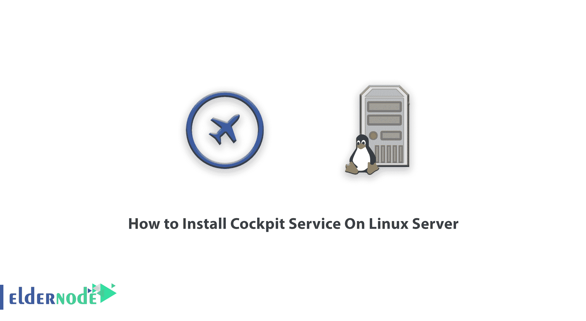
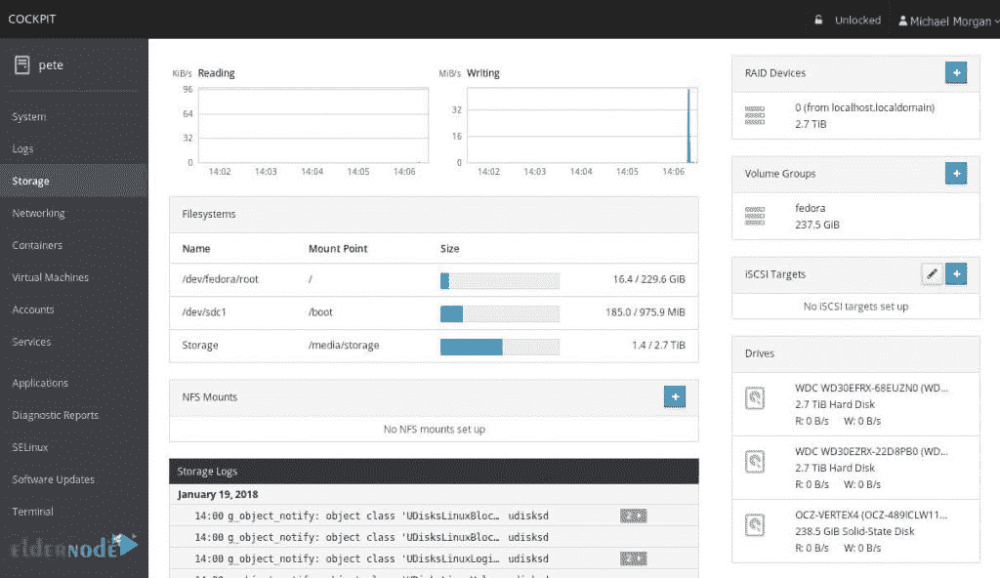
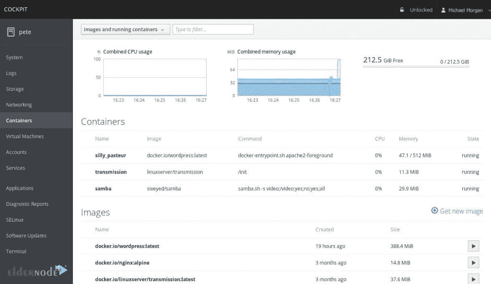
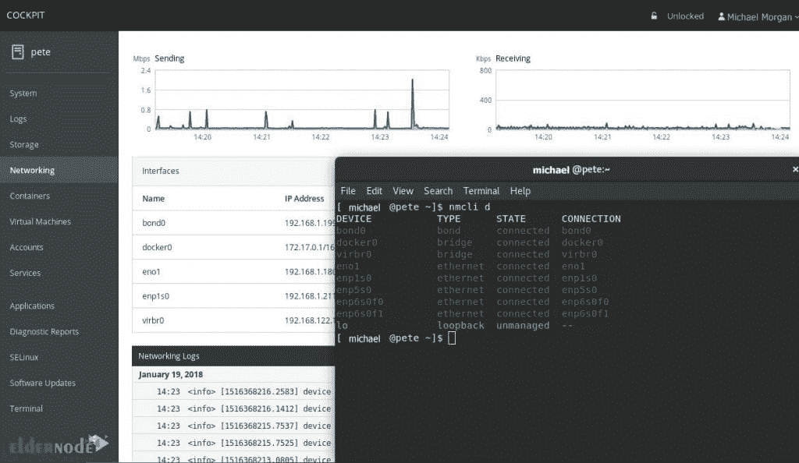

# 如何在 Linux 服务器上安装驾驶舱服务- Eldernode 博客

> 原文：<https://blog.eldernode.com/install-cockpit-service-on-linux/>



Cockpit 是一个管理工具，它使得管理 Linux 服务器变得更加容易。它为用户提供了一个图形界面，使他们可以更容易地通过浏览器执行管理员在一天中遇到的几乎所有任务。该软件由 Redhat [Linux](https://blog.eldernode.com/tag/linux/) 发行版的主要开发者提供支持。它可以很容易地安装在 Linux 服务器上。在这篇文章中，我们将教你**如何在 Linux 服务器**上安装驾驶舱服务。你可以访问 [Eldernode](https://eldernode.com/) 中可用的包来购买一个 [Linux VPS](https://eldernode.com/linux-vps/) 服务器。

## **教程在 Linux 服务器上安装驾驶舱服务**

## 【Linux 服务器驾驶舱系统简介

Cockpit 是与 Linux 服务器一起工作的软件，不需要使用命令行。这个软件是免费和开源的。在服务器上安装并激活之后(默认情况下，在某些 Linux 发行版上也可能存在)，您所要做的就是在浏览器中使用 9090 端口打开 IP 服务器，并使用 root 用户名和密码登录。

驾驶舱仍在开发中。这意味着似乎需要将另一个页面添加到页面集中，这样就不需要参考命令行。例如，如果你使用你的服务器作为网络服务器来托管你的个人网站，你需要在你的服务器上安装和配置一个网络服务器软件，例如 [Apache](https://blog.eldernode.com/apache-web-server-ubuntu-20/) 或 [Nginx](https://blog.eldernode.com/install-nginx-on-ubuntu-20-04-lts/) 。然而，目前还没有为 Cockpit 管理和配置 web 服务器的插件，你仍然需要使用命令行来完成。

### 座舱系统概要

驾驶舱允许系统管理员浏览服务器的不同部分。借助该工具，您可以轻松执行诸如容器启动、存储资源管理、网络配置、日志记录和调用日志等任务。

另一方面，你可以同时使用终端和驾驶舱。终端和驾驶舱之间的切换不会成为问题，驾驶舱将继续不受干扰地运行。例如，从驾驶舱开始的服务或流程可以通过终端停止。此外，如果终端出现错误，您可以通过浏览器在驾驶舱日志部分看到它。下图显示了驾驶舱环境中的存储设置。



应该注意的是，您可以同时监控和管理多台服务器。你所要做的就是把服务器添加到驾驶舱。这样，该服务器将与其他服务器一起被管理。在本文的以下部分，我们将解释如何在各种 Linux 发行版上安装驾驶舱，包括 Fedora、Red Hat Enterprise Linux、Fedora CoreOS、 [CentOS](https://blog.eldernode.com/tag/centos/) 、Debian 和 [Ubuntu](https://blog.eldernode.com/tag/ubuntu/) 。和我们在一起。

### 优势

cockpit 是用于监控和管理多个 Linux 服务器的强大工具，其最重要的优势如下:

**–**在一个会话中激活多个 Linux 服务器的管理

**–**在终端窗口中提供网页布局

**–**通过 Docker 管理集装箱

**–**支持系统账户管理的能力

**–**使用性能副驾驶显示系统性能信息

**–**支持收集系统配置和诊断信息

**–**支持 Kubernetes 集群

下图显示了驾驶舱环境中的容器设置。



### 缺点

基于 API 的内容管理系统的驾驶舱不具备管理前端内容的能力。这意味着它不能用作站点构建器服务。但它是一个开源服务，可以与 SQLite 或 [MongoDB](https://blog.eldernode.com/install-mongodb-ubuntu-20/) 一起使用来管理大型数据库。

### 驾驶舱系统的 10 个特征

Cockpit 涵盖了服务器管理的许多方面。其中最重要的是:

**1-** 检查服务器报告

**2-** 管理存储空间、硬盘和分区

**3-** 网络和防火墙设置并监控它们

**4-** 虚拟机和容器的构建和管理

**5-** 创建和管理用户账户

**6-** 管理并检查服务器上服务或软件包的状态

**7-** Selinux 设置

**8-** 更新服务器及其软件

**9-** 有终端环境

**10-** 安全级别管理和防火墙

从上面的列表可以看出，Cockpit 几乎涵盖了所有的管理部门。这个工具可以成为管理甚至配置 Linux 服务器的一个有趣的解决方案。当然，服务器不需要控制面板将托管空间或资源转移给最终用户。因为如果你的服务器是提供商业托管的托管服务器，Cockpit 肯定不适合你！

另一方面，如果你想学习如何管理和配置一个 Linux 服务器，最好先学习 Cockpit。使用这个轻量级软件会向您介绍网络和 Linux 服务器管理的许多概念和原则。在本文的后续部分，我们将教您如何在不同的 Linux 发行版上安装 Cockpit 服务。下图显示了驾驶舱环境中的网络设置。



## **在 Linux 服务器上安装驾驶舱服务分发**

## 如何在 Fedora 上安装驾驶舱服务

在开始在 Fedora 上安装 Cockpit 之前，您需要知道默认情况下，Cockpit 在 Fedora 服务器上是可用的。但是要在其他 Fedora 选项中安装这个工具，可以使用以下命令。第一步是运行以下命令来安装驾驶舱:

```
sudo dnf install cockpit
```

然后在下一步中，您必须在以下命令的帮助下启用驾驶舱:

```
sudo systemctl enable --now cockpit.socket
```

驾驶舱成功安装在 Fedora 上。如有必要，您可以使用以下命令打开防火墙:

```
sudo firewall-cmd --add-service=cockpit
```

```
sudo firewall-cmd --add-service=cockpit --permanent
```

## 如何在红帽企业版 Linux 上安装驾驶舱服务

现在是时候在红帽企业版 Linux 上安装 Cockpit 了。请注意，该工具在 Red Hat Enterprise Linux 7 及更高版本上可用。要安装驾驶舱，您必须遵循以下步骤。首先使用以下命令打开 **RHEL 7** 并启用附加存储库:

```
sudo subscription-manager repos --enable rhel-7-server-extras-rpms
```

现在，通过执行以下命令来安装驾驶舱:

```
sudo yum install cockpit
```

然后，您需要启用驾驶舱:

```
sudo systemctl enable --now cockpit.socket
```

如果需要，您可以在 RHEL 7 和 8 中打开防火墙:

```
sudo firewall-cmd --add-service=cockpit
```

```
sudo firewall-cmd --add-service=cockpit --permanent
```

## 如何在 Fedora CoreOS 上安装驾驶舱服务

现在是时候在 Fedora CoreOS 上安装驾驶舱服务了。有趣的是，驾驶舱包并不存在于标准的 Fedora CoreOS 映像中。因此，您需要使用以下命令并安装这些软件包:

```
rpm-ostree install cockpit-system cockpit-ostree cockpit-podman
```

现在重新启动系统一次。然后，您需要使用以下命令以 root 用户身份运行 Cockpit web 服务:

```
podman pull cockpit/ws    podman container runlabel --name cockpit-ws RUN cockpit/ws
```

最后，您需要通过输入以下命令来运行 Cockpit:

```
podman container runlabel INSTALL cockpit/ws    systemctl enable cockpit.service
```

## **如何在 CentOS**T3 上安装驾驶舱服务

要在 CentOS 7 或更高版本的 Linux 发行版上安装 cockpit，可以使用以下命令:

```
sudo yum install cockpit
```

然后，您需要通过执行以下命令来启用驾驶舱:

```
sudo systemctl enable --now cockpit.socket
```

最后，如果需要，您可以使用以下命令打开防火墙:

```
sudo firewall-cmd --permanent --zone=public --add-service=cockpit    sudo firewall-cmd --reload
```

## **如何在 Debian**T3 上安装驾驶舱服务

在各种 Linux 发行版中，是时候在 Debian 上安装驾驶舱了。第一步是使用以下命令激活反向端口存储库:

```
echo 'deb http://deb.debian.org/debian buster-backports main' > \  /etc/apt/sources.list.d/backports.list  apt update
```

然后，通过执行下面的命令，您可以很容易地在 Debian 中安装 cockpit 包:

```
sudo apt install -t buster-backports cockpit
```

## **如何在 Ubuntu 上安装驾驶舱服务**

在 Ubuntu 发行版中安装驾驶舱比在其他发行版中容易得多。你应该知道这个工具在 Ubuntu 17.04 以上的版本中是受支持的，并且可以安装。在这些版本中，默认情况下还会启用反向端口。如果要自定义 apt 资源，必须手动启用它们。

通过执行以下命令在 Ubuntu 上安装驾驶舱:

```
sudo apt-get install cockpit
```

## 结论

Cockpit 是一个免费的基于网络的服务器管理软件。一个漂亮的 web 控制台，允许系统管理员轻松执行任务，如存储管理、网络配置、检查 [VPS 服务器](https://eldernode.com/vps/)或[专用服务器](https://eldernode.com/dedicated-server/)的性能、启动和停止许多服务。在本文中，我们试图完整地介绍这个工具的优点和特性，然后解释如何在不同版本的 Linux 服务器上安装 cockpit。