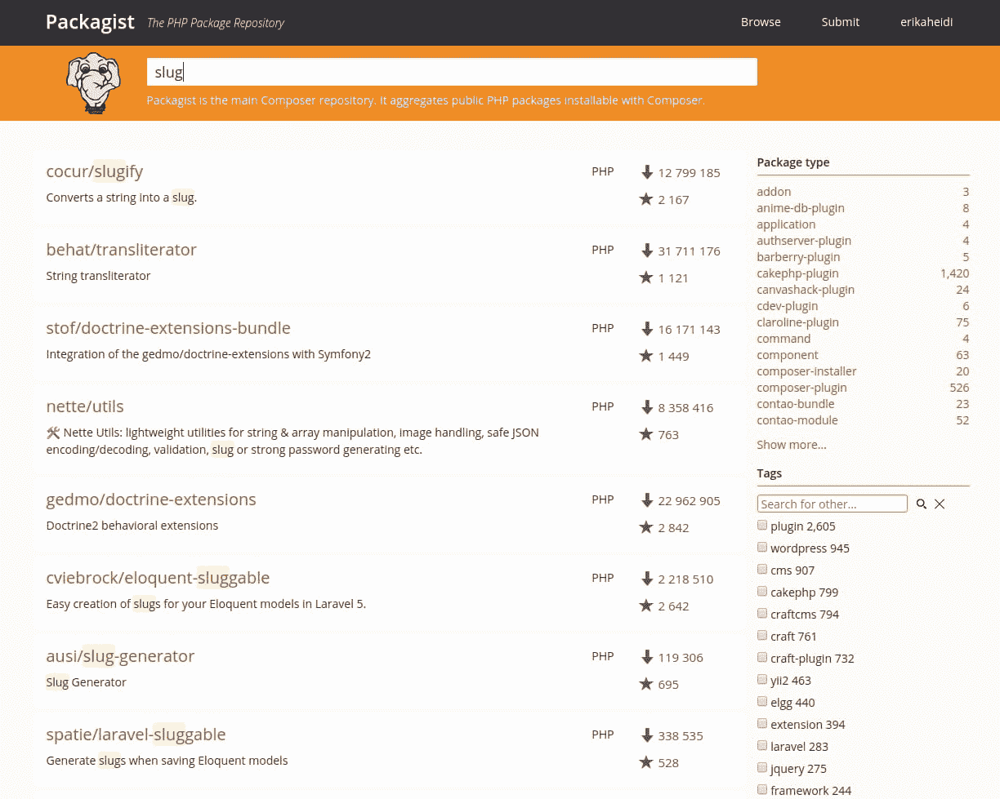

# 如何在 Debian 10 上安装 Composer 5 步[完成] - Eldernode

> 原文：<https://blog.eldernode.com/install-composer-debian-10/>

![How To Install Composer on Debian 10 with 5 Step [complete]](img/8ebb2c55180fd5143bfbe28b5b4979b3.png)

Composer 是一个流行的 PHP 依赖项管理工具，主要用于方便项目依赖项的安装和更新。它将检查一个特定的项目依赖于哪些其他的包，并根据项目需求使用合适的版本为您安装它们。Composer 也常用于引导基于流行 PHP 框架的新项目，如 [Symfony](https://symfony.com/) 和 [Laravel](https://laravel.com/) 。不要错过最强大的 [Linux 主机](https://eldernode.com/linux-hosting/)来享受与您的研究工作。

## 

为了让本教程更好地发挥作用，请考虑以下**先决条件**:

一个拥有 sudo 权限
的非根用户来设置，遵循我们的[Debian 10](https://eldernode.com/initial-setup-with-debian-10/)的初始设置

## 如何用 5 个步骤在 Debian 10 上安装 Composer【完成】

加入我们的指南，开始学习如何在 Debian 10 上安装和使用 Composer。

### 步骤 1:安装依赖项

在下载和安装 Composer 之前，请确保您的服务器已经安装了所有依赖项。

首先，通过运行以下命令更新软件包管理器缓存:

```
sudo apt update
```

现在，让我们安装依赖项。你需要 curl 来下载 Composer 和 php-cli 来安装和运行它。 php-mbstring 包是为您将要使用的库提供函数所必需的。 **git** 由 Composer 用于下载项目依赖项，而 **unzip** 用于提取压缩的包。所有东西都可以用下面的命令安装:

```
sudo apt install curl php-cli php-mbstring git unzip
```

安装了必备组件后，您可以安装 Composer 本身。

### 第二步:下载并安装 Composer

Composer 提供了一个用 PHP 编写的**安装程序**。您将下载它，验证它没有损坏，然后用它来安装 Composer。

确保您在您的主目录中，然后使用 **curl** 检索安装程序:

```
cd ~
```

```
curl -sS https://getcomposer.org/installer -o composer-setup.php
```

接下来，验证安装程序是否与[Composer 公钥/签名][composer-sigs]页面上找到的最新安装程序的 SHA-384 哈希相匹配。从该页面复制散列并将其存储为一个 shell 变量:

```
HASH=48e3236262b34d30969dca3c37281b3b4bbe3221bda826ac6a9a62d6444cdb0dcd0615698a5cbe587c3f0fe57a54d8f5
```

确保用最新的散列值替换上面一行的值。

现在执行下面的 PHP 脚本，验证安装脚本可以安全运行:

```
php -r "if (hash_file('SHA384', 'composer-setup.php') === '$HASH') { echo 'Installer verified'; } else { echo 'Installer corrupt'; unlink('composer-setup.php'); } echo PHP_EOL;"
```

输出

```
Installer verified 
```

如果您看到安装程序损坏了，那么您需要再次下载安装脚本，并再次检查您是否使用了正确的哈希。然后运行命令再次验证安装程序。一旦您有一个经过验证的安装程序，您可以继续。

要全局安装 composer ，请使用以下命令，该命令将 composer 作为名为 composer 的系统级命令下载并安装在 /usr/local/bin 下:

```
sudo php composer-setup.php --install-dir=/usr/local/bin --filename=composer
```

输出

```
All settings correct for using Composer  Downloading...    Composer (version 1.8.6) successfully installed to: /usr/local/bin/composer  Use it: php /usr/local/bin/composer
```

要测试您的安装，请运行:

```
composer
```

输出

```
 ______    / ____/___  ____ ___  ____  ____  ________  _____   / /   / __ \/ __ `__ \/ __ \/ __ \/ ___/ _ \/ ___/  / /___/ /_/ / / / / / / /_/ / /_/ (__  )  __/ /  \____/\____/_/ /_/ /_/ .___/\____/____/\___/_/                      /_/  Composer version 1.8.6 2019-06-11 15:03:05    Usage:    command [options] [arguments]    Options:    -h, --help                     Display this help message    -q, --quiet                    Do not output any message    -V, --version                  Display this application version        --ansi                     Force ANSI output        --no-ansi                  Disable ANSI output    -n, --no-interaction           Do not ask any interactive question        --profile                  Display timing and memory usage information        --no-plugins               Whether to disable plugins.    -d, --working-dir=WORKING-DIR  If specified, use the given directory as working directory.    -v|vv|vvv, --verbose           Increase the verbosity of messages: 1 for normal output, 2 for more verbose output and 3 for debug      . . .
```

这验证了 Composer 已成功安装在您的系统上，并且在系统范围内可用。

***注意* :** 如果您希望在这个服务器上为您托管的每个项目拥有单独的 Composer 可执行文件，那么您可以基于每个项目在本地安装它。NPM 的用户将熟悉这种方法。当您的系统用户没有权限在系统范围内安装软件时，这种方法也很有用。

为此，使用命令PHP composer-setup.php。这会在你当前的目录下生成一个 composer.phar 文件，可以用执行。/composer.phar 命令。

现在让我们看看如何使用 Composer 来管理 PHP 依赖项。

步骤 3:在 PHP 项目中使用 Composer

### PHP 项目通常依赖于外部库，管理这些依赖关系和它们的版本可能会很棘手。Composer 通过跟踪您的依赖项并使其他人易于安装它们来解决这个问题。

为了在您的项目中使用 Composer，您需要一个 **composer.json** 文件。 **composer.json** 文件告诉 composer 它需要为您的项目下载哪些依赖项，以及允许安装每个包的哪些版本。这对于保持项目的一致性和避免安装可能导致向后兼容问题的不稳定版本非常重要。

您不需要手动创建这个文件——这样做很容易遇到语法错误。当您使用 require 命令向项目添加依赖项时，Composer 会自动生成 composer.json 文件。您可以用同样的方式添加其他依赖项，而无需手动编辑该文件。

使用 Composer 将软件包作为依赖项安装到项目中的过程包括以下步骤:

**确定**应用程序需要什么样的库。

**研究**Packagist.org 上合适的开源库，Composer 的官方软件包库。

**选择**你要依赖的包。

运行 composer 要求在 composer.json 文件中包含依赖项并安装软件包。

让我们用一个演示应用程序来尝试一下。

这个应用程序的目标是将一个给定的句子转换成一个 URL 友好的字符串——slug。这通常用于将页面标题转换为 URL 路径(就像本教程中 URL 的最后一部分)。

让我们首先为我们的项目创建一个目录。你将称之为 **slugify** :

现在是时候在 Packagist.org 搜索一个可以帮助我们生成 slugs 的软件包了。如果您在 Packagist 上搜索术语“slug ”,您会得到与此类似的结果:

```
cd ~  mkdir slugify  cd slugify
```




##### 您会在列表中每个包裹的右侧看到两个数字。顶部的数字代表软件包安装的次数，底部的数字显示软件包在 **GitHub** 上被标星的次数。您还可以根据这些数字对搜索结果进行重新排序(在搜索栏的右侧寻找两个图标)。一般来说，安装越多，明星越多的软件包往往越稳定，因为有这么多人在用。检查软件包描述的相关性以确保它是您所需要的也很重要。

你需要一个简单的串-段转换器。从搜索结果来看，包 cocur/slugify 似乎是个不错的搭配，安装量和星级都比较合理。

Packagist 上的软件包有一个供应商名称和一个软件包名称。每个包都有一个惟一的标识符(一个名称空间),格式与 GitHub 用于其存储库的格式相同，都是 vendor/package 格式。您要安装的库使用名称空间 cocur/slugif 。您需要命名空间，以便在项目中需要该包。

现在您已经确切地知道了您想要安装哪个包，运行 composer 需要将它作为一个依赖项包含进来，并为项目生成 composer.json 文件:

输出

```
composer require cocur/slugify
```

从输出中可以看到，Composer 自动决定使用哪个版本的包。如果您现在检查您的项目目录，它将包含两个新文件: composer.json 和 composer.lock ，以及一个供应商目录:

```
Using version ^3.2 for cocur/slugify  ./composer.json has been created  Loading composer repositories with package information  Updating dependencies (including require-dev)  Package operations: 1 install, 0 updates, 0 removals    - Installing cocur/slugify (v3.2): Downloading (100%)           Writing lock file  Generating autoload files
```

ls -l

输出

composer.lock 文件用于存储关于每个包安装了哪些版本的信息，并确保如果其他人克隆您的项目并安装其依赖项时使用相同的版本。 **厂商** 目录是项目依赖所在的目录。 **vendor** 文件夹不需要提交版本控制——你只需要包含 **composer.json** 和 **composer.lock** 文件。

当安装一个已经包含一个 composer.json 文件的项目时，运行 composer install 来下载项目的依赖项。

```
total 12  -rw-r--r-- 1 noodi noodi   59 jul 15 13:53 composer.json  -rw-r--r-- 1 noodi noodi 2952 jul 15 13:53 composer.lock  drwxr-xr-x 4 noodi noodi 4096 jul 15 13:53 vendor
```

`让我们快速看一下版本约束。如果您检查您的 composer.json 文件的内容，您会看到类似这样的内容:`

`输出`

`您可能会注意到 composer.json 中版本号前的特殊字符**。Composer 支持几种不同的约束和格式来定义所需的包版本，以便在保持项目稳定的同时提供灵活性。自动生成的 composer.json 文件使用的脱字符( **^** )操作符是最大互操作性的推荐操作符，遵循**语义版本**。在这种情况下，它将 **3.2** 定义为最低兼容版本，并允许更新到低于 **4.0** 的任何未来版本。**`

```
**`cat composer.json`**
```

`**一般来说，您不需要篡改您的 composer.json 文件中的版本约束。然而，某些情况下可能需要您手动编辑约束——例如，当您所需库的主要新版本发布并且您想要升级时，或者当您想要使用的库不遵循语义版本化时。**`

```
**`{      "require": {          "cocur/slugify": "^3.2"      }  }`**
```

`**以下是一些示例，可以让您更好地理解 Composer 版本约束的工作原理:**`

`****约束** **意为允许的示例版本****`

`**^1.0                                        >= 1.0 < 2.0                1.0, 1.2.3, 1.9.9**`

`**^1.1.0                                     >= 1.1.0 < 2.0             1.1.0, 1.5.6, 1.9.9**`

`**~1.0                                        >= 1.0 < 2.0.0            1.0, 1.4.1, 1.9.9**`

`**~1.0.0                                     >= 1.0.0 < 1.1            1.0.0, 1.0.4, 1.0.9**`

`**1.2.1                                        1.2.1                             1.2.1**`

`**1.*                                           >= 1.0 < 2.0               1.0.0, 1.4.5, 1.9.9**`

`**1.2.*                                        >= 1.2 < 1.3                1.2.0, 1.2.3, 1.2.9**`

`**步骤 4:包括自动加载脚本**`

`**由于 PHP 本身不会自动加载类，Composer 提供了一个自动加载脚本，您可以将它包含在您的项目中以免费获得自动加载。这使得处理依赖关系更加容易。**`

`**在任何类实例化之前，您唯一需要做的事情就是在 php 脚本中包含 vendor/autoload.php 文件。当您添加第一个依赖项时，编写器会自动生成该文件。**`

### `**让我们在应用程序中尝试一下。创建文件test.php并在你的文本编辑器中打开它:**`

`**添加以下代码，该代码引入了 vendor/autoload.php 文件，加载了 **cocur/slugify** 依赖项，并使用它创建了一个 slug:**`

`**test.php**`

`**保存文件并退出编辑器。**`

```
**`nano test.php`**
```

`**现在运行脚本:**`

`**这产生了输出hello-world-this-is-a-long-sentence and I-need-make-a-slug-from it。**`

```
**`<?php  require __DIR__ . '/vendor/autoload.php';  use Cocur\Slugify\Slugify;    $slugify = new Slugify();    echo $slugify->slugify('Hello World, this is a long sentence and I need to make a slug from it!');`**
```

`**当新版本出现时，依赖项需要更新，所以让我们看看如何处理这一点。**`

```
**`php test.php`**
```

`**步骤 5:更新项目依赖关系**`

`**最后，请继续阅读，回顾在 Debian 10 上安装 Composer 的最新步骤。每当您想要将项目依赖项更新到最新版本时，运行 update 命令:**`

`**`这将检查项目中所需库的较新版本。如果发现新版本，并且它与 composer.json 文件中定义的版本约束兼容，composer 将替换先前安装的版本。将更新 composer.lock 文件以反映这些变化。`**`

### `**`您也可以通过如下指定来更新一个或多个特定的库:`**`

`**`因此，在更新了依赖项之后，一定要提交对您的 composer.json 和 composer.lock 文件的更改，这样项目中的任何人都可以访问相同的包版本。`**`

```
**``composer update``**
```

```
**``composer update vendor/package vendor2/package2``**
```

`**`结论`**`

`**`在本文中，您了解了如何在 Debian 10 上安装 Composer。composer 是每个 PHP 开发人员都应该拥有的强大工具。在本教程中，您在 Debian 10 上安装了 Composer，并在一个简单的项目中使用了它。现在，您知道了如何安装和更新依赖项。除了提供一种简单可靠的方法来管理项目依赖，它还为共享和发现社区创建的 PHP 包建立了一个新的事实上的标准。如果你有兴趣阅读更多相关文章，可以找到我们的文章[如何在 Ubuntu 20.04 LTS 上安装 Laravel【完整】](https://blog.eldernode.com/install-laravel-on-ubuntu-20-04-lts/)。`**`

## `**`结论`**`

`**`在本文中，您了解了如何在 Debian 10 上安装 Composer。composer 是每个 PHP 开发人员都应该拥有的强大工具。在本教程中，您在 Debian 10 上安装了 Composer，并在一个简单的项目中使用了它。现在，您知道了如何安装和更新依赖项。除了提供一种简单可靠的方法来管理项目依赖，它还为共享和发现社区创建的 PHP 包建立了一个新的事实上的标准。如果你有兴趣阅读更多相关文章，可以找到我们的文章[如何在 Ubuntu 20.04 LTS 上安装 Laravel【完整】](https://blog.eldernode.com/install-laravel-on-ubuntu-20-04-lts/)。`**`