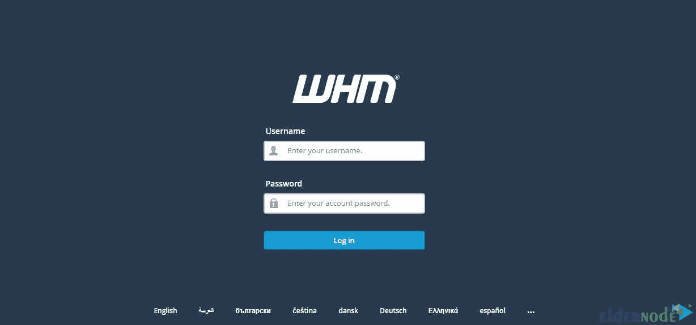
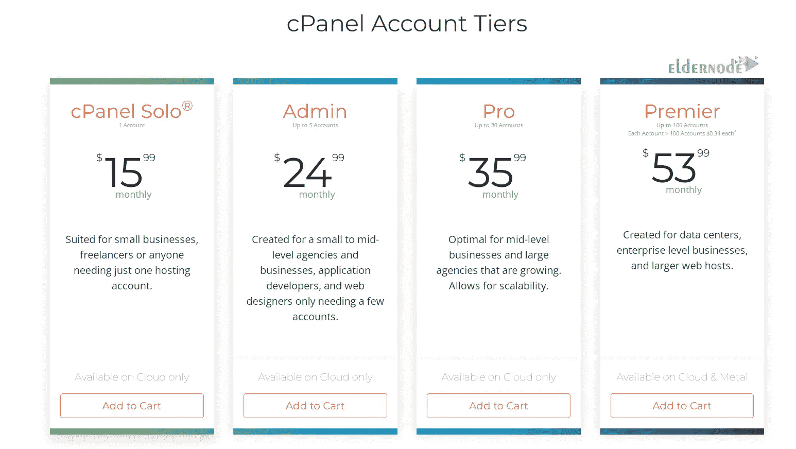

# 如何在 Ubuntu 22.04 - Eldernode 上安装 CPanel

> 原文：<https://blog.eldernode.com/install-cpanel-on-ubuntu-22-04/>


每个主机公司都向他们的客户提供一个控制面板，以简化网站托管，管理电子邮件服务器等。CPanel 是最受欢迎的控制面板之一，允许您在一个地方轻松管理所有服务。本文将教你如何在 Ubuntu 22.04 上安装 CPanel。查看 [Eldernode](https://eldernode.com/) 网站上提供的软件包，购买 [Ubuntu VPS](https://eldernode.com/ubuntu-vps/) 服务器。

## **教程在 Ubuntu 22.04 上安装 CPanel**

### **CPanel 是什么？**

CPanel 是一个基于 Linux 的在线图形界面和网络托管控制面板。你可以使用 CPanel 发布网站、管理域名、组织网页文件、创建电子邮件帐户等等。它有两个界面，包括一个名为 [cPanel](https://blog.eldernode.com/cpanel-and-whm-installation-tutorial/) 的用户界面和一个名为 Web 主机管理器或 WHM 的服务器管理界面。这将允许您管理您的网站，并提供服务器管理工具。

## **在 Ubuntu 22.04 上安装 CPanel**

首先，以 root 用户身份登录到你的 Ubuntu 22.04 服务器。

如果您有一个活动的防火墙，您应该在安装 CPanel 之前使用以下命令禁用并停止它:

```
iptables-save > ~/firewall.rules
```

```
systemctl stop firewalld.service
```

```
systemctl disable firewalld.service
```

现在使用下面的命令更新系统包:

```
sudo apt update
```

```
sudo apt upgrade
```

接下来，您需要在 Ubuntu 22.04 上设置完全合格的主机名。因为 CPanel 需要一个完全合格的 FQDN 域名来安装。要将主机名设置为域名，请输入以下命令:

```
nano /etc/hostname
```

主机名文件打开后，设置新的主机名。然后按 **Ctrl+O** 保存，按 **Ctrl+X** 关闭文件。

在这一步中，打开文件，如下所示:

```
nano /etc/hosts
```

您应该用主机名更改新的 IP 地址:

```
IP_address yourserver.domain.com yourserver
```

如上所述保存并关闭文件。

现在是时候在 Ubuntu 22.04 上安装 CPanel 和 WHM 了。为此，请运行以下命令:

```
cd /home && curl -o latest -L https://securedownloads.cpanel.net/latest && sh latest
```

等待一段时间，直到安装完成。

### **在 Ubuntu 22.04 上访问 WHM/CPanel**

要访问 WHM 网络界面，请打开浏览器并输入以下 URL:

```
http://SERVER_IP:2087
```

在浏览器中打开 [WHM](https://blog.eldernode.com/cpanel-and-whm-installation-tutorial/) 后，您可以使用 root 用户名和密码登录:



### **如何购买并激活 CPanel 许可**

以 root 用户身份登录 WHM 界面后，单击界面顶部试用许可横幅中的购买许可。

现在创建一个 CPanel 商店帐户并登录。



然后，您应该验证您的许可证订单。如果您从 WHM 接口购买许可证，请注意，系统会自动为您的服务器选择许可证类型，并检测要许可的 IPv4 地址。

然后完成支付过程。

最后，您将从 CPanel 商店收到一封确认邮件和一封发票电子邮件。

您可以在 CPanel 网站上检查 CPanel 产品许可证是否是为服务器 IP 购买的，或者是否使用以下 URL:

```
https://verify.cpanel.net/app/verify
```

您将看到许可证生效的日期和时间以及许可证的产品类型。

最后，是时候使用下面的命令激活 ubuntu 服务器上的 CPanel 许可证了:

```
/usr/local/cpanel/cpkeyclt
```

就是这样！

## 结论

CPanel 是管理服务器或配置虚拟主机包的最流行的软件解决方案之一。在本文中，我们教你如何在 Ubuntu 22.04 上安装 CPanel。我希望这篇教程对你有用，并帮助你安装 CPanel。如果您有任何问题或建议，可以在评论区联系我们。