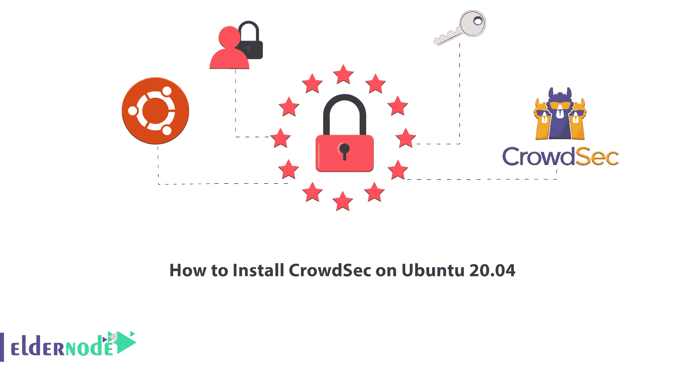

# 如何在 Ubuntu 20.04 - Eldernode 博客上安装 CrowdSec

> 原文：<https://blog.eldernode.com/install-crowdsec-on-ubuntu-20-04/>



CroowdSec 是一个新的安全项目，旨在保护服务器、服务、容器或虚拟机。它允许您主动预防威胁。本文将教你**如何在 Ubuntu 20.04** 上安装 CrowdSec。如果你想购买一台 [**Ubuntu VPS**](https://eldernode.com/ubuntu-vps/) 服务器，你可以查看 [Eldernode](https://eldernode.com/) 网站上提供的软件包。

## **教程在 Ubuntu 20.04 上安装 CrowdSec**

### **什么是 CrowdSec？**

CrowdSec 是一个开源、轻量级、模块化、可插拔的免费安全解决方案，旨在通过服务器端代理保护互联网上的 Linux 服务、服务器、容器或虚拟机。它是用 Golang 写的，是 Fail2ban 的现代化版本。该软件检测本地行为，管理威胁，并通过共享全球识别的 IP 地址与您的用户网络协作。

CrowdSec 解决方案使用基于长期 IP 行为分析引擎的解决方案来检测攻击。检测到任何违规后，会提供各种类型的补救措施来处理违规背后的 IP，此报告由平台管理。如果该报告是合法的，它将在整个 Crowdsec 社区中共享，这样用户就可以针对该 IP 地址保护他们的资产。

### **CrowdSec 功能**

–易于安装和日常操作

–再现性

–可观察性

–以 API 为中心

–行为分析

–网络安全软件

在这篇来自 [Ubuntu 培训](https://blog.eldernode.com/tag/ubuntu/)系列的文章的继续中，我们打算教你如何在 Ubuntu 20.04 上安装 Crowdsec。

## **在 Ubuntu 20.04 上安装 CrowdSec**

在本节中，您将学习如何在 Ubuntu 20.04 上安装 CrowdSec。只需按照下面的步骤，在你的 Ubuntu 20.04 系统上输入命令。

首先，您应该打开您的终端并输入以下命令来**下载 Crowdsec** :

```
curl -s https://packagecloud.io/install/repositories/crowdsec/crowdsec/script.deb.sh | sudo bash
```

现在**使用以下命令更新您的系统包**:

```
sudo apt-get update
```

您可以通过运行以下命令来安装 Crowdsec :

```
sudo apt-get install crowdsec
```

## 常见问题解答

[sp _ easy agreement]

## 结论

CrowdSec 软件允许您识别具有恶意行为的人，并阻止他们在不同级别访问您的系统。您可以选择要保护的方案，也可以添加新的自定义方案。在本文中，我们教你如何在 Ubuntu 20.04 上安装 Crowdsec。我希望这篇教程对你有用，并且你喜欢它。