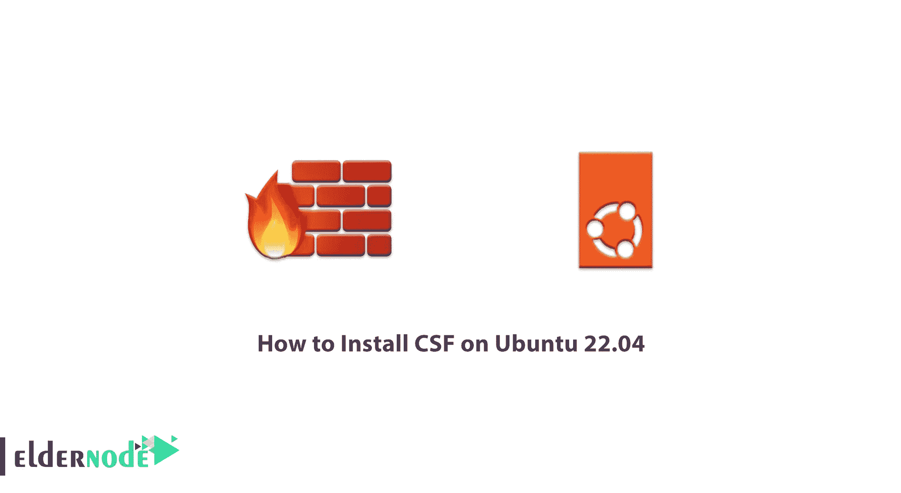

# 如何在 Ubuntu 22.04 上安装 CSF 顶法] - Eldernode 博客

> 原文：<https://blog.eldernode.com/install-csf-on-ubuntu-22-04/>



CSF 是一个非常强大的免费软件防火墙，由 the Way 向 Web 团队发布，并提供给公众。您可以通过安装 CSF(配置服务器防火墙)来保护您的服务器。这种防火墙是一种流行的服务器安全工具。在本文中，我们将一步一步地向您展示如何在 Ubuntu 22.04 上安装 CSF。如果你想购买一台 **[Ubuntu VPS](https://eldernode.com/ubuntu-vps/)** 服务器，你可以查看 [Eldernode](https://eldernode.com/) 网站上提供的软件包。

## **教程在 Ubuntu VPS 上安装 CSF**

### **什么是 CSF？**

CSF 或配置服务器防火墙是一个免费的软件防火墙，可以很容易地安装在 Redhat，CentOS 和 Ubuntu 服务器上。要提高此服务的效率，您必须在安装后对其进行配置。防火墙会自动扫描您的服务器和控制面板，并在**检查服务器安全性**部分显示漏洞。

CSF 的用途是在服务器用户和 Linux 防火墙核心之间配置和建立一个简单的连接，这个连接就是 **iptables** 。因此，专家认为 CSF 是配置 **iptables** 的脚本。

### **在 Ubuntu 22.04 上安装 CSF 的先决条件**

–>一台可与 [Ubuntu](https://blog.eldernode.com/tag/ubuntu/) 18.04、20.04、22.04 和任何基于 Debian 的发行版配合使用的服务器。

–>作为非 rooted sudo 用户或访问 root 用户。

–>使用新安装的操作系统。

## **在 Ubuntu 22.04 上安装 CSF**

首先**更新您的系统**包:

```
sudo apt update 
```

```
sudo apt upgrade
```

现在**从 CSF 官方网站下载最新的 CSF** 存档源代码:

```
wget http://download.configserver.com/csf.tgz
```

解压下载文件后，**运行安装脚本**:

```
tar -xvzf csf.tgz 
```

```
cd csf 
```

```
sudo bash install.sh
```

要在您的系统上安装所需的 **iptables** 模块，请运行以下命令:

```
sudo perl /usr/local/csf/bin/csftest.pl
```

然后你会看到下面的**输出**:

```
RESULT: csf should function on this server
```

现在**根据以下命令配置 CSF** :

```
nano /etc/csf/csf.conf
```

根据您的需要，您可以在下面一行中进行更改:

```
TESTING = "0"  RESTRICT_SYSLOG = "3"  TCP_IN = "20,21,22,25,53,80,110,143,443,465,587,993,995"
```

```
# Allow outgoing TCP ports  TCP_OUT = "20,21,22,25,53,80,110,113,443,587,993,995"
```

```
# Allow incoming UDP ports  UDP_IN = "20,21,53,80,443"
```

```
# Allow outgoing UDP ports  # To allow outgoing traceroute add 33434:33523 to this list  UDP_OUT = "20,21,53,113,123"
```

```
# Allow incoming PING. Disabling PING will likely break external uptime  # monitoring  ICMP_IN = "1"
```

保存文件后，使用以下命令重新启动 CSF:

```
csf -r 
```

```
csf -l
```

然后你会看到下面的**输出**:

```
iptables mangle table
```

```
Chain PREROUTING (policy ACCEPT 55 packets, 3332 bytes)  num pkts bytes target prot opt in out source destination
```

```
Chain INPUT (policy ACCEPT 48 packets, 3054 bytes)  num pkts bytes target prot opt in out source destination
```

```
Chain FORWARD (policy ACCEPT 0 packets, 0 bytes)  num pkts bytes target prot opt in out source destination
```

```
Chain OUTPUT (policy ACCEPT 24 packets, 15822 bytes)  num pkts bytes target prot opt in out source destination
```

```
Chain POSTROUTING (policy ACCEPT 24 packets, 15822 bytes)  num pkts bytes target prot opt in out source destination
```

```
iptables raw table
```

```
Chain PREROUTING (policy ACCEPT 51 packets, 3321 bytes)  num pkts bytes target prot opt in out source destination
```

```
Chain OUTPUT (policy ACCEPT 24 packets, 15966 bytes)  num pkts bytes target prot opt in out source destination
```

```
iptables nat table
```

```
Chain PREROUTING (policy ACCEPT 12 packets, 1410 bytes)  num pkts bytes target prot opt in out source destination
```

```
Chain INPUT (policy ACCEPT 0 packets, 0 bytes)  num pkts bytes target prot opt in out source destination
```

```
Chain OUTPUT (policy ACCEPT 1 packets, 69 bytes)  num pkts bytes target prot opt in out source destination
```

```
Chain POSTROUTING (policy ACCEPT 1 packets, 23 bytes)  num pkts bytes target prot opt in out source destination
```

然后我们进入 CSF 网络界面。为此，首先用以下命令**编辑原始 CSF 配置文件**:

```
nano /etc/csf/csf.conf
```

然后添加以下几行:

```
#Enable Web UI  UI = "1"
```

```
#Listening Port  UI_PORT = "8080"
```

```
#Admin username  UI_USER = "admin"
```

```
#Admin user password
```

```
UI_PASS = "your-password"
```

```
#Listening Interface  UI_IP = ""
```

然后**保存**该文件，并根据以下命令进行编辑:

```
nano /etc/csf/ui/ui.allow
```

现在**添加您的服务器 IP** 和远程机器 IP:

```
your-server-ip
```

```
remote-machine-ip
```

保存文件后，**重启 CSF 和 LFD** 服务以应用更改:

```
csf -r
```

```
service lfd restart
```

最后搜索服务器的 IP 地址，然后从浏览器中搜索**端口 8080** :

```
http://your-server-ip:8080
```

## 结论

在本文的开头，我们首先向您介绍了 CSF。这样，您的服务器通过在 Ubuntu 22.04 上安装和配置 CSF 来保护，防火墙会自动扫描您的服务器和控制面板。谢谢你加入我们。如果您有任何疑问或问题，请通过评论部分联系我们。