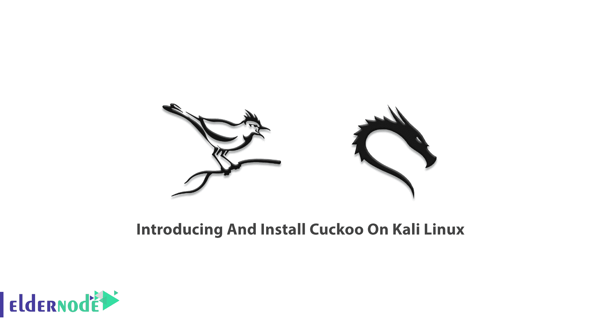

# Kali Linux - Eldernode 博客上布谷鸟的介绍和安装

> 原文：<https://blog.eldernode.com/install-cuckoo-on-kali-linux/>



布谷鸟沙盒是一个免费和开源的自动化恶意软件分析系统。它为您提供了您认为可疑的文件的详细报告。此外，它不仅检测和删除恶意软件工件，还检查入侵的背景、动机和目标。布谷鸟沙盒软件自动分析 [Windows](https://blog.eldernode.com/tag/windows/) 、macOS、Linux、Android 下的任何恶意文件。在本文中，我们将向您介绍在 Kali Linux 上介绍并安装 Cuckoo 的**。如果你找不到合适的 [Linux VPS](https://eldernode.com/linux-vps/) ，那么 [Eldernode](https://eldernode.com/) 上的可用软件包将帮助你购买一个来开始使用你自己的 VPS。**

## **介绍如何在 Kali Linux 上安装布谷鸟**

### **杜鹃是什么？**

布谷鸟是在 GPLv3 的许可下。当您阅读以上内容时，Cuckoo 了解在潜在受害者的机器上执行可疑文件时的行为。两台不同机器的分析也是有可比性的。由于它在包含的虚拟环境中运行恶意文件，因此标签为“**沙箱**”。

### **沙盒是什么？**

不可信的、未知的或未经测试的程序或代码正在计算机安全中运行。虚拟环境中的程序，而不会使您的主机或操作系统面临风险。它叫做**沙箱**。使用 Cuckoo 允许您在一个隔离的环境中运行一个未知的、不可信的应用程序或文件，并分析其行为。

### **关于布谷鸟沙盒的一切**

**分析生成一份报告，对数据的“恶意性”进行评分**。报告包括基本文件信息的详细信息，如大小、类型和哈希。所有的行动，恶意项目采取时，激活，截图，和任何丢弃的文件将被描述的签名。

为了满足你的研究需求，你可以**建立一个虚拟环境**。您可以配置 Cuckoo 与各种虚拟化环境一起工作，这些环境可以运行带有任何操作系统和软件的虚拟机。必须安装所有软件，但是一些虚拟机构建者可以自动安装您拥有许可证的软件包。

您可以**定制**您的沙箱，并选择您的虚拟机是否更新 Windows、使用防病毒软件或使用防火墙。然而，你的系统越脆弱，对恶意软件的研究就越有利。此外，您可以决定是否将文件发送到 VirusTotal 进行分析。

### **杜鹃特征**

作为一个高级的、高度模块化的、开源的自动恶意软件分析系统，Cuckoo 有几项能力。

**Cuckoo** 能够分析不同的恶意文件，如可执行文件、office 文档、pdf 文件、电子邮件等。

**Cuckoo** 即使使用 SSL/TLS 加密，也会转储和分析网络流量。对于本地网络，路由支持丢弃所有流量，或者通过 InetSIM、网络接口或 VPN 进行路由。

**Cuckoo** 通过易失性以及使用 YARA 在进程内存粒度上对受感染的虚拟化系统执行高级内存分析。

Cuckoo 跟踪 API 调用和文件的一般行为，并将其提取为任何人都能理解的高级信息和签名。

此外，为了让最终用户更容易使用这些结果，Cuckoo 能够处理它们并生成不同类型的报告。下面的列表是它的意思:

*   JSON 报告
*   HTML 报告
*   MAEC 报告
*   MongoDB 接口
*   HPFeeds 接口

### **恶意软件分析**

布谷鸟是一个动态的恶意软件分析工具。恶意软件分析有两种类型。**静态恶意软件分析**和**动态恶意软件分析。**

分析恶意软件而不实际运行它是静态恶意软件分析。它考虑了文件名、MD5 校验和或哈希、文件类型、文件大小以及防病毒检测工具的识别等功能。

通过实际运行来分析恶意软件是动态恶意软件分析。它会分析它的行为，比如 API 调用、内存使用、网络流量等等。

## **如何在卡莉 Linux 上安装布谷鸟**

在 Kali Linux 上安装 Cuckoo 非常简单，只需运行以下命令。

```
sudo apt-get install cuckoo
```

现在，Cuckoo 安装了它所依赖的任何包。

要安装其依赖项，请键入:

```
sudo apt-get install
```

## **结论**

在本文中，向您介绍了 Cuckoo，您学习了如何在 Kali Linux 上安装 Cuckoo。您可以轻松地定制分析环境、分析结果处理和报告阶段的任何方面。所有需求都由布谷鸟轻松提供。因此，您可以轻松地将沙盒集成到您现有的框架和后端，以您想要的方式，以您想要的格式，所有这些都没有许可要求。如果你对这个主题感兴趣，多读一些 Kali Linux 和[安全](https://blog.eldernode.com/tag/security/)教程