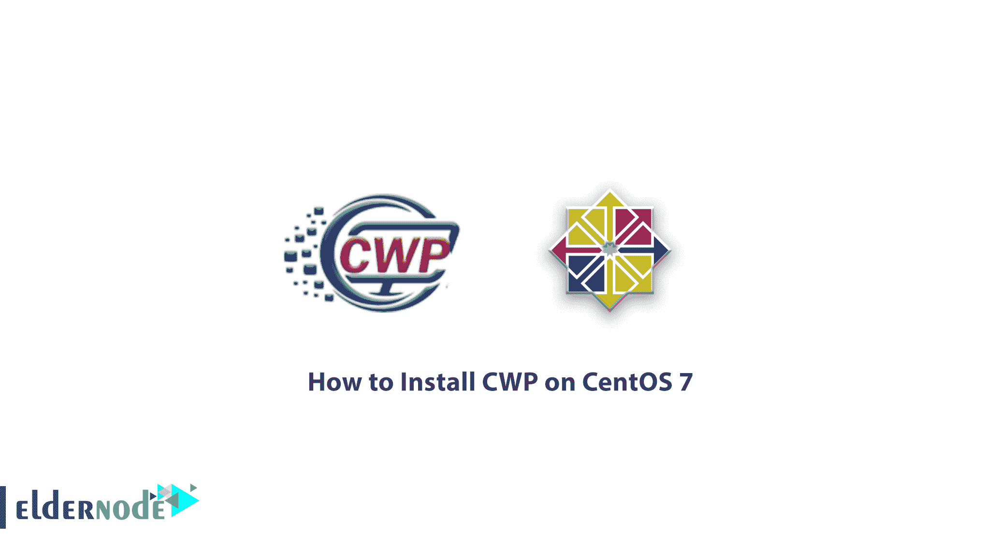

# 如何在 CentOS 7 - Eldernode 博客上安装 CWP

> 原文：<https://blog.eldernode.com/install-cwp-on-centos-7/>



了解如何在 CentOS 7 上逐步安装 CWP。CWP 控制面板是 CentOS Web Panel 的缩写，CentOS Web Panel 是免费的控制面板之一，用于虚拟主机和轻松管理 [VPS 服务器](https://eldernode.com/vps/)或[专用服务器](https://eldernode.com/dedicated-server/)。CWP 在您的面板中提供了许多服务器管理功能。这个控制面板自动安装所有需要的软件包，如 HTTP 服务器、PHP、数据库服务器、邮件服务器等。托管网站并允许在面板中管理它们。在本文中，我们试图教你如何在 CentOS 7 上安装 CWP。您可以访问 [Eldernode](https://eldernode.com/) 中提供的包来购买 [CentOS VPS](https://eldernode.com/centos-vps/) 服务器。

## 教程如何在 CentOS 7 上安装 CWP

### CWP 控制面板介绍

使用主机管理控制面板，您不必通过命令来执行所有操作，您可以使用基于 web 的工具来管理主机。与其他主机面板一样，CWP 面板有一个用于服务器控制的管理部分，可以通过端口 2030 和 2031 进行访问。这个强大的面板，除了为服务器管理员提供的托管功能外，还将为用户提供其他管理工具来管理和配置服务器，这是这个面板的一个优点。除了全面安装[灯](https://blog.eldernode.com/how-to-install-lamp-on-ubuntu-20-04/)，CWP 还安装了[清漆](https://blog.eldernode.com/install-varnish-apache-centos/)缓存系统。正因如此，这个有趣的特性可以被认为是这个免费面板的一个优越因素。

### Centos Web Panel (CWP)有什么特点？

如前所述，CWP 是一个安装在 Centos Linux 操作系统上的免费控制面板。该控制面板最全面的特点是将 LAMP 完全安装在服务器上。你可以在下面看到其中的一部分。可由控制面板默认安装并可为您配置的项目:

**A.** Apache Web 服务器(Mod 安全+自动更新规则可选)

**B.** PHP 5.6 (suPHP，SuExec + PHP 版本切换器)

**c .**MySQL/Maria db+phpMyAdmin

**d .**Postfix+Dovecot+round cube webmail(防病毒、Spamassassin 可选)

**E.** CSF 防火墙

**F.** 文件系统锁定(不再有网站黑客入侵，您的所有文件都被锁定以防更改)

**G.** 备份(可选)

**H.** 服务器配置自动修复

**可以作为第三方安装和配置的软件包括:**

**1。** CloudLinux + CageFS + PHP 选择器

**2。**软软的

**3。**脚本安装程序(免费和高级)

**4。** LiteSpeed 企业([网络服务器](https://blog.eldernode.com/setup-a-web-server-with-a-cwp/)

***注:*** 需要注意的是，本软件的部分功能需要购买许可证，不能免费激活。

在安全部分，CSF 将被自动安装。默认情况下，防止 DDOS 攻击的现有插件也将安装在您的服务器上。

### CWP 有什么好处？

在本文的后续部分，我们将讨论 web 服务器、CWP 面板、PHP、帐户管理、安全特性和数据库的好处。

#### 网络服务器的优势

**1。**支持清漆缓存，网站加载速度提高 3 倍

**2。**完全支持 Nginx 反向代理

**3。**从源代码编译 Apache，将 web 服务器性能提高 15%

**4。**只需一次点击即可安装 Apache 模块

**5。**显示 Apache 性能状态

**6。**能够编辑 Apache 设置、主机、虚拟主机

7 .**。**能够一键刷新和更新所有主机

**8。**使用 SuExec 和 SuPHP 提高安全性

**9。**安装和支持 ApacheTomCat 8 的能力

10。防御拒绝服务攻击

**11。**自动安装和调整 Spamhaus RBL，以保护和提高上传、发布和连接方法的安全性

**12。**支持 Perl CGI 脚本

#### CWP 面板的优势

**1。**设置服务器为多个网站提供服务

**2。**拥有各种 API，用于管理账户、连接 WHMCS 和支付系统的简单设置

**3。**支持 NAT -ed

**4。**免费托管及相关模块

#### PHP 的好处

**1。**从源头编译，系统效率提升 20%

**2。能够安装 PHP 切换器和 PHP 选择器，并支持所有 PHP 版本**

**3。**有 PHP 编辑器

**4。**已经。ini 生成器

**5。**一键安装多个 PHP 插件的能力

**6。** Ini 对每个账户的分配及其定制能力

**7。**支持视频媒体网站的 FFMPEG

**8。**支持 ioncube 和 php-imap

#### 账户管理的好处

**1。**能够添加、删除和编辑用户

**2。**完成账户监控

**3。**外壳管理访问

**4。**使用配额和信息节点管理用户限制

**5。**能够限制每个账户的流程

**6。**能够限制每个帐户的运行文件数量

**7。**用户可以完全访问 FTP 和具有全部功能的文件管理器

**8。**为每个账户分配 IP 的能力

#### CWP 的安全特征

**1。**使用 CSF 防火墙

**2。**有一个专用的 SSL 生成器

**3。**支持 Letsencrypt

**4。**用 CSF / LDF 保护免受暴力攻击

**5。**限制一般流程

**6。**防御 DOS 和 DDOS 攻击

7 .**。**自动备份

**8。**保护和显示 PHP 进程

**9。**所有账户的 AutoSSL 配置

#### CWP 数据库的优势

**1。**完整的 MySQL 管理

**2。**能够添加远程和本地用户

**3。**实时监控数据库

**4。**自动安装 phpMyAdmin 来管理数据库

**5。**能够安装和支持 PostgreSQL 和 pgAdmin

**6。**支持 MySQL remote

**7。**MongoDB 的安装和支持

### 在 CentOS 7 上安装 CentOS Panel Web 的先决条件

**–**采用 CentOS 7 操作系统的 VPS

**–**"**一个**"类型的 DNS 记录，根据您想要使用的 [FQDN](https://en.wikipedia.org/wiki/Fully_qualified_domain_name) 显示您的服务器的 IP 地址。**例如**，记录一条，命名为*的 eldernode.com*域，是指*的 test.eldernode.com**域**的 域。*

**–**32 位系统所需的最低内存是 512 MB。对于 64 位系统，您还需要 1 GB 的 RAM 和 10 GB 的可用空间。

**–**仅支持静态 IP 地址。不支持动态、粘性和内部 IP 地址。

***注意:*** 只在新安装的 CentOS 7 上安装 CWP，不做任何配置更改。

## 如何在 CentOS 7 上配置和安装 CWP

在本文中，我们将在 CentOS 7 本地服务器上安装 CWP，静态 IP 地址为 **192.168.0.104** ，主机名为【cwp.eldernode.com】T2。在本教程的后续部分，请跟随我们完成第一步，即如何设置主机名。

### 如何设置主机名

第一步，您需要以 root 用户身份登录 CentOS 7 服务器，并确保主机名得到正确验证。请注意，主机名和域名应该是不同的。例如，如果 eldernode.com 是你的域名，使用 hostname.eldernode.com 作为你的 FQDN。

```
# hostnamectl set-hostname cwp.eldernode.com
```

```
# hostnamectl
```

### 如何配置 IP 地址服务器

安装 CWP 的第二步是网络配置。在本教程中，我们将使用 nmtui 工具，它代表 NetworkManager 文本用户界面。NMTUI 通过网络管理器控件为网络配置提供了一个图形界面。

```
# yum install NetworkManager-tui
```

```
# nmtui
```

## 在 CentOS 7 上设置 CWP

为了能够安装 wget 工具来获得 CWP 安装脚本，您需要首先更新服务器。因此，您可以使用以下命令将服务器更新到最新版本。执行以下命令后，安装过程开始。请注意，此过程可能需要几分钟时间。

```
# yum -y update
```

```
# yum -y install wget
```

```
# cd /usr/local/src
```

```
# wget http://centos-webpanel.com/cwp-el7-latest
```

```
# sh cwp-el7-latest
```

如果下载链接不起作用，您可以使用以下方法:

```
http://dl1.centos-webpanel.com/files/cwp-el7-latest
```

成功安装 CWP 后，将您在页面上看到的信息复制到一个安全的地方，以便以后需要时可以访问。

现在是时候使用以下命令重启系统了:

```
# reboot
```

### 在 CentOS 7 中配置 CentOS Web 面板

要在 CentOS 7 中配置 CWP 设置，您必须首先以 root 用户身份登录服务器。

成功登录后，您将在第一页看到已登录用户的信息。您还可以查看其他信息，如使用的磁盘空间量。

最后，您可以使用上一步中安装程序提供的链接轻松登录 CentOS Web Panel 服务器。

```
CentOS WebPanel Admin GUI: http://SERVER-IP:2030/  Username: root  Password: your root password
```

## 结论

CWP 有许多功能，除了免费的工具和服务，它还支持大多数商业服务。在安装过程中，该面板默认安装 LAMP 堆栈以及电子邮件服务和其他托管要求，并且能够提供完整的服务而无需额外设置。尽管 CWP 控制面板是免费的，但它现在已经成为商业控制面板的主要竞争对手。这个面板的较新版本也能够完全安装和运行 Cloudlinux。它还支持其他 Cloudlinux 特性，如 PHP 选择器、MySQL 调控器、CageFS。在本文中，我们试图教你如何在 CentOS 7 上安装和配置 CWP。