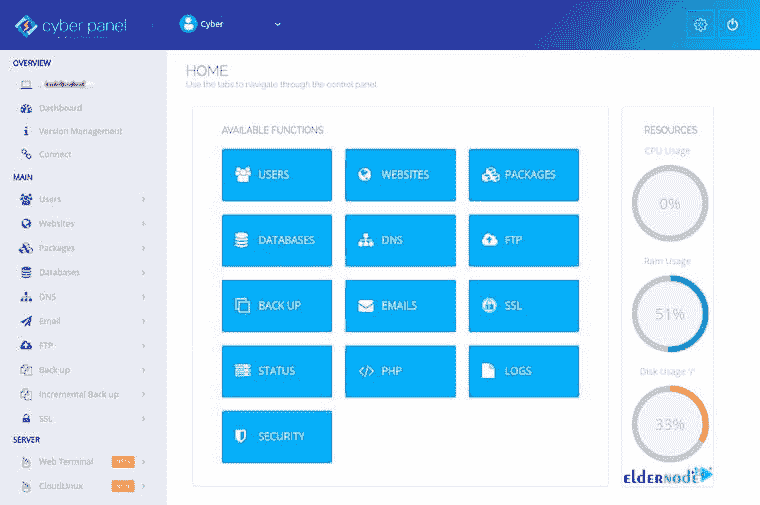
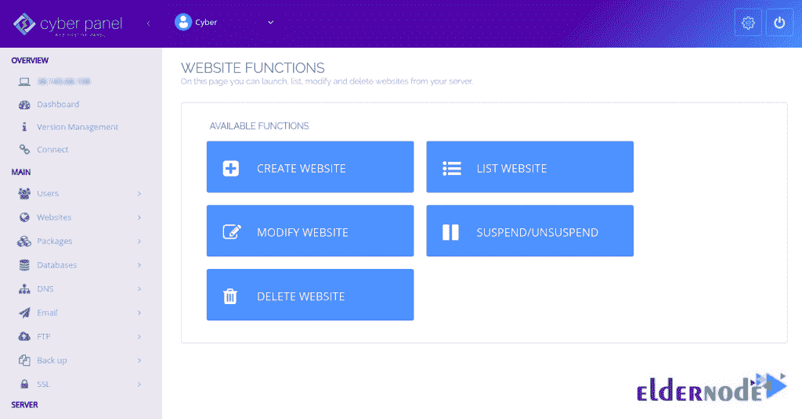

# 在 CentOS 7 - Eldernode 博客上介绍和安装 CyberPanel

> 原文：<https://blog.eldernode.com/install-cyberpanel-on-centos-7/>


CyberPanel 是一个由 OpenLiteSpeed 支持的开源免费网络托管控制面板。它让 CyberPanel 可以利用 OpenLiteSpeed 的优势，而不仅仅是传统的 web 服务器，因为它有助于减少资源使用，从而提高性能。这就是 CyberPanel 不同于其他控制面板的原因。Cyberpanel 有免费版和企业版。免费版使用 OpenLiteSpeed，企业版使用 LSWS。本文将在 CentOS 7 上介绍并安装 cyber panel**。此外，要完成本指南，请购买您自己的 [CentOS VPS](https://eldernode.com/centos-vps/) ，同时获得支持、高质量和最优惠的价格。**

为了让本教程更好地发挥作用，请考虑以下**先决条件**:

_ [CentOS](https://blog.eldernode.com/tag/centos/) 7 (64 位)服务器，内存至少为 2 GB。

_ 拥有 Sudo 权限的非 root 用户。

_ 访问命令行。

yum 包管理器，默认包含。

## **在 CentOS Linux 上引入并安装 cyber panel**

CyberPanel 是下一代主机控制面板。免费版本的 CyberPanel 附带了 [OpenLite Speed](https://blog.eldernode.com/install-openlitespeed-centos-8/) 对无限数量的域和工作进程是免费的。但是 CyberPanel 企业版附带的 LiteSpeed 网络服务器企业版只对一个域免费。为了自动安装 OpenLiteSpeed、LSCache、 [WordPress](https://blog.eldernode.com/tag/wordpress/) 、Prestashop、Joomla 和 git，CyberPanel 提供了一个一键式安装程序。此外，CyberPanel 具有丰富的功能，包括 Docker 支持、AutoSSL、备份和恢复、CSF 防火墙、Git、多个 PHP 等等。使用 CyberPanel 可以减少设置主机的时间，因为它可以自动完成邮件服务和 DNS 等组件的初始设置。在下一节中，我们将介绍 CyberPanel 的重要特性。请加入我们。

### **CyberPanel 功能**

CyberPanel 允许你根据你的站点需求选择 PHP 版本。任何时候你想把一个旧网站转移到新的托管环境，不要忘记使用 CyberPanel。然而，这两个版本都有一些特点。以下是他们的名单。

WordPress、Joomla 和 Prestashop 的自动安装程序

2-通过 Git webhooks 附加和部署 Git repo

3-让我们加密 SSL 安装程序，以便轻松获得您的域的 SSL 证书

4-内置 DNS 和电子邮件服务器功能，可托管您自己的 DNS 区域。电子邮件帐户和轻量级 DNS 服务器

5-防火墙和 SpamAssassin 管理帮助保护您的服务器

6-如果您只有 shell 访问权限，可以使用命令行界面与 CyberPanel 交互

优化虚拟主机企业家的预算

8-不同级别的用户

9- FTP 服务器

10- [PHPMyAdmin](https://blog.eldernode.com/phpmyadmin-debian-10/)

11-文件管理器

12-一键式备份和恢复

13- LSCache 缓存系统

14-与 Apache 重写规则兼容

15-无限制的工作进程

16-多个 PHP

17- Brotli 压缩

18-已经支持 TLS v1.3 版

19-反 DDOS

20- Mod_security

21- ReCaptcha 保护

22-高可用性

23-简易 GUI 面板显示

在下一节中，请加入我们，教您如何在 CentOS 7 上安装 CyberPanel。

## **如何在 CentOS 7 | CentOS 8** 上安装 CyberPanel

CyberPanel 被完整地介绍给你，它的显著特征也被提及。现在，让我们浏览一下本指南的步骤，并回顾一下 CentOs 7 上的 CyberPanel 安装。

第一步:

首先，**更新**安装在您系统上的软件包。所以，运行:

```
yum update -y
```

第二步:

由于 CyberPanel 是免费的，您不必准备任何类型的许可证，您可以使用以下命令安装它:

```
sh <(curl https://cyberpanel.net/install.sh || wget -O - https://cyberpanel.net/install.sh)
```

一旦你看到下面的输出，输入 **1** 并按**回车:**

———————————————

CyberPanel Installer v2.0

1.安装网络面板。

2.安装插件。

3.退出。

请输入数字[1-3]:

———————————————

然后，您将看到如下内容:

———————————————

CyberPanel Installer v2.0

内存检查:71/487MB (14.58%)

磁盘检查:1/20GB (7%)(最小 10GB 可用空间)

1.用 OpenLiteSpeed 安装 CyberPanel。

2.用 LiteSpeed Enterprise 安装 Cyberpanel。

3.退出。

请输入数字[1-3]:

———————————————

输入 **1** 并再次按下**输入**。

第三步:

在这一步，安装程序会提示您选择一个版本的 [MariaDB](https://blog.eldernode.com/whats-mariadb-how-it-works/) 进行安装。选择 MariaDB 1.0，因为它是该面板唯一官方支持的版本。

对于接下来的六个提示，选择 *y* 。它将看起来如下:

```
Mirror server network is optimized for Asia Pacific region...    If you experience very slow download speed during installation, please try use mirror server on clean system...    Use mirror server [y/N]: y
```

```
Replace JS/CSS files to JS Delivr?    This may improve panel loading speed in Asia Pacific region...    Please select [y/N]: y
```

```
Install Memcached extension for PHP?    Please select [y/N]: y    Install LiteSpeed Memcached?    Please select [y/N]: y    Install Redis extension for PHP?    Please select [y/N]: y
```

```
Install Redis?    Please select [y/N]: y
```

这样，CyberPanel 就和它的扩展一起被安装了。安装程序将输出您的管理员详细信息:

```
CyberPanel Successfully Installed
```

```
Current Disk usage : 3/20GB (16%)
```

```
Current RAM usage : 233/487MB (47.84%)
```

```
Installation time : 0 hrs 3 min 24 sec
```

```
Visit: https://(YOUR_SERVER_IP):8090
```

```
Panel username: admin
```

```
Panel password: 1234567
```

```
Mysql username: root
```

```
Mysql password: iPe2cEiSh7wEn7
```

```
Please change your default admin password If you change mysql password, please modify file in /etc/cyberpanel/mysqlPassword with new password as well
```

```
Website : https://www.cyberpanel.net
```

```
Forums : https://forums.cyberpanel.net
```

```
Wikipage: https://docs.cyberpanel.net 
```

```
Enjoy your accelerated Internet by CyberPanel & OpenLiteSpeed
```

### **如何在 CentOS 7** 上访问 CyberPanel

要查看管理员登录，请在 CyberPanel 端口访问您的服务器 IP 地址，(Your_Server_IP):8090。输入用户名 **admin** 和密码 **1234567** 。然后点击名称“**赛博潘**”旁边的**用户菜单**箭头。选择“**编辑个人资料**”。在“**修改用户**页面的下拉菜单中选择**管理员**。

现在，建议您相应地更改名字、姓氏、电子邮件地址和密码。

### **如何在电脑面板上配置防火墙**

防火墙规则定义了允许或阻止何种类型的互联网流量。您可以验证操作系统防火墙和 Vultr 防火墙在以下端口上对入站和出站都是开放的:

1_ 网络面板的 TCP: 8090

2_ 网络服务器的 TCP: 80、TCP: 443 和 UDP: 443

3 _ TCP 的 TCP: 21 和 TCP: 40110-40210

4_ 邮件服务的 TCP: 25、TCP: 587、TCP: 465、TCP: 110、TCP: 143 和 TCP: 993

5_ 用于 DNS 服务的 TCP: 53 和 UDP: 53


### **如何在 CentOS 上使用 cyber panel**

当安装过程完成后，您就可以开始使用这个托管控制面板及其所有出色的功能了。首先，打开你的浏览器，输入网址 https://your-ip-address:8090。您将被重定向到以下页面，以便**登录 CyberPanel** :


现在，您必须提供您的默认管理员用户名和密码，并点击**登录**按钮。然后，您应该会在下面的屏幕上看到 **CyberPanel 仪表盘**:



要创建您的第一个**网站**，点击**网站**按钮。因此，您将看到如下屏幕:



现在，你可以通过点击**创建网站**按钮**创建一个新网站**。因此，您将看到以下屏幕:


在这一步中，您可以提供所有必需的信息，如所有者、网站名称、电子邮件、PHP 版本，然后单击**创建网站**按钮。接下来，如果网站创建成功，您可以看到下面的屏幕。


最后，要查看您的网站，如下图所示，请点击左侧窗格中的**列表网站**。


接下来，打开你的网络浏览器，输入网址 http://test.Eldernode.com。您应该会在以下屏幕上看到新创建的网站:


就是这样！如果您已经仔细通过了上述所有步骤，CyberPanel 应该安装在您的 CentOS 7 VPS 上。所以，不要等待和使用 CyberPanel 托管无限数量的网站。

## 结论

在本文中，将向您介绍 CyberPanel，您将了解如何在 CentOs 7 上安装 CyberPanel。由于虚拟主机控制面板是这项业务的主要部分之一，您可以轻松地在您的 Eldernode droplets 上设置站点，并自动将它们备份到 Eldernode Spaces。让你的朋友知道你在[老年人社区](https://community.eldernode.com/)使用的任何替代品。