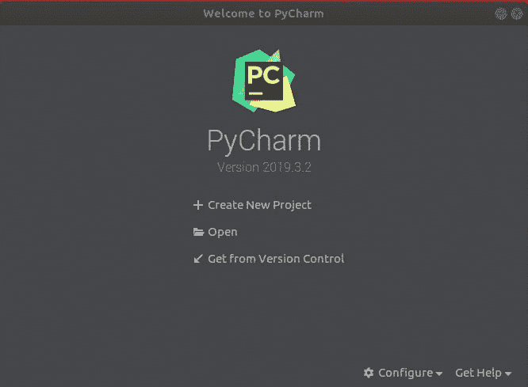

# 教程在 Ubuntu 20.04 和 21.04 上安装开发工具

> 原文：<https://blog.eldernode.com/install-development-tools-on-ubuntu/>


当您想要从源代码安装软件包或编译软件时，您将需要开发工具和库。此外，开发人员需要在 Linux 系统中构建包。开发工具包含所有必要的应用程序，如 GCC、g++、make、libc6-dev 和 dpkg-dev 包。根据您的 Linux 发行版，这些工具可以以不同的方式安装。加入我们来回顾一下**教程在 Ubuntu 20.04 & 21.04** 上安装开发工具。在 [Eldernode](https://eldernode.com/) 上有各种有趣的软件包，看看并订购自己的 [Ubuntu VPS](https://eldernode.com/ubuntu-vps/) 主机。

## **在 Ubuntu 上安装开发工具 20.04&21.04**

在本文中，您将学习如何在 Ubuntu 上安装开发工具组。您可以通过两种方式安装开发人员工具，一个接一个地安装，或者一次全部安装。为了使它更容易，我们将向您展示如何一次性安装它。

### **在 Ubuntu 上安装开发工具的先决条件**

为了让本教程更好地工作，请考虑以下先决条件:

_ 拥有 Sudo 权限的非 root 用户。要设置，请遵循我们在 Ubuntu 21.04 上的[初始服务器设置。](https://blog.eldernode.com/initial-server-setup-on-ubuntu-21-04/)

## **如何在 Ubuntu 上设置/安装开发工具**

由于开发工具包在大多数基于 Ubuntu 的系统的默认 apt 库下可用，所以运行下面的命令**在您的 Ubuntu 系统上安装开发工具包**:

```
sudo apt-get update
```

```
sudo apt-get install build-essential
```

通过这种方式，您可以一次安装所有的开发人员工具，现在所有的 build-essential 包都已经安装在您的系统上了。

安装完成后，使用以下命令检查重要二进制文件的安装版本:

```
gcc --version
```

## **在 Ubuntu 上安装 Make 20.04&21.04**

也可以安装最新版本的开发者工具和 ide(PHP storm、WebStorm、PyCharm、Android Studio、Eclipse、NetBeans 等。)使用 Ubuntu Make。它是一个命令行实用程序，可以以一种简单的方式安装所有需要的依赖包。

在本节中，你将学习如何在 Ubuntu 20.04 和 21.04 上安装 Ubuntu Make。然后，您将回顾在 Ubuntu 20.04 和 21.04 上使用 Ubuntu Make 安装最新版本的开发人员工具和 ide。

*第一步:*

Ubuntu Make 包可以在 Ubuntu 的官方 universe 包库中获得。

第一步，您将**在 Ubuntu 上启用官方的 universe 软件包库**。因此，运行下面的命令来实现这一点:

```
sudo apt-add-repository universe
```

*第二步:*

现在，使用下面的命令**更新 APT** **包存储库缓存**:

```
sudo apt update
```

*第三步:*

在这一步，你已经准备好**安装 Ubuntu Make** 。因此，使用下面的命令，然后按下 **Y** to 和 **Enter** 确认安装:

```
sudo apt install ubuntu-make
```

*第四步:*

一旦安装完成，你可以检查 Ubuntu Make 是否正常工作。为此，请运行以下命令:

```
umake --version
```

如果可以在输出中查看当前版本，说明 Ubuntu Make 工作正常。

### **如何在 Ubuntu**T5 上找到可用的软件组名和包名

**要安装开发人员工具或 IDE，您需要知道组名和开发人员工具或 IDE 包名。找到它们并不复杂。使用以下命令找出**支持的组**和**开发者工具**或 **IDE 包名**:**

```
`umake --help`
```

**然后，要找到您想要的组中可用的软件，向下滚动 **umake** 输出。请注意，每个组都有自己的一套软件。但是，您应该会看到所有当前可用的软件包名称。但是，如果您希望更快地找到所需组中的可用软件程序，而不是滚动和搜索，请运行以下命令:**

```
`umake <groupName> --help`
```

*****注意* :** **不要**忘记用<组名>替换你想要的组**

**让我们看一个例子。如果您想查看 web 组中有哪些软件可用，请运行以下命令:**

```
`umake web --help`
```

**因此，您将看到“ **firefox-dev 和 visual-studio-code** ”。如果在阅读这篇文章的时候存在的话。**

## ****在 Ubuntu** 上安装开发者工具和 IDEs】**

**当您确定了组名和开发工具或 IDE 包名后，您就可以使用 Ubuntu Make 在您的 Ubuntu 上安装开发工具或 IDE 了。**

**为了继续这一部分，让我们继续一个例子。作为一个 python 开发者，如果你需要在你的 Ubuntu 机器上安装 **PyCharm 社区版**，可以使用 Ubuntu Make。所以，根据上面的解释，组名应该是 ide，包名应该是 pycharm。**

**使用 Ubuntu Make 从 ide 组运行 **umake 命令**到**安装 pycharm** :**

```
`umake ide pycharm`
```

**然后，会要求您输入登录密码和安装路径。输入密码并按 **<回车>** 继续。你也可以离开默认，按 **<进入>** 。**

**接下来，您可以看到 Ubuntu Make 将开始下载并安装所有 PyCharm 依赖项和 PyCharm。所以，你可以从 Ubuntu 的应用菜单中启动它。**

****

*****

****

### ****如何移除 Ubuntu 上的开发者工具和 ide****

**你也可以使用 Ubuntu Make 移除开发者工具和 ide**。为了向您展示这有多简单，我们删除了之前安装的 PyCharm Community IDE 作为示例。****

**因此，使用-r 标志运行 umake，如下所示:**

**这样，PyCharm 社区 IDE 就被移除了。**

### ****如何在 Ubuntu 上更新开发者工具和 ide****

**使用 Ubuntu Make 无法更新已安装的开发工具或 ide。所以，你可以用一个小技巧，用 Ubuntu Make 更新已经安装的开发者工具和 ide。按照下面的路径来做这件事；**

**1-删除要更新的已安装的开发人员工具或 IDE:**

```
`umake -r ide pycharm`
```

**2-用 Ubuntu Make 重新安装开发工具或 IDE:**

```
`umake ide pycharm`
```

**现在应该更新开发人员工具或 IDE。**

*****注意:*** 使用此招时，可能会丢失开发者工具或 IDE 配置。但是开发工具或 IDE 将会更新。您只需要重新配置开发工具或 IDE。**

## **结论**

**在本文中，您了解了如何在 Ubuntu 20.04 和 21.04 上安装开发工具。解释了两种不同的方法。此外，您可以在其他 Linux 发行版中安装开发工具组，如 RHEL、CentOS、Fedora、OpenSUSE、Debian、Mint 和 Arch Linux。**