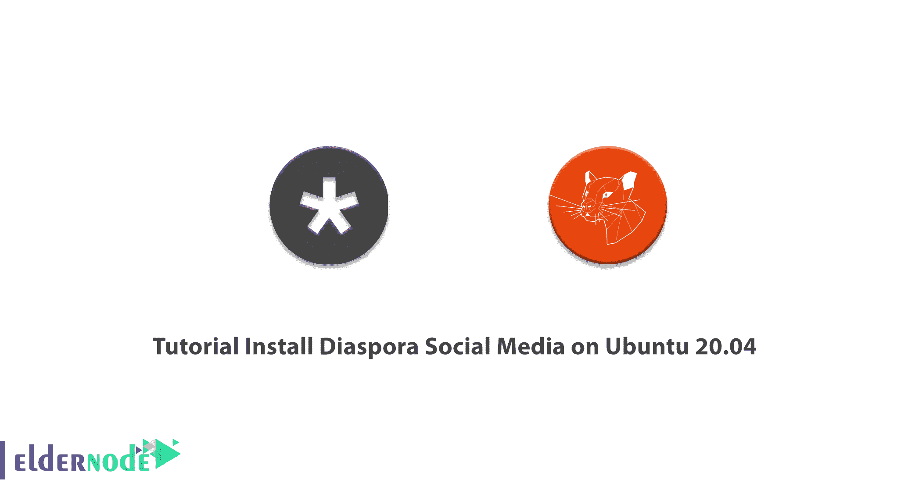

# 教程在 Ubuntu 20.04 上安装 Diaspora 社交媒体- Eldernode 博客

> 原文：<https://blog.eldernode.com/install-diaspora-social-media-on-ubuntu/>



Diaspora 是一个非盈利、用户所有的分布式社交网络。该程序由一组独立的节点组成，这些节点一起工作形成一个网络。这个社交网络不属于任何人或机构，使网络不受公司或广告的占用。在本文中，我们尝试学习你的教程在 Ubuntu 20.04 上安装 Diaspora 社交媒体。你可以访问 [Eldernode](https://eldernode.com/) 提供的包来购买 [Ubuntu VPS](https://eldernode.com/ubuntu-vps/) 服务器。

## **如何在 Ubuntu 20.04 上安装 Diaspora 社交媒体**

本文涵盖的部分包括以下主题。我们将首先学习如何安装依赖包。然后需要为 Diaspora 创建一个 PostgreSQL 用户。下一步，我们将解释如何安装 RVM 和 [Ruby](https://blog.eldernode.com/install-ruby-centos8/) ，最后我们将学习如何下载和配置 Diaspora。在本教程中跟随我们。

### **如何安装包依赖安装流散**

在你开始在 Ubuntu 20.04 上安装 Diaspora 社交媒体之前，你必须先安装依赖项。这些依赖包包括 [PostgreSQL](https://blog.eldernode.com/install-postgresql-debian10/) 、 [Redis](https://blog.eldernode.com/configure-redis-on-linux-ubuntu-20-04/) 和 [Nginx](https://blog.eldernode.com/install-nginx-on-ubuntu-20-04-lts/) web 服务器。使用以下命令安装依赖项:

```
sudo apt-get install build-essential cmake gnupg2 libssl-dev libcurl4-openssl-dev libxml2-dev libxslt-dev imagemagick ghostscript curl libmagickwand-dev git libpq-dev redis-server nodejs postgresql
```

现在您已经安装了依赖包，您需要启动并激活它们。为此，您可以运行以下命令:

```
systemctl start redis-server
```

```
systemctl enable redis-server
```

```
systemctl start postgresql
```

```
systemctl enable postgresql
```

### 如何为 Diaspora 创建新的 PostgreSQL 用户

在为 Diaspora 创建新的 PostgreSQL 用户之前，首先需要更改默认的 postgres 用户密码。您必须首先登录 PostgreSQL:

```
sudo -i -u postgres psql
```

现在，您需要使用以下命令来更改密码。输入以下命令后，您必须输入新密码并再次键入，以便为 postgres 用户设置新密码。

```
\password postgres
```

更改密码后，现在是时候创建一个新的 **diaspora** 用户，该用户拥有 **CREATEDB** 权限来创建数据库。为此，请运行以下命令。

***注意:*** 在下面的命令中，你必须输入你的密码，而不是 **yourpassword** 。

```
CREATE USER diaspora WITH CREATEDB PASSWORD 'yourpassword';
```

输入以下命令退出 PostgreSQL shell:

```
EXIT
```

### 了解如何创建新用户

在这一步中，您必须使用以下命令创建一个名为 diaspora 的新系统用户。然后使用下一个命令为其设置密码。应该注意的是，这个用户是在创建之后添加到 sudo 组中的。

```
adduser --disabled-login Diaspora
```

```
passwd diaspora
```

```
usermod -a -G sudo diaspora
```

### 教程安装 RVM 和红宝石

要安装 RVM 和 Ruby，您必须首先使用以下命令登录到 **diaspora** 用户:

```
su - diaspora
```

还需要安装 RVM 和红宝石 **GPGP 键**。为此，请运行以下命令:

```
gpg2 --recv-keys 409B6B1796C275462A1703113804BB82D39DC0E3 7D2BAF1CF37B13E2069D6956105BD0E739499BDB
```

完成上述步骤后，您现在可以安装 RVM 了。通过以下命令成功安装 RVM 后，您必须输入 diaspora 用户的密码。

```
curl -sSL https://get.rvm.io | bash -s stable
```

然后，您需要使用以下命令将 rvm 脚本加载到您的服务器:

```
source /home/diaspora/.rvm/scripts/rvm
```

需要注意的是，您可以使用以下命令轻松安装 **Ruby 2.6** ，然后检查其版本:

```
rvm install 2.6
```

```
ruby -v 
```

### 如何下载和配置 Diaspora

您必须首先通过运行以下命令来安装 Diaspora 源代码:

```
git clone -b master https://github.com/diaspora/diaspora.git
```

```
cd diaspora
```

接下来，您需要运行以下命令来配置数据库和 diaspora:

```
cp config/database.yml.example config/database.yml
```

```
cp config/diaspora.yml.example config/diaspora.yml
```

现在您需要用 Vim 编辑器编辑数据库配置文件:

```
vim config/database.yml
```

打开文件后，将用户名和密码信息更改为您想要的数据。然后**保存**文件并退出。

```
postgresql: &postgresql  adapter: postgresql  host: "localhost"  port: 5432  username: "diaspora"  password: "yourpassword"  encoding: unicode
```

现在您需要使用 vim 编辑器编辑 diaspora 配置文件:

```
vim config/diaspora.yml
```

打开 diaspora 配置文件后，必须按如下方式进行配置。在下面的命令中，你必须输入你想要的域名，而不是 **yourdomainname** 。做出更改后，您可以**保存**它们。

```
configuration: ## Section  ...  environment: ## Section  ...  url: "https://yourdomainname.com/"  certificate_authorities: '/etc/ssl/certs/ca-certificates.crt'  require_ssl: true  ...  server: ## Section  rails_environment: 'production'  ...
```

成功完成上述步骤后，现在应该安装 gem 和 ruby 库了:

```
gem install bundler
```

```
script/configure_bundler
```

```
bin/bundle install --full-index
```

接下来，您需要将数据库迁移到 Diaspora:

```
RAILS_ENV=production bundle exec rake db:create db:migrate
```

最后，您必须运行以下命令来编译所有 rails 资产管道:

```
RAILS_ENV=production bin/rake assets:precompile
```

## 结论

Diaspora 是一个社交网络，由一组相互隶属的独立节点(pod)组成，这些节点一起工作形成一个网络。在这篇文章中，我们试图一步一步地学习如何在 Ubuntu 20.04 上安装 Diaspora 社交媒体。