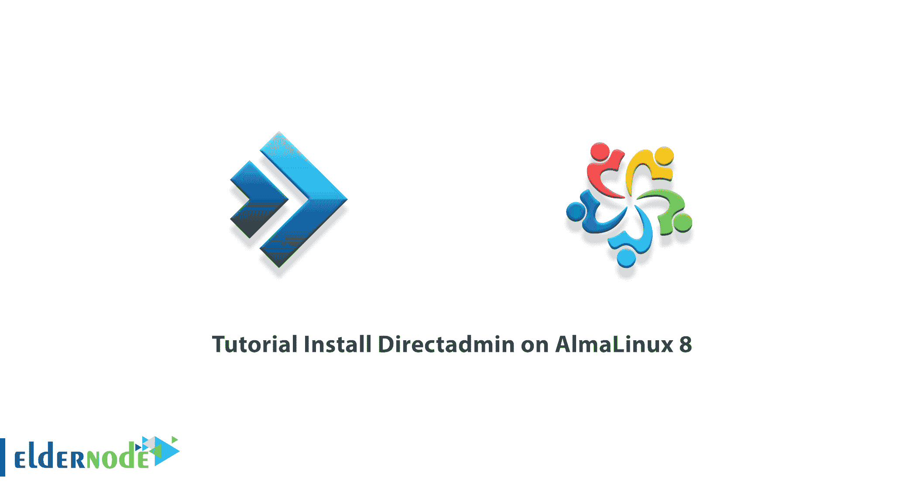
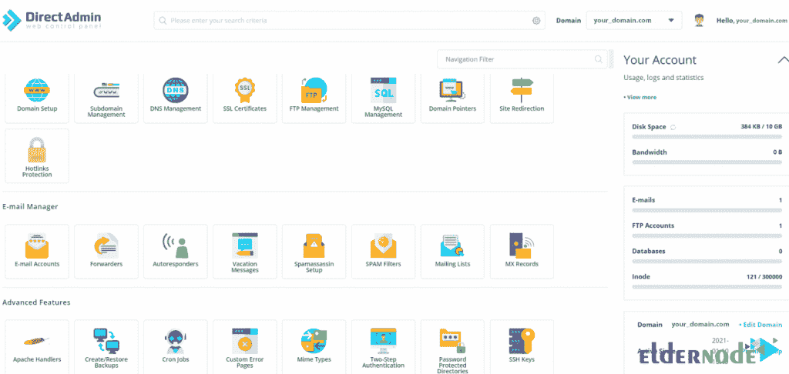

# 教程在 AlmaLinux 8.4 上安装 direct admin-elder node 博客

> 原文：<https://blog.eldernode.com/install-directadmin-on-almalinux/>



Directadmin 是一个托管控制面板。使用图形控制面板管理主机既有趣又简单。这个强大的面板支持所有版本的 Linux，比如 RedHat 和 Debian。在本文中，我们将一步一步地教你如何在 AlmaLinux 8 上安装 Directadmin。如果你想买一个 [**VPS 托管**](https://eldernode.com/vps-hosting/) 服务器，你可以在 [Eldernode](https://eldernode.com/) 看到可用的软件包。

## **如何在 AlmaLinux 8 上安装 direct admin**

### **direct admin**简介

DirectAdmin 是一个流行且强大的加拿大控制面板，也称为 DA，是管理 Linux 服务器的一个很好的选择。使用该用户界面，您可以执行所需的操作，如上传文件、发送和接收电子邮件、数据库管理等。

互联网上可用的顶级控制面板之一是 DirectAdmin，它不仅轻量级，而且价格实惠。Directadmin 在 Linux 操作系统的主机上都有，而且由于 Linux 的 RAM 和 CPU 的低功耗，这个控制面板也属于低功耗的范畴。需要注意的是，Directadmin 不需要很高的硬件资源，但是，它在响应用户请求方面有很好的速度。

以下是 DirectAdmin 的一些优势:

1.变轻

2.与 [Cpanel](https://blog.eldernode.com/tag/cpanel/) 相比的成本效益

3.简单易用的用户界面

4.高度安全

5.合适的速度

6.提供经销商的能力

### **在 AlmaLinux 8.4 上安装 Directadmin 的先决条件**

_ AlmaLinux/RHEL/CentOS 7.x 64 位、8.x 64 位

_ RAM:至少 4GB

_ 至少 500 Mhz 的英特尔和 AMD CPU

_ 最少 2gb 的可用空间

_ Root 访问权限

在本文的后续部分，请加入我们，了解如何在 AlmaLinux 8 上安装 Directadmin。

## **在 AlmaLinux 8 上安装 direct admin**

在前面几节中熟悉了 Directadmin 之后，在这一节中，我们想向您展示如何在 AlmaLinux 8 上安装 Directadmin。为此，您必须按顺序执行以下步骤。

第一步是使用以下命令对系统进行更新:

```
sudo dnf update
```

```
sudo dnf install epel-release
```

现在，您可以使用以下命令在 AlmaLinux 8 上轻松地**下载并安装 DirectAdmin** :

```
bash <(curl -Ss https://www.directadmin.com/setup.sh || wget -O - https://www.directadmin.com/setup.sh) auto
```

需要注意的重要一点是，主机名不应与主域名相同，因为这会导致电子邮件和 FTP 出现问题。

DirectAdmin 安装成功后，会显示管理员的**用户名**和**密码**以及**登录网址**。您还可以使用以下命令查看 DirectAdmin 管理员密码:

```
grep adminpass /usr/local/directadmin/scripts/setup.txt
```

或者

```
cat /usr/local/directadmin/scripts/setup.txt
```

### **如何在 AlmaLinux 8 上访问 direct admin**

在上一节中，您能够根据说明在 AlmaLinux 8 上成功安装 Directadmin。现在我们想向您展示如何访问 Directadmin。

要访问 DirectAdmin，只需按照以下步骤操作。你必须首先打开你最喜欢的浏览器。然后输入以下地址:

```
http://your-domain.com/2222
```

或者

```
http://your-server-ip/2222
```

需要注意的是，如果使用的是防火墙，需要打开**端口 2222** 。



## 结论

在不同的级别，Directadmin 控制面板为其用户提供不同的功能，其中最重要的是代表级别、经理级别和用户级别。在本文中，我们试图教你如何在 AlmaLinux 8 上安装 Directadmin。