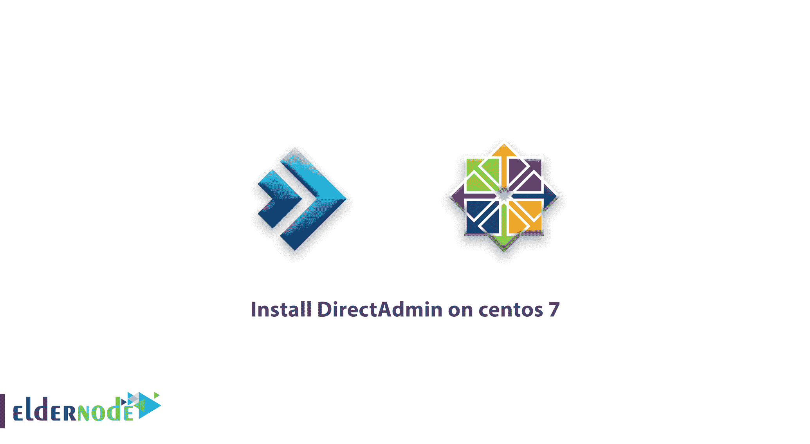

# 教程如何在 Centos 7 | Centos 8 - | Eldernode 上安装 DirectAdmin

> 原文：<https://blog.eldernode.com/install-directadmin-on-centos-7/>



**教程如何在 centos 7** ，Centos 8 上安装 DirectAdmin。Direct Admin 是一个基于 web 的图形化虚拟主机控制面板，使管理 web 和服务器上的网站变得非常容易。

在本文中，我们将在一台 [Linux VPS](https://eldernode.com/linux-vps/) Centos 7 服务器 Centos 8 上安装 DirectAdmin。

## **如何在 centos 7 上安装 direct admin**

安装 DirectAdmin 的硬件要求:

1.至少一个频率为 500 MHz 的处理器。

2.管理目录所需的最低 RAM 是 1GB，但建议使用 2GB 或更多的 RAM。

3.安装所需的最小空间是 2gb。

注意:如果你的网站流量很高，你的 Directadmin 需要更多的资源。

首先，以 root 用户身份登录并更新[服务器](http://eldernode.com/):

```
yum update
```

然后，我们在 CentOS 7 上安装 [DirectAdmin](https://blog.eldernode.com/tag/directadmin/) 正常运行所需的软件包:

```
yum install psmisc net-tools systemd-devel libdb-devel perl-DBI
```

现在，通过 wget 下载 [DirectAdmin](https://www.directadmin.com/) 安装脚本。如果您还没有 wget，可以通过命令 yum install wget 安装它。

```
wget -O setup.sh http://www.directadmin.com/setup.sh
```

```
chmod 755 setup.sh
```

要运行安装脚本，请在命令下输入:

```
./setup.sh
```

安装完成后，您可以通过以下地址访问 DirectAdmin:

```
http://server_ip:2222
```

祝你好运。🙂