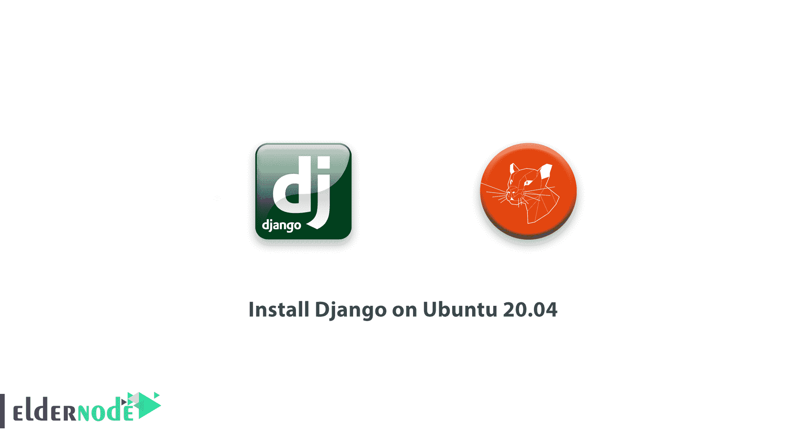
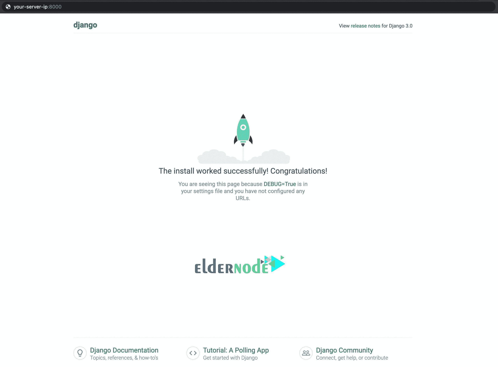
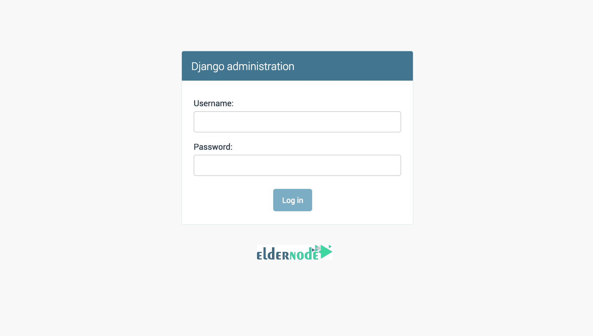
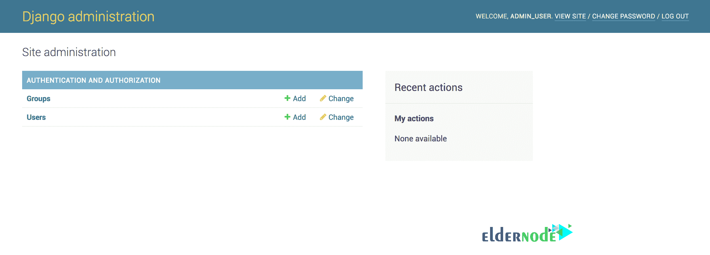

# 如何在 Ubuntu 20.04 上安装 Django-Django 开发环境

> 原文：<https://blog.eldernode.com/install-django-on-ubuntu-20/>



作为一个直播网站，你需要有额外的考虑，包括连接到一个数据库。在本文中，您将学习如何在 Ubuntu 20.04 上安装 Django，以及如何设置开发环境。

### 简介

Django 是一个免费、开源、快速开发的高级 Python Web 框架。它还以松散耦合和单个组件的框架级一致性而闻名。Django 是设置域名和增加安全层所必需的。快得不可思议、安全可靠、可伸缩性极强是 Django 最有用的特性。

**先决条件**

如果您知道以下内容，本教程可能会更有用:

**1-** 注意在用户界面中使用 root 权限执行命令时，必须在所有命令之前使用 Sudo 命令。

**2-** Python 3 建立虚拟编程环境

**也有**，你可以在 Ubuntu 20.04 上的 [初始服务器设置查看更多信息](https://eldernode.com/initial-server-setup-on-ubuntu-20/)

## 如何在 Ubuntu 20.04 上安装 Django

让我们按照本指南的步骤来学习如何在 Ubuntu 20.04 上安装 Django

### **步骤 1-** **安装 Django**

在虚拟环境中安装**Django**(Python 包管理器 pip)的几种方法中，我们会以一种安全平稳的方式继续。您需要通过服务器的主目录创建包含您的 Django 应用程序的目录。因此，要创建一个目录，请运行以下命令。你可以选择你所选择的名字(而不是 Django-apps )来导航到目录。

```
mkdir django-apps
```

```
cd django-apps
```

**在 django-apps 目录下创建**你的虚拟环境。同样，你需要选择一个合适的名字。(而不是 env )。

```
virtualenv env 
```

**激活**虚拟环境 bt 输入以下命令:

```
. env/bin/activate 
```

当您**将前缀**更改为(环境)时，它将被激活，并且根据您所在的目录，结果将如下所示:

```
(env) [[email protected]](/cdn-cgi/l/email-protection):$
```

使用 pip 在环境中安装 Django 包。它帮助您创建和运行 Django 应用程序。

```
(env) [[email protected]](/cdn-cgi/l/email-protection):$ pip install django
```

**安装**之后，通过运行版本检查来验证 Django 的安装:

```
(env) [[email protected]](/cdn-cgi/l/email-protection):$ django-admin --version
```

输出如下所示:

输出

```
3.0.6
```

**第二步**–**调整防火墙设置**

### 您可以使用以下命令打开 **UFW 防火墙**的端口:

**第三步-** **启动项目**

```
(env) [[email protected]](/cdn-cgi/l/email-protection):$ sudo ufw allow 8000
```

### 在这个部分中，您可以**生成**一个名为 django-admin 的应用程序。运行以下命令创建项目目录结构。

为了明显看出创建了什么文件，导航到测试站点目录。

```
(env) [[email protected]](/cdn-cgi/l/email-protection):$ jango-admin startproject testsite
```

输出

```
(env) [[email protected]](/cdn-cgi/l/email-protection):$ cd testsite  (env) [[email protected]](/cdn-cgi/l/email-protection):$ ls
```

**然后**，您将通过如下运行来查看 manage.py 脚本。

```
manage.py  testsite
```

**读完脚本后，按** q 退出查看文件。

```
(env) [[email protected]](/cdn-cgi/l/email-protection):$ less manage.py
```

为了**查看**其他文件，导航到试验场目录。

要**列出**目录的内容，输入以下命令。

```
(env) [[email protected]](/cdn-cgi/l/email-protection):$ cd testsite/
```

**然后**，你会看到 4 个文件。

```
(env) [[email protected]](/cdn-cgi/l/email-protection):$ ls
```

输出

**我们来了解一下**这 4 档是什么。

```
__init__.py asgi.py settings.py urls.py wsgi.py 
```

__init__。py 是 Python 项目的入口点。

asgi.py 是 WSGI 很好的继承者。这是关于异步服务器网关接口的可选部署的配置。

让 Django 知道哪些设置是可用的，并描述 Django 安装的配置。

urls.py 包含一个 urlpatterns 列表，它将 URL 路由并映射到它们的视图。

wsgi.py 包含 Web 服务器网关接口的配置，它为同步 Python 应用程序提供了一个标准。

[**购买 VPS 主机**](https://eldernode.com/vps-hosting/)

**第四步**–**配置 Django**

### **现在**你可以通过输入 runserver 命令启动服务器后在指定的主机上查看网站。

将您的服务器 IP 地址添加到位于的 settings.py 文件中的 ALLOWED_HOST 列表中

我们需要将您的服务器 IP 地址添加到位于~/test _ django _ app/test site/test site/的 settings.py 文件中的 ALLOWED_HOSTS 列表中

**同样**，您可以使用您认为合适的文本编辑器来添加 IP 地址。如果您使用的是 nano ，运行下面的命令。

**如果**想要改变并退出 nano，按住 CTRL+X 键，然后按下**y键。**

```
(env) [[email protected]](/cdn-cgi/l/email-protection):$ nano ~/django-apps/testsite/testsite/settings.py
```

**最后**，您可以使用 createsuperuser 命令创建一个管理用户。

您将被要求输入用户名、电子邮件地址和密码。

```
(my_env) $ python manage.py createsuperuser
```

**第五步**–**访问 Django Web App**

### 配置完成后，请务必导航回 manage.py 所在的目录。

要用您的服务器的 ip 替换您的服务器 IP 文本，请运行以下命令。

```
(env) [[email protected]](/cdn-cgi/l/email-protection):$ cd ~/django-apps/testsite 
```

**然后**，导航到以下链接查看您的框架网站，并用您服务器的实际 IP 地址替换突出显示的文本:

```
(env) [[email protected]](/cdn-cgi/l/email-protection):$ python manage.py runserver 0.0.0.0:8000 
```

```
http://your-server-ip:8000/
```

结果您会看到下面的页面。



这表明 Django 已经正确安装，并且您的测试项目正在正确运行。此外，您可以在您的 URL 末尾添加 /admin/ 来访问管理界面。

```
http://your_server_ip:8000/admin/
```



如果您输入刚刚创建的管理员用户名和密码，您将可以访问该网站的主要管理部分。



要返回到您的编程环境并测试您的应用程序，请按 CTL + C 停止 runserver 命令。

要离开 Python 环境，运行 deactivate 命令。

**如果**您停用编程环境，它会将您带回到终端命令提示符。

```
(env) [[email protected]](/cdn-cgi/l/email-protection):$ deactivate
```

亲爱的用户，我们希望这篇关于如何在 Ubuntu 20.04 上安装 Django 的教程能对你有所帮助，如果你有任何问题或者想查看我们用户关于这篇文章的对话，请访问[提问页面](https://eldernode.com/ask)。也为了提高你的知识，有这么多有用的教程为[老年节点培训](https://eldernode.com/blog/)准备。

**不要错过**

``**Do not miss**``