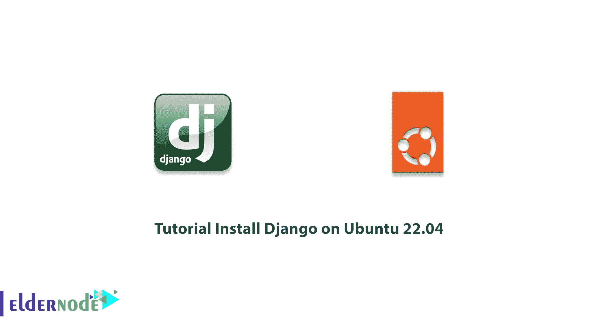
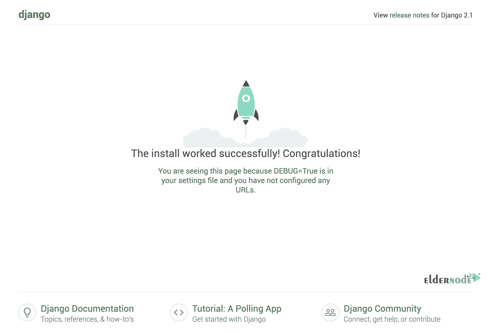
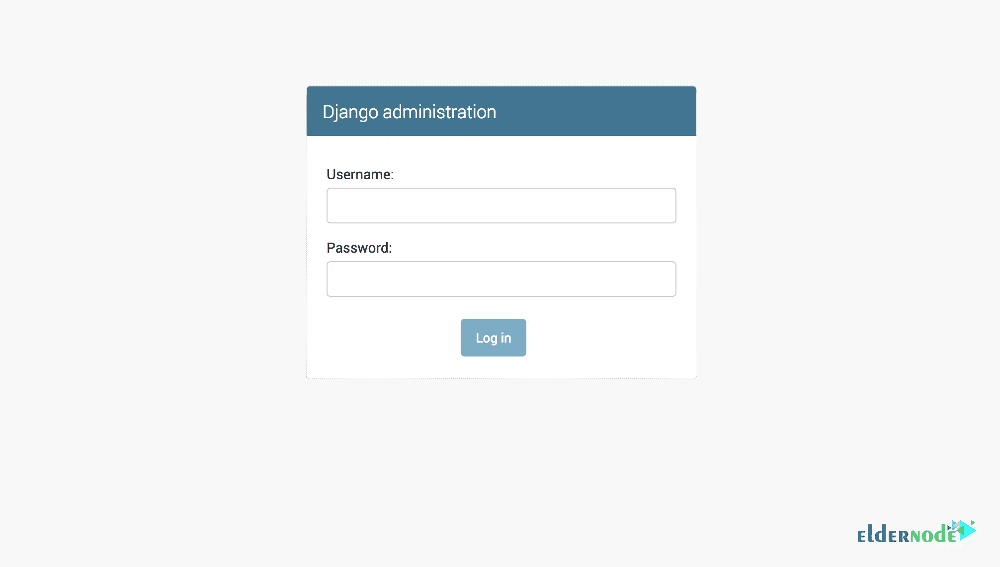
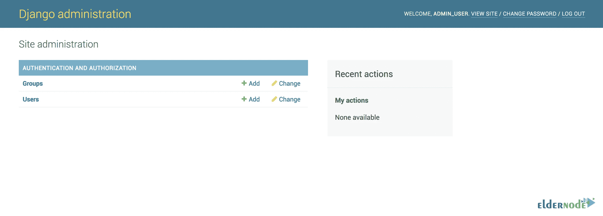

# 教程在 Ubuntu 22.04 上安装 Django-elder node 博客

> 原文：<https://blog.eldernode.com/install-django-on-ubuntu-22-04/>



Django 库是一个 Python 应用程序开发平台(或框架),用于构建和“维护”高质量的 web 应用程序。Django Library 通过消除重复任务简化了 web 开发过程，并且随着时间的推移具有成本效益。在本文中，我们将一步一步地教你如何在 Ubuntu 22.04 上安装 Django。如果你想购买一台 **[Ubuntu VPS](https://eldernode.com/ubuntu-vps/)** 服务器，你可以访问 [Eldernode](https://eldernode.com/) 中提供的软件包。

## **如何在 Ubuntu 22.04 上设置 Django**

### **Django 及其特色介绍**

Django 是用 [Python](https://blog.eldernode.com/python-3-9-on-eldernode-linux/) 编写的 web 编程的高级框架(或平台),为程序员和开发人员实现 web 应用程序的“快速开发”和实用设计。Django 库允许用户用更少的代码更快地生成更好的应用程序。

*在 Django 图书馆设计哲学最重要的原则中，可以提到以下几点:*

->本平台各组件的相对独立性

->少编码

->不重复自己|干的原则

->快速发展

->简洁的设计

*在使用 Django 库的优势中，可以提到以下几点:*

->支持对象关系映射(ORM)

->多语言支持

->支持各种 web 开发平台和框架

->管理“图形用户界面| GUI”

->开发环境

在这篇文章的续篇中，加入我们来教你如何在 [Ubuntu](https://blog.eldernode.com/tag/ubuntu/) 22.04 上安装 Django。

### **在 Ubuntu 22.04 上安装 Django 的先决条件**

–具有 sudo 权限的非超级用户

–要进行设置，请按照我们的[对 Ubuntu 22.04](https://blog.eldernode.com/initial-server-setup-on-ubuntu-22-04/) 进行初始设置

## **在 Ubuntu 22.04 上安装 Django**

在 Ubuntu 22.04 上安装 Django 有两种方法:

**1。从软件包安装**

**2。用 pip** 安装

在下文中，我们将解释上述每一种方法。

### **如何在 Ubuntu 22.04** 上从软件包安装 Django

这样，你就可以通过 Ubuntu 22.04 仓库中的包来安装 Django 了。为此，您需要在第一步中使用以下命令更新这些包:

```
sudo apt update
```

在下一步中，建议您使用以下命令来检查您的系统上安装了哪个版本的 Python :

```
python3 -V
```

最后，您可以通过键入以下命令轻松地安装 Django :

```
sudo apt install python3-django
```

执行以下命令以确保 Django 在 Ubuntu 22.04 上成功安装:

```
django-admin --version
```

### **如何在 Ubuntu 22.04 上用 PIP 安装 Django**

在这个方法中，我们将一步一步地向您展示如何在 Ubuntu 22.04 的虚拟环境中使用 pip 安装 Django。要做到这一点，只需仔细遵循以下步骤。

和前面一样，在第一步中，您必须使用以下命令**更新 Ubuntu 存储库中的包**，然后检查您已经安装的 Python 版本:

```
sudo apt update
```

```
python3 -V
```

现在是时候使用以下命令**安装 pip 和 venv** 了:

```
sudo apt install python3-pip python3-venv
```

成功完成上述步骤后，现在可以使用以下命令启动一个新的项目目录:

```
mkdir ~/newproject
```

```
cd ~/newproject
```

现在您需要使用下面的命令在项目目录中创建一个虚拟环境:

```
python3 -m venv my_env
```

注意，在上面的命令中，你可以命名你的虚拟环境，而不是 **my_env** 。

然后，您必须使用以下命令在隔离环境中安装并激活软件包:

```
source my_env/bin/activate
```

注意，您可以使用 pip 在您的新环境中安装 Django:

```
pip install django
```

最后，您可以通过执行以下命令来验证 Django 的安装:

```
django-admin --version
```

您应该记住，要退出您的虚拟环境，您可以使用以下命令:

```
deactivate
```

每当您想要处理项目时，可以再次使用以下命令:

```
cd ~/newproject
```

```
source my_env/bin/activate
```

### **如何创建样本项目**

在您成功安装 Django 之后，在这一节中，我们将教您如何创建一个项目。第一步是**使用以下命令为您的项目创建目录**:

```
mkdir ~/django-test
```

```
cd ~/django-test
```

成功创建目录后，您现在可以通过运行以下命令创建一个虚拟环境，然后激活它:

```
python3 -m venv my_env
```

```
source my_env/bin/activate
```

使用以下命令安装 Django:

```
pip install django
```

我们现在进入项目创建阶段，您可以使用下面的命令来完成这项工作。需要注意的是，本例中我们的项目名称是 **eldernodeproject** ，您可以用自己的名称替换它。重要的是使用以下命令避免嵌套目录:

```
django-admin startproject eldernodeproject.
```

在下一步中，您可以使用以下命令来迁移数据库:

```
python manage.py migrate
```

使用以下命令创建一个管理用户。最后，您需要填写用户名、电子邮件地址和密码。

```
python manage.py createsuperuser
```

关键是测试 Django 设置中的一个指令来测试你的应用。因此，您必须使用以下命令运行设置文件:

```
nano ~/django-test/eldernodeproject/settings.py
```

一旦您运行了配置文件，您现在应该在其中寻找 **ALLOWED_HOSTS** 命令。正如您在下面的命令中看到的，您需要列出与 Django 服务器相关联的 IP 地址或域名。

***注意:*** 如果要请求整个域和子域，需要在命令输入的开头加一个点。完成所需的更改后，**保存**文件并退出。

```
ALLOWED_HOSTS = ['your_server_ip_or_domain', 'your_second_ip_or_domain', . . .]
```

### **如何在 Ubuntu 22.04 上测试 Django 开发服务器**

我们建议您首先使用以下命令打开防火墙中的适当端口:

```
sudo ufw allow 8000
```

然后，您可以通过运行以下命令轻松运行开发服务器:

```
python manage.py runserver your_server_ip:8000
```

现在，您可以在浏览器中运行以下地址:

```
http://your_server_ip:8000/
```



还应注意，您可以使用以下命令来访问**管理界面**:

```
http://your_server_ip:8000/admin/
```



*



## 结论

如前所述，Django 库是一个用 Python 语言开发 web 应用程序的平台，和大多数现代平台一样，支持 MVC 架构。在本文中，我们试图在介绍 Django 及其特性和优点之后，一步步教你如何在 Ubuntu 22.04 上安装 Django。