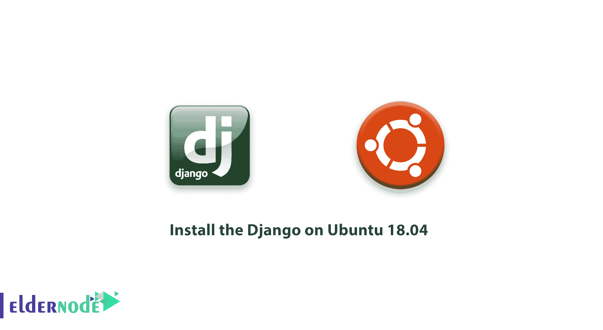

# 如何在 Ubuntu 18.04 上安装 Django LTS-elder node 博客

> 原文：<https://blog.eldernode.com/install-django-ubuntu-18/>



【更新日期:2021-01-07】Django 是一个用于开发动态网站和应用程序的 Python Web 框架。作为一名开发人员，您需要 Django 在提供更高安全性的同时，快速完成应用程序。在本文中，你将学习如何在 Ubuntu 18.04 LTS 版上安装 Django。为了减少常见的安全错误并创建 Python web 应用程序，让我们了解一下这个免费的开源软件，像大公司一样享受它的特性。另外，你可以购买自己的 [Ubuntu VPS](https://eldernode.com/ubuntu-vps/) 或者在 [Eldernode](https://eldernode.com/) 上找到你考虑的软件包。

为了让本教程更好地发挥作用，请考虑以下**先决条件**:

拥有 sudo 权限的非 root 用户。

要设置，请按照我们的[初始设置 Ubuntu 18.04](https://eldernode.com/initial-setup-ubuntu-18/)

## **教程在 Ubuntu 18.04 上安装 Django**

请和我们一起回顾这份指南。您将在一个 [Linux](https://blog.eldernode.com/tag/linux/) Ubuntu 18.04 服务器上运行 Django。Django 发展了许多大公司。你可以找到诸如华盛顿邮报、讨论、Instagram、Mozilla、Pinterest 等名字。

有 3 种不同的方法来安装 Django。在本文中，我们将回顾这些方法:

**1-** 从软件包全局安装

**2-** 在虚拟环境中安装 *pip*

**3-** 开发版用 *git* 安装

### 在 LTS Ubuntu 18.04 上安装 Django

Django 可以在官方的 Ubuntu 仓库中获得，并且可以和传统的 *apt* 包管理器一起安装。

首先，使用下面的命令更新您的本地包索引。

```
sudo apt update
```

现在，您可以通过运行以下命令来检查 Python 版本:

```
python3 -V
```

然后，要安装 Django，键入:

```
sudo apt install python3-django
```

此外，您可以检查安装是否成功。

```
django-admin --version
```

### 在虚拟环境中安装 pip

要使用灵活的方式安装 Django，创建一个虚拟环境是一个好主意。通过使用 *venv* 和 *virtualenv* 工具，这将成为可能。

同样，建议您刷新本地包索引:

```
sudo apt update
```

使用下面的命令查看安装的 Python 版本。

```
python3 -V
```

要从 Ubuntu 库安装 *pip* ，请键入:

```
sudo apt install python3-pip
```

现在用 *pip* 安装 *venv* 包

```
sudo apt install python3-venv
```

通过开始一个新项目，你也可以为此创建一个虚拟环境。要开始创建项目并进入该目录，请运行:

```
mkdir ~/newproject cd ~/newproject
```

使用 Python 命令(与您的 Python 版本兼容)，您可以在项目目录中创建一个虚拟环境。

```
python3.6 -m venv my_env
```

您可以将其名称更改为描述性名称。将以该名称创建一个目录。

激活隔离环境，将软件包安装到该环境中。

```
source my_env/bin/activate
```

使用 pip 在您的新环境中安装 Django。另外，请注意，您**不需要**来使用 sudo ，因为您是在本地安装:

```
(my_env) $ pip install django
```

现在，您可以通过运行以下命令来验证安装:

```
(my_env) $ django-admin --version
```

发出 deactivate 命令，让您离开虚拟环境。

```
(my_env) $ deactivate
```

只要进入项目目录并激活它，您就可以随时重新激活您的虚拟环境。

```
cd ~/newproject  source my_env/bin/activate
```

### 用 Git 安装开发版本

在这一步中，您将看到如何通过从 Git repo 获取代码来安装最新的开发版本，而不是稳定版本。要开发 Django 的版本，从它的存储库中下载并安装 Django。那么，让我们在虚拟环境中完成这项工作。

首先使用以下命令更新本地包索引:

```
sudo apt update
```

要检查已安装的 Python 版本，请输入:

```
python3 -V
```

要从官方存储库中安装 *pip* ,运行

```
sudo apt install python3-pip
```

安装 *venv* 包来创建您的虚拟环境:

```
sudo apt install python3-venv
```

然后，要将存储库克隆到您的主目录中名为 ***~/** django-dev* 的目录中，键入:

```
git clone git://github.com/django/django ~/django-dev
```

注意，更改到此目录:

```
cd ~/django-dev
```

同样，通过使用 Python 命令(与您的 Python 版本兼容)，您可以在项目目录中创建一个虚拟环境。

```
python3.6 -m venv my_env
```

接下来，要激活它:

```
source my_env/bin/activate
```

使用 *pip* 安装存储库。 *-e* 选项将以“可编辑”模式安装，这在从版本控制安装时是必要的:

```
(my_env) $ pip install -e ~/django-dev
```

通过运行以下命令检查安装是否成功:

```
django-admin --version
```

### 如何创建样本项目

安装 Django 后，您可以构建您的项目。让我们看看如何创建一个项目，并在开发服务器上测试它。

要为您的项目创建一个目录并在其中进行更改，请运行:

```
mkdir ~/django-test  cd ~/django-test 
```

现在，您可以通过键入以下命令来创建您的虚拟环境:

```
python3.6 -m venv my_env
```

然后，为了激活环境:

```
source my_env/bin/activate
```

安装 Django:

```
(my_env) $ pip install django
```

此外，您可以使用 *django-admin* 来构建您的项目。 *startproject* 会在你当前的工作目录下创建一个目录，包括:

一个管理脚本，manage.py，您可以使用它来管理各种特定于 Django 的任务。
包含实际项目代码的目录(与项目同名)

然而，为了避免有太多的嵌套目录，让我们告诉 Django 将管理脚本和内部目录放在*当前*目录中(注意结束点):

```
(my_env) $ django-admin startproject djangoproject .
```

要迁移数据库(这个例子默认使用 SQLite)，让我们使用 migrate 命令和 *manage.py* 。[迁移](https://docs.djangoproject.com/en/2.0/topics/migrations/)将您对 Django 模型所做的任何更改应用到您的数据库模式。

要迁移数据库，请键入:

```
(my_env) $ python manage.py migrate
```

输出:

```
Operations to perform:    Apply all migrations: admin, auth, contenttypes, sessions  Running migrations:    Applying contenttypes.0001_initial... OK    Applying auth.0001_initial... OK    Applying admin.0001_initial... OK    Applying admin.0002_logentry_remove_auto_add... OK    Applying admin.0003_logentry_add_action_flag_choices... OK    Applying contenttypes.0002_remove_content_type_name... OK    Applying auth.0002_alter_permission_name_max_length... OK    Applying auth.0003_alter_user_email_max_length... OK    Applying auth.0004_alter_user_username_opts... OK    Applying auth.0005_alter_user_last_login_null... OK    Applying auth.0006_require_contenttypes_0002... OK    Applying auth.0007_alter_validators_add_error_messages... OK    Applying auth.0008_alter_user_username_max_length... OK    Applying auth.0009_alter_user_last_name_max_length... OK    Applying sessions.0001_initial... OK
```

**最后，**您可以创建一个管理用户，这样您就可以使用 Django 管理界面。让我们用*创建超级用户*命令来做这件事:

系统将提示您输入用户名、电子邮件地址和密码。

```
(my_env) $ python manage.py createsuperuser
```

如何在 Django 设置中修改 ALLOWED _ HOSTS

### 修改 Django 设置中的一个指令，以便能够成功测试您的应用程序。

使用以下命令打开设置文件:

在内部，找到 *ALLOWED_HOSTS* 指令。这定义了一个地址或域名的白名单，可以用来连接到 Django 实例。主机标头不在此列表中的传入请求将引发异常。Django 要求您设置这个来防止某类安全漏洞。

```
(my_env) $ nano ~/django-test/djangoproject/settings.py
```

首先，在方括号中列出与 Django 服务器相关的 IP 地址或域名。每一项都应该用引号括起来，用逗号分开。如果希望请求整个域和任何子域，请在条目的开头加上一个句点:

~/django-test/django project/settings . py

完成后，保存文件并退出编辑器。

```
. . .  ALLOWED_HOSTS = ['your_server_ip_or_domain', 'your_second_ip_or_domain', . . .]
```

如何测试开发服务器

### 因为您有了一个用户，所以您可以启动 Django 开发服务器。但在此之前，ypu 应该确保在您的防火墙中打开适当的端口。通过运行以下命令打开端口 8000:

然后，启动开发服务器:

```
(my_env) $ sudo ufw allow 8000
```

在 web 浏览器中访问服务器的 IP 地址，后跟 8000:

```
(my_env) $ python manage.py runserver your_server_ip:8000
```

您应该会看到类似这样的内容:

```
http://your_server_ip:8000
```


此外，要访问管理界面，请在您的网址末尾添加 /admin/ :

这将带您进入登录屏幕:

```
http://your_server_ip:8000/admin/
```


如果您输入刚刚创建的管理员用户名和密码，您将可以访问网站的主要管理部分:


要解释更多的 ****，**** 任何时候你需要停止开发服务器，在你的终端输入 CTRL-C。如果您希望构建您的应用程序并定制您的站点，您应该查阅 Django 文档。

To explain more****,**** anytime you need to stop the development server, type CTRL-C in your terminal. You should check out the Django documentation if you wish to build your applications and customize your site.

结论

## 在本文中，你学习了如何在 Ubuntu 18.04 上安装 Django。使用 Django 帮助 ypu 更容易地创建网站。您可能犯的安全错误，如 SQL、注入、XSS、CSRF 和点击劫持将被避免。如果你还需要获得最新版本的指南，请关注我们的文章[如何在 Ubuntu 20.04 上安装 Django](https://blog.eldernode.com/install-django-on-ubuntu-20/)。

In this article, you learned How To Install Django on Ubuntu 18.04\. Using Django helps ypu create websites easier. Your probable security mistakes such as SQL, Injection, XSS, CSRF, and clickjacking would be avoided. In case you also need to get the guide of the latest version, follow our article on [How to install Django on Ubuntu 20.04](https://blog.eldernode.com/install-django-on-ubuntu-20/).