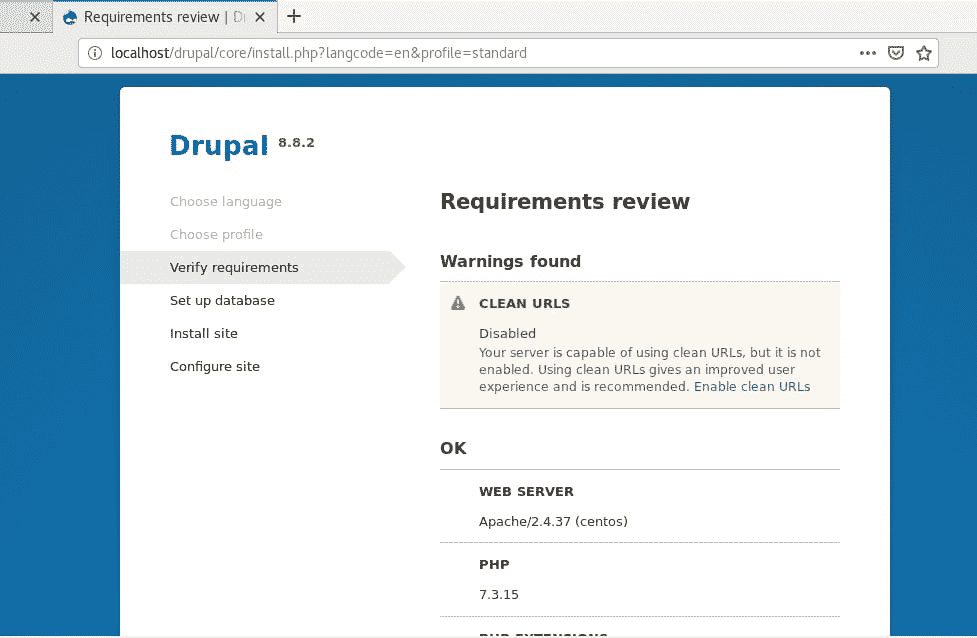

# 如何在 CentOS 8 上安装 Drupal——如何配置 Drupal 设置

> 原文：<https://blog.eldernode.com/install-drupal-on-centos-8/>


Drupal 是用 PHP 编写的免费开源 CMS，附带 GNU / GPL 许可。在这篇文章中，我们将向你**学习如何在 CentOS 8** 上安装 Drupal。

类似于流行的 CMS 平台，如 [WordPress](https://eldernode.com/install-wordpress-on-iis/) 和 [Joomla](https://eldernode.com/install-joomla-on-debian-10/) ，有了 **Drupal** ，你可以在对网络编程或标记语言知之甚少或一无所知的情况下从头开始创建自己的博客或网站。

#### 先决条件

在我们开始之前，请确保您已经在 CentOS 8 上安装了[LAMP stack。此外，确保你有一个](https://eldernode.com/install-lamp-stack-on-centos-8/) [SSH 连接](https://eldernode.com/ssh-connection-softwares/)到你的 CentOS 8 服务器和一个良好稳定的互联网连接。

## 如何在 CentOS 8 上安装 Drupal

在本教程中，你将学习如何在 **CentOS 8** Linux 上安装 **Drupal** 。

### 在 CentOS 8 安装额外的 PHP 模块

因为 Drupal 需要额外的 PHP 模块才能顺利运行，所以通过执行下面的命令来安装它们。

```
sudo dnf install php-curl php-mbstring php-gd php-xml php-pear php-fpm php-mysql php-pdo php-opcache php-json php-zip 
```

### 创建一个 Drupal 数据库

安装完所有需要的 PHP 模块后，您需要创建一个数据库来容纳 Drupal 的安装文件。因此，如图所示，登录到您的 **MariaDB** 数据库。

```
sudo mysql -u root -p 
```

要为 Drupal 创建一个数据库并授予 Drupal 用户所有权限，请在登录后运行以下命令。

```
**MariaDB [(none)]>** CREATE DATABASE drupal_db;  **MariaDB [(none)]>** GRANT ALL ON drupal_db.* TO ‘drupal_user’@’localhost’ IDENTIFIED BY ‘[[email protected]](/cdn-cgi/l/email-protection)’;  **MariaDB [(none)]>** FLUSH PRIVILEGES;  **MariaDB [(none)]>** EXIT;
```

您可以退出并重新启动数据库服务器。

```
sudo systemctl restart mariadb 
```

### 在 CentOS 8 下载 Drupal

有了 Drupal 的数据库，下一步将是从 Drupal 的官方网站下载 Drupal 的 tarball 文件。这包含了 Drupal 正常运行所需的所有必要文件。在撰写本文时，最新版本是 **Drupal 8.8.4**

```
sudo wget https://ftp.drupal.org/files/projects/drupal-8.8.4.tar.gz 
```

因此，下载完成后，解压缩 tarball 文件。

```
sudo tar -xvf drupal-8.8.4.tar.gz 
```

现在，将提取的文件夹移动到 Apache 文档根目录。

```
sudo mv drupal-8.8.2 /var/www/html/drupal 
```

使用文档根目录中的 drupal 未压缩文件，修改文件权限以允许 apache 访问该目录。

```
sudo chown -R apache:apache /var/www/html/drupal 
```

[购买 Linux 虚拟私有服务器](https://eldernode.com/linux-vps/)

### 配置 Drupal 设置

在此步骤中，从默认设置文件(**default.settings.php**)创建一个设置文件，该文件已存在于以下位置。

```
cd /var/www/html/drupal/sites/default  sudo cp -p default.settings.php settings.php
```

如果在您的系统上启用了 **SELinux** ，那么运行下面的命令来影响 **/var/www/html/drupal/** 目录上的 SELinux 规则。

### 敲定 Drupal 安装

当所有的配置都设置好了，剩下的唯一一件事就是在浏览器上设置 Drupal。为此，在你的地址栏中输入以下地址，然后点击**回车**。

```
http://server-IP/drupal
```

将显示'**欢迎使用**'屏幕。但首先，选择您的首选语言，然后点击“**保存并继续**按钮。


在接下来的屏幕上，选择'**标准配置文件**作为要使用的配置文件，点击'**保存并继续**按钮进入下一页。


是时候看看需求的概述并启用干净的 URL 了。要启用干净的 URL，请转到位于**/etc/httpd/conf/httpd . conf**文件中的 Apache 配置文件。

并将 **AllowOverride** 属性从 **None** 设置为 **All** 。



此时，刷新页面继续到'**数据库配置**页面，如图所示。填写必填字段，如数据库类型、数据库名称、数据库密码和用户名。


再次点击“**保存并继续**按钮进入下一步。Drupal 将开始安装所有的特性，大约需要 5 分钟。


填写以下详细信息:


最后，您将看到如图所示的主页。现在，您可以继续创建您的网站并向其中添加内容。您可以使用大量的 Drupal 主题和插件来增强站点的外观。


**好样的** ！我们一步一步的指导你如何在 CentOS 8 上安装 T4 Drupal T5。而且从现在开始你知道如何在 [CentOS 8](https://eldernode.com/tag/learning-centos-8/) 上安装 Drupal 了。

亲爱的用户，我们希望你喜欢这个教程，你可以在评论区提出关于这个培训的问题，或者解决 [Eldernode](https://eldernode.com/) 培训领域的其他问题，请参考 [提问页面](https://eldernode.com/ask) 部分并在其中提出你的问题。