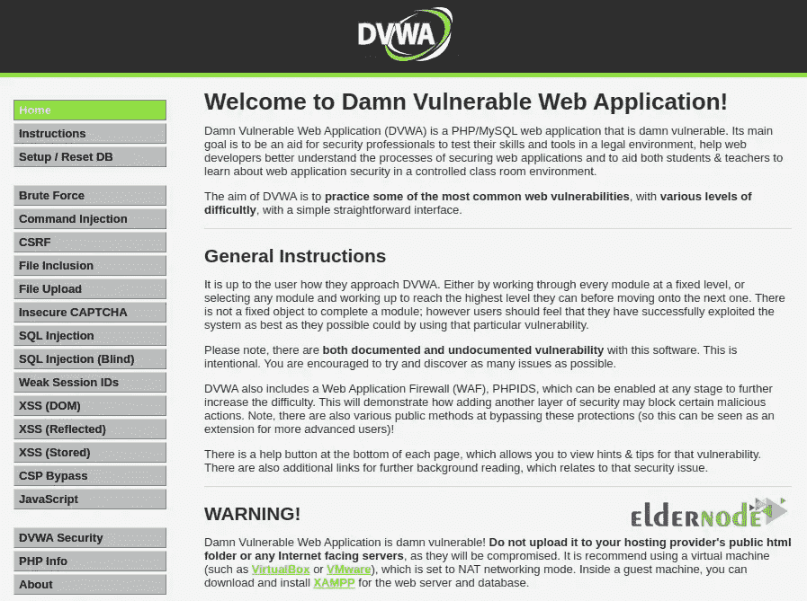

# 在 CentOS 7 上安装 DVWA 的一种方法

> 原文：<https://blog.eldernode.com/install-dvwa-on-centos-7/>


该死的易受攻击的 web 应用或简称 DVWA，顾名思义，就是漏洞很多的 Web 应用！事实上，该软件旨在帮助安全专业人员并衡量他们的技能，帮助 web 开发人员更好地了解保护 web 应用程序的过程，并最终供教授和学生学习黑客和安全主题。在这篇文章中，我们将教你一种在 CentOS 7 上安装 DVWA 的方法。需要注意的是，如果你想购买一台 [CentOS VPS](https://eldernode.com/centos-vps/) 服务器，可以访问 [Eldernode](https://eldernode.com/) 网站上提供的计划。

## **如何在 CentOS 7 上安装 DVWA**

## **什么是 DVWA？**

DVWA 是一个处理不同难度的安全漏洞的 web 应用程序。它也有一个非常用户友好的界面，使开发者更容易。此外，请记住，该软件中有意记录和未记录漏洞，以鼓励用户发现更多漏洞。需要注意的是，这个 web 应用程序是用 PHP/MySQL 实现的。DVWA 是开源的，每个人都可以免费使用，您可以修改和重新发布它的源代码。

### **DVWA 特性**

在本节中，我们将提到 DVWA 的一些特性。使用 DVWA，可以执行以下操作:

–暴力攻击

–命令注入攻击

–CSRF 袭击

–文件包含攻击

–文件上传攻击

–SQL 注入攻击

–盲目的 SQL 注入攻击。

–XSS 袭击的类型 9

–弱会话 id 攻击

在这篇来自 [CentOS 培训](https://blog.eldernode.com/tag/centos/)系列的文章的续篇中，我们将一起学习如何在 CentOS 7 上安装 DVWA。

## **在 CentOS 7 上安装 DVWA**

在上一节熟悉了 DVWA 之后，现在我们要教你如何在 CentOS 7 上安装 DVWA。在开始安装 DVWA 之前，有必要使用以下命令安装 Apache web server、MariaDB、PHP 和其他所需的扩展:

```
sudo yum install httpd mariadb-server php php-pdo php-mysqlnd php-cli php-gd git -y
```

现在您需要使用您最喜欢的文本编辑器打开 **php.ini** 文件:

```
sudo nano /etc/php.ini
```

打开文件后，您现在应该查找以下行，并按如下方式更改和保存它们:

```
allow_url_fopen = On
```

```
allow_url_include = On
```

```
display_errors = Off
```

**运行以下命令，启动**，然后**启用 httpd** :

```
sudo systemctl start httpd
```

```
sudo systemctl enable httpd
```

还需要使用以下命令**启动**，然后**启用 MariaDB** :

```
sudo systemctl start mariadb
```

```
sudo systemctl enable mariadb
```

现在是时候为 DVWA 创建数据库和用户了。运行以下命令连接到数据库:

```
mysql
```

使用以下命令创建数据库:

```
MariaDB [(none)]> create database dvwa;
```

您也可以通过运行以下命令来创建用户:

```
MariaDB [(none)]> grant all on dvwa.* to [[email protected]](/cdn-cgi/l/email-protection) identified by 'password';
```

创建数据库和用户后，现在可以清除特权，然后退出 MariaDB:

```
MariaDB [(none)]> flush privileges;
```

```
MariaDB [(none)]> exit;
```

要下载 DVWA，您可以运行以下命令:

```
git clone https://github.com/ethicalhack3r/DVWA /var/www/html/
```

在下一步中，您需要将目录更改为配置文件夹。完成此操作后，您可以复制示例配置文件:

```
cd /var/www/html/config/
```

```
cp config.inc.php.dist config.inc.php
```

同样，有必要用文本编辑器打开并编辑配置文件，然后指定您的数据库细节。

```
sudo nano /var/www/html/config/config.inc.php
```

```
$_DVWA[ 'db_server' ] = '127.0.0.1';
```

```
$_DVWA[ 'db_database' ] = 'dvwa';
```

```
$_DVWA[ 'db_user' ] = 'dvwa';
```

```
$_DVWA[ 'db_password' ] = 'password';
```

#您需要在 https://www.google.com/recaptcha/admin 生成自己的密钥

```
$_DVWA[ 'recaptcha_public_key' ] = 'Your_Public_Key';
```

```
$_DVWA[ 'recaptcha_private_key' ] = 'Your_Private_Key';
```

**修改后保存**配置文件。

重要的是，此时您需要为 Apache 根目录设置适当的权限和所有权。为此，您可以使用以下命令:

```
chown -R apache:apache /var/www/html
```

最后，您需要通过运行以下命令来重启 Apache 和 MariaDB。通过这样做，将应用更改:

```
sudo systemctl restart mariadb httpd
```

### **如何访问 DVWA**

在前面的步骤中，您遇到了 DVWA 并学习了如何安装它。如果你已经按照正确的步骤安装了 DVWA，现在是时候知道如何访问它了。打开您最喜欢的浏览器之一，输入以下地址:

```
http://your-server-ip/setup.php
```


点击**创建/重置数据库**，如上图所示。现在你必须输入你在这个部分的配置文件中设置的**用户名**和**密码**，点击**登录**:


在下图中，您可以看到 DVWA 仪表板:



## 结论

正如本教程中提到的，DVWA 是一个具有各种漏洞的 web 应用程序，它可以帮助在黑客和安全领域工作的人测试他们的技能，并学习新的黑客和安全技巧。在本文中，我们试图教你一种在 CentOS 7 上安装 DVWA 的方法。如果你有任何问题，可以在评论区和我们分享。