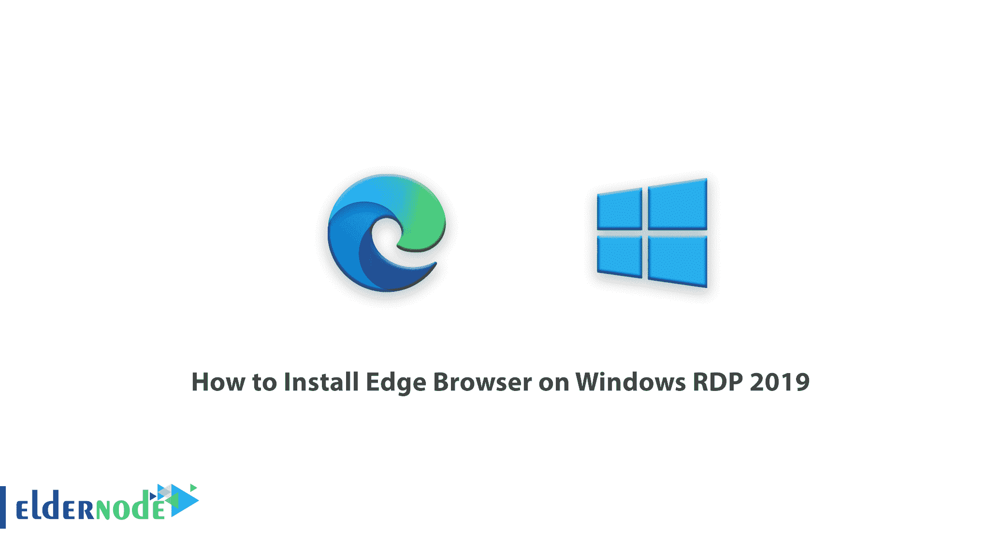

# 如何在 Windows RDP 2019 - Eldernode 博客上安装 Edge 浏览器

> 原文：<https://blog.eldernode.com/install-edge-browser-on-windows-rdp-2019/>

由于 Internet Explorer 的不受欢迎，微软在网络浏览器方面没有多少声誉。随着微软 edge 浏览器的出现，该公司找到了在浏览器领域赢得声誉的机会。这款浏览器虽然不错，但仍然存在问题。所以微软推出了全新版本的 Edge。微软的变化不仅仅是几个选项的小变化。这一改变使它成为你可以在电脑上下载和享受的最好的浏览器之一。在这篇文章中，我们试图教你如何**在 Windows RDP 2019** 上安装 Edge 浏览器。你可以访问 [Eldernode](https://eldernode.com/) 提供的包来购买 [Windows VPS](https://eldernode.com/windows-vps/) 服务器。

## 教程在 Windows Server 2019 上安装 Edge 浏览器

## 在 Windows RDP 2019 上安装 Edge 浏览器

第一步你必须打开一个你最喜欢的[浏览器](https://blog.eldernode.com/clear-the-browser-cache/)，然后输入并搜索“**微软 edge 下载**”。然后点击第一个链接，也就是[微软网站](https://www.microsoft.com/en-us/edge#mainContent)的链接，进入 edge 浏览器下载页面。

点击“下载”按钮旁边的**箭头**，选择您想要的窗口。然后点击**下载**进入下一步。

选择窗口类型后，将立即出现以下屏幕。选择您希望继续安装过程的语言，然后单击“**接受并下载**”。

以下页面表示文件已下载。

现在转到下载文件所在的位置。在下载文件夹中找到“ **MicrosoftEdgeSetup** ”文件，双击它。

在打开的窗口中，点击**运行**。

等一会儿进入下一阶段…

在下一个窗口中，点击**完成设置**。

如果您希望将浏览器信息传输到新浏览器 edge，请单击**从 Internet Explorer 导入**。否则，点击**继续，不导入**。最后点击**确认**。

在下一个窗口中，从**灵感**、**信息**和**聚焦**中选择一个选项来启动新的标签页信息。然后点击**确认**。

最后不登录点击**继续，完成 edge 浏览器的安装。**

您将看到您已成功进入 edge 浏览器环境。

你可以在**开始菜单**中输入 edge，选择**微软 Edge** 。

结论

## Microsoft Edge 旨在与 Windows 版本的浏览器 [Internet Explorer](https://blog.eldernode.com/disable-security-questions-in-ie/) 无缝同步内容和数据。这种浏览器浏览网页速度快，安全性高。它还使用组织和优化具有扫描二维码能力的页面上的元素。该浏览器的用户可以将网页归类为收藏夹。通过在其应用程序中进行这些升级，微软已经能够在浏览器中获得声誉，并开始一个成功的未来。在这篇文章中，我们试图教你如何在 Windows RDP 2019 上安装 Edge 浏览器。需要注意的是，如果要安装 Google Chrome、Firefox 和 opera 浏览器，可以参考文章[在 RDP 管理员](https://blog.eldernode.com/install-google-chrome-on-rdp-admin/)上安装 Google Chrome、[如何在 RDP 管理员](https://blog.eldernode.com/install-firefox-on-rdp-admin/)上安装 Firefox、[在 RDP 管理员](https://blog.eldernode.com/install-opera-on-rdp-admin/)上安装 Opera。

Microsoft Edge is built to sync content and data seamlessly with the Windows version of the browser, [Internet Explorer](https://blog.eldernode.com/disable-security-questions-in-ie/). This browser has high speed and security in browsing web pages. It also uses the organization and optimization of elements on a page that has the ability to scan QR codes. Users of this browser can categorize web pages as favorites. By making these upgrades in its application, Microsoft has been able to gain a reputation among browsers and start a successful future. In this article, we tried to teach you How to Install Edge Browser on Windows RDP 2019\. It should be noted that if you want to install Google Chrome, Firefox and opera browsers, you can refer to the articles [Install Google Chrome on RDP admin](https://blog.eldernode.com/install-google-chrome-on-rdp-admin/) , [How to Install Firefox on RDP admin](https://blog.eldernode.com/install-firefox-on-rdp-admin/) and [Install Opera on RDP admin](https://blog.eldernode.com/install-opera-on-rdp-admin/).