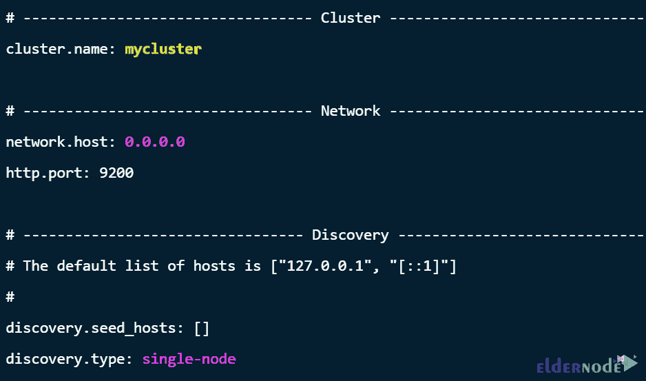
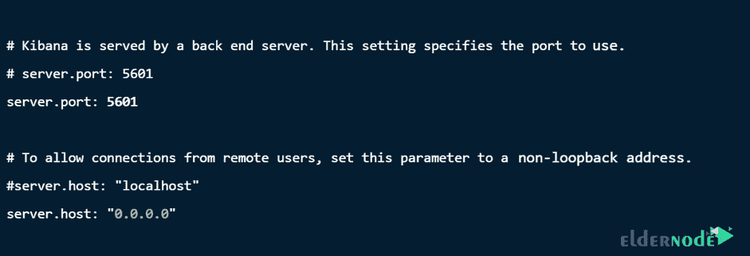
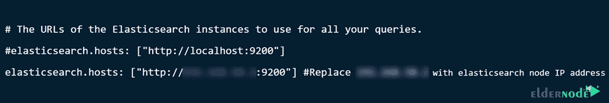
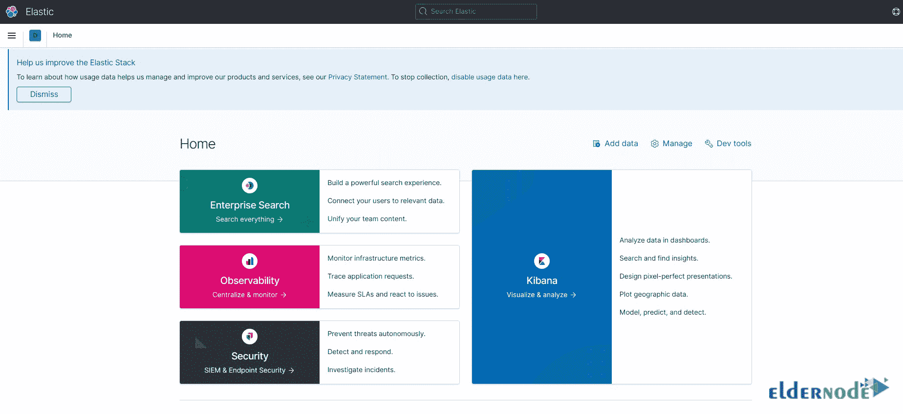
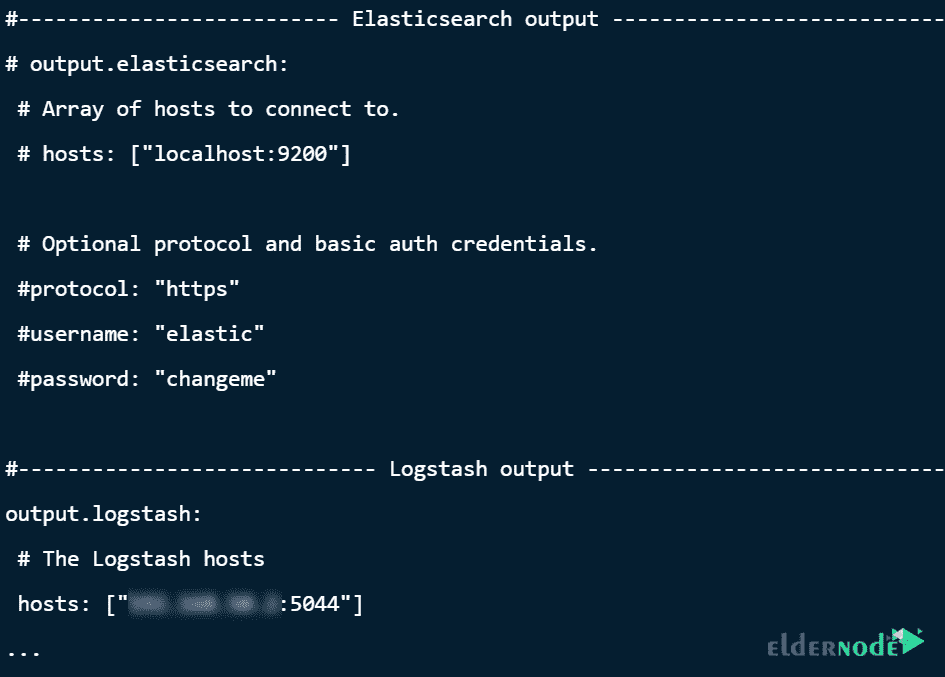
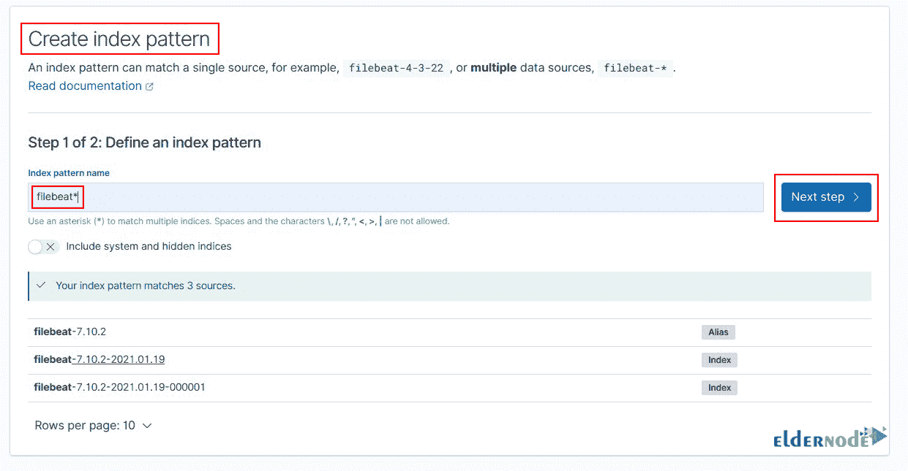
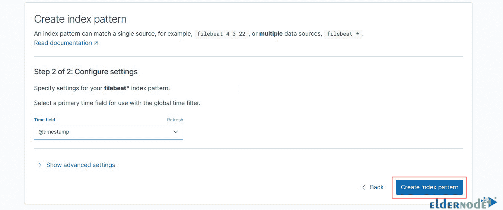
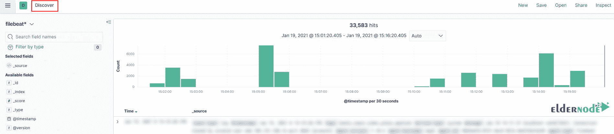

# Debian 11 - Eldernode 博客如何安装 Elastic Stack 7

> 原文：<https://blog.eldernode.com/install-elastic-stack-7-on-debian-11/>


**ELK** 是一个开源应用的集合。您可以使用 ELK 收集、分析和可视化来自各种来源的报告。它由称为 Elastcisearch、Logstash 和 Kibana 的组件组成，在本文中，你将熟悉它们的特性，然后你将学习**如何在 Debian 11** 上安装 Elastic Stack 7。如果您想购买 [**Linux VPS**](https://eldernode.com/linux-vps/) 服务器，您可以在 [Eldernode](https://eldernode.com/) 网站上看到可用的软件包。

## **教程在 Debian 11 上安装弹性栈 7**

### **麋鹿**组件 

1 –>**elastic search**是一个搜索和分析引擎。

2 –>**Logstash**是一个服务器端数据处理管道，它同时接收、转换然后发送来自多个资源的数据。

3 –>**Kibana**允许用户在 Elasticsearch 中使用图表和图形可视化数据。

4 –>**Beats**从服务器收集报告并发送到 Logstash 或 Elasticsearch。

在这篇来自 [Debian 教程](https://blog.eldernode.com/tag/debian/)系列的文章的续篇中，我们将一步一步地向你解释如何在 Debian 11 上安装 Elastic Stack 7 及其组件。

## **在 Debian 11 上安装弹性栈 7**

首先**使用以下命令更新您的系统** **包**:

```
sudo apt-get update
```

```
sudo apt-get upgrade
```

```
sudo reboot
```

安装 ELK 之前需要**安装 Java 8** 或者 11。运行以下命令安装 OpenJDK 11:

```
sudo apt install openjdk-11-jdk -y
```

您可以检查版本以确认 Java 安装:

```
java --version
```

然后使用下面的命令**安装弹性栈 PGP 签名密钥**:

```
wget -qO - https://artifacts.elastic.co/GPG-KEY-elasticsearch | sudo apt-key add -
```

您可以使用以下命令在 Debian 11 上安装 ELK APT 存储库:

```
sudo apt install apt-transport-https
```

```
echo "deb https://artifacts.elastic.co/packages/7.x/apt stable main" | sudo tee /etc/apt/sources.list.d/elastic-7.x.list
```

然后**使用以下命令更新包列表**的缓存:

```
sudo apt update
```

成功添加 ELK 存储库之后，您就可以安装弹性堆栈的各个组件了。

### **如何在 Debian 11 上安装 elastic search**

为了**安装 Elasticsearch** ，首先运行以下命令:

```
sudo apt install elasticsearch
```

现在运行以下命令来配置 Elasticsearch，以定义您想要监听的 IP 地址和端口，并设置发现类型和集群名称:

```
sudo vim /etc/elasticsearch/elasticsearch.yml
```

然后应用以下更改:



**使用以下命令调整系统内存中的 JVM 堆大小**:

```
sudo vim /etc/elasticsearch/jvm.options
```


现在**保存**文件并运行以下命令以**开始并启用弹性搜索**:

```
sudo systemctl enable --now elasticsearch
```

然后使用下面的命令确认状态:

```
systemctl status elasticsearch
```

### **如何在 Debian 11 上安装 Kibana**

使用以下命令安装 Kibana :

```
sudo apt install kibana
```

使用以下命令**配置 Kibana** :

```
sudo vim /etc/kibana/kibana.yml
```



应用以下设置来配置 Kibana 与 Elasticsearch 的连接:



运行以下命令**启用并启动 Kibana** :

```
sudo systemctl enable --now kibana
```

然后使用以下命令确认 **Kibana 状态**:

```
systemctl status kibana
```

运行以下命令来**配置防火墙**，以便 Kibana 端口可以从互联网访问:

```
sudo ufw allow 5601/tcp
```

您可以使用 **IP 服务器**或**主机名**和**基巴纳端口** : **http:// <服务器 IP 地址> :5601** 从浏览器**访问基巴纳仪表板**



### **如何在 Debian 11 上安装 Logstash**

您可以使用以下命令**安装 Logstash** :

```
sudo apt-get install logstash
```

为了**配置 Logstash** ，首先创建一个名为 **02-beats-input.conf** 的文件，您可以在其中配置您的 Filebeat 输入:

```
sudo vim /etc/logstash/conf.d/02-beats-input.conf
```

然后添加以下内容:

```
input {  beats {    port => 5044   } }
```

现在您需要将过滤器设置添加到**创建系统报告**，因此运行以下命令来创建另一个配置文件:

```
sudo vim /etc/logstash/conf.d/10-syslog-filter.conf
```

按以下顺序修改文件内容:

```
filter { if [type] == "syslog" { grok { match => { "message" => "%{SYSLOGTIMESTAMP:syslog_timestamp} %{SYSLOGHOST:syslog_hostname} %{DATA:syslog_program}(?:\[%{POSINT:syslog_pid}\])?: %{GREEDYDATA:syslog_message}" } add_field => [ "received_at", "%{@timestamp}" ] add_field => [ "received_from", "%{host}" ] } syslog_pri { } date { match => [ "syslog_timestamp", "MMM d HH:mm:ss", "MMM dd HH:mm:ss" ] } } }
```

最后，通过 Logstash 创建另一个配置文件来存储 Elasticsearch 中的 beats 数据:

```
sudo vim /etc/logstash/conf.d/30-elasticsearch-output.conf
```

将以下内容添加到文件中:

```
output { elasticsearch { hosts => ["your_ip_address:9200"] manage_template => false index => "ssh_auth-%{+YYYY.MM}" } }
```

运行以下命令来**启动并启用 Logstash** :

```
sudo systemctl start logstash
```

```
sudo systemctl enable logstash
```

### **如何在 Debian 11 上安装 Filebeat**

ELK 使用 beats 发送各种来源的数据，并提交给 Logstash 或 Elasticsearch。 **Filebeat** 用于采集和发送报表文件。

运行以下命令将 Filebeat 安装到与 Elasticsearch 相同的服务器上:

```
sudo apt-get install filebeat
```

要将数据发送到 Logstash，运行以下命令来**配置 Filebeat** :

```
sudo vim /etc/filebeat/filebeat.yml
```

在输出部分，应用以下更改:



**使用以下命令启用 Filebeat 模块**:

```
sudo filebeat modules enable system
```

然后运行以下命令**加载索引模板**:

```
sudo filebeat setup \
```

```
--index-management -E output.logstash.enabled=false \
```

```
-E 'output.elasticsearch.hosts=["IP.address:9200"]'
```

最后，您可以使用以下命令**启动并启用 Filebeat** :

```
sudo systemctl start filebeat
```

```
sudo systemctl enable filebeat
```

现在**登录到基巴纳**到**添加 Filebeat 索引**并按照下面的路径添加一个新的索引:

管理->堆栈管理-> Kibana ->索引模式->创建索引模式

要搜索匹配模式，请在索引模式名称中输入 **filebeat** 。找到图案后，点击**下一步**:



然后要配置新的索引，点击**创建索引模式**:



最后，从上一菜单中，点击**发现**以显示您的数据:



## 结论

在本文中，我们介绍了 Elastic Stack，这是一个开源应用程序的集合，并分析了它的组件(Elasticsearch、Kibana、Logstash)的特性。通过这篇文章，你还学习了如何在 Debian 11 上安装 Elastic Stack 7。