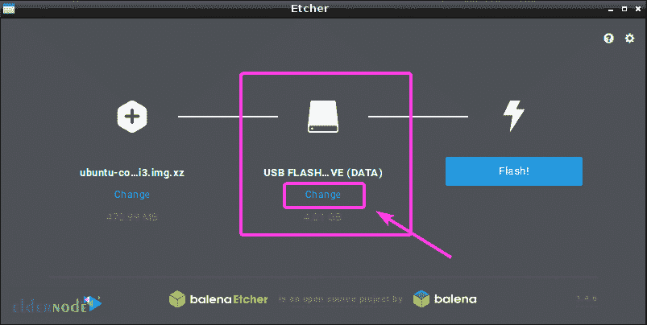

# 如何在 Debian 10 - Eldernode 博客上安装 Etcher

> 原文：<https://blog.eldernode.com/install-etcher-on-debian-10/>


Etcher 是一个免费的开源工具，用于编写图像文件，如。iso 和。img 文件，以及存储介质上的压缩文件夹，以创建动态 SD 卡和 USB 闪存驱动器。它是由 balena 和 ay face 开发的，也被称为 **balenaEtcher** 。蚀刻机是根据阿帕奇许可证 2.0 许可。蚀刻机是通过图形用户界面使用。还有一个正在积极开发中的命令行界面。在这篇文章中，你将学习**如何在 Debian 10** 上安装 Etcher。首先，你首先需要有自己的 [Linux VPS](https://eldernode.com/linux-vps/) 。根据您的需求在 [Eldernode](https://eldernode.com/) 中找到合适的包装，并触摸其中的差异。

为了让本教程更好地发挥作用，请考虑以下**先决条件**:

拥有 sudo 权限的非 root 用户。

要进行设置，请按照 Debian 10 的[初始设置进行。](https://blog.eldernode.com/initial-setup-with-debian-10/)

## **教程在 Debian 10 | Debian 9 上安装 Etcher**

Etcher 是一个神奇的 USB 图像写入工具。此外，如果您提供 EtcherRo，您将拥有一个独立的硬件设备，允许您以极高的速度一次写入多个卡或 USB 磁盘。使用这个易于使用的媒体创建工具，您将能够创建可引导的 USB 驱动器或 Sd 卡。要开始在 Debian 10 上安装 Etcher 的过程，请按照以下步骤成功完成本指南。

*第一步:*

照例推荐你[从其官网下载 Etecher](https://www.balena.io/etcher/) 。当 Iis 页面打开时，点击下载链接，下载用于 [Linux](https://blog.eldernode.com/tag/linux/) 的 Etcher。


然后，向下滚动并单击链接，如下所示:


*第二步:*

当系统提示您保存文件时，打卡**保存文件**。然后你会看到下载过程将开始。

*第三步:*

一旦为 Linux 下载了 Etcher，您就可以在 Linux 上安装它了。所以，你需要在你的 Linux 发行版上安装***【zenity】***或者 ***Xdialog*** ，或者 ***kdialog*** 包。当您在 Debian 上安装 Etecher 时，安装 zenity 会更容易，因为它可以在这些 Linux 发行版的官方软件包库中找到。

*第四步:*

**通过运行以下命令来更新**您的 Debian 机器的包存储库:

*第五步:*

```
sudo apt update
```

使用以下命令安装 **zenity** :

并且要继续，按下 **y** 和<T2 输入 T7。然后，应该安装 **zenity** 。

```
sudo apt install zenity
```

*第 6 步:*
在这一步中，您应该使用以下命令导航到下载 Etcher 的**~/下载**目录:

第 7 步:
然后，要解压文件，输入:

```
cd ~/Downloads
```

当您提取 zip 文件时，将会生成一个新的 AppOmage 文件。现在，使用以下命令将 AppImage 文件移动到/opt 目录:

```
unzip etcher-electron-1.4.6-linux-x64.zip
```

*第八步:*

```
sudo mv etcher-electron-1.4.6-x86_64.AppImage /opt
```

使用以下命令运行蚀刻机:

第九步:
当你面对安装桌面文件的对话框时，点击 yes 看它启动。

```
/opt/etcher-electron-1.4.6-x86_64.AppImage
```


你不必从命令行启动 Etcher 了，从应用程序菜单启动 Etcher。

**如何在 Linux 上使用 Etcher**

### 现在，你可以用蚀刻机给你的树莓 Pi 刷 microSD 卡了。打开蚀刻机并点击选择图像。

这样，一个文件拾取器就会被打开。然后，选择您希望用来闪存 microSD 卡的操作系统映像文件，并点击**打开**。


然后，您会看到图像被选中。


插入您希望用 Etcher 闪存的 microSD 卡或 USB 存储设备。如果您的计算机上连接了多个 USB 存储设备或 microSD 卡，您可以点击**更改。**接下来，从列表中选择你想用蚀刻机擦写的，点击**继续**。



您也可以使用 Etcher 同时闪存 USB 设备或 microSD 卡，为此，您必须从列表中选择需要闪存的设备，然后点击**继续**。


它将被选中，如下所示:


Etcher 可以闪存 MicroSD 卡或 USB 存储设备的方式可能会被你改变。如果你想改变它，点击齿轮图标。


你将能够很容易地使用蚀刻机设置面板。在那里，您可以选中或取消选中您想要的内容，然后点击**返回**按钮。因为默认设置是好的，你可以在那里什么都不做。

但是，如果您取消选中**成功时验证写入**，它会检查 microSD 卡或 USB 存储设备上的所有内容是否都正确写入，从而节省您大量的时间。这给你的 microSD 卡或 USB 设备带来了很大的压力，需要很长时间才能完成。这取决于你，如果你没有一个有问题的 microSD 卡或 USB 存储设备，取消选中这个选项不会有什么坏处。


最后，单击 Flash！


这样，Etcher 就会开始刷新你的 microSD 卡或者 USB 存储设备。


当刷新 microSD 卡或 USB 存储设备时，您可以看到下面的窗口。然后，您可以关闭 Etcher 并弹出您的 microSD 卡或 USB 存储设备，并在您的 Raspberry Pi 设备上使用它。


结论

在本文中，您学习了如何在 Debian 10 上安装 Etcher。这就是你在 Linux 上安装和使用 Etcher 的方法。这个指南也可以在 Ubuntu 上使用。它将支持持久存储，允许 live SD 卡或 USB 闪存驱动器用作硬盘驱动器，以及支持将多个引导分区闪存到单个 SD 卡或 USB 驱动器。

## Conclusion

In this article, you learned How To Install Etcher On Debian 10\. That’s how you install and use Etcher on Linux. This guide could also be used on Ubuntu. It will support persistent storage allowing the live SD card or [USB](https://blog.eldernode.com/prevent-copying-of-data-on-usb/) flash drive to be used as a hard drive, as well as support for flashing multiple boot partitions to a single SD card or USB drive.