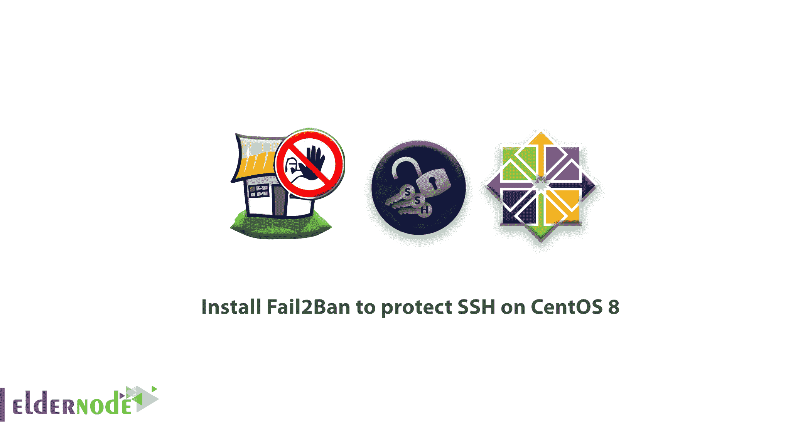
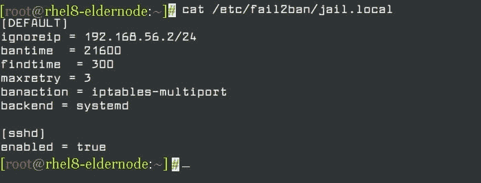

# 如何在 CentOS 8 上安装 Fail2Ban 保护 SSH——如何保护 SSH

> 原文：<https://blog.eldernode.com/install-fail2ban-centos-8/>



最近你复习了一下 [宋承宪](https://eldernode.com/set-up-ssh-keys-on-centos-8/) 。在这篇文章中，你将学习**如何在 CentOS 8** 上安装 Fail2Ban 来保护 SSH。但是首先，什么是 **Fail2ban。**这是一款免费、开源、广泛使用的入侵防御工具，它扫描日志文件，寻找显示过多密码失败等恶意迹象的IP 地址，并禁止它们。默认情况下，它附带了各种服务的过滤器，包括 **sshd** 。

## 如何在 CentOS 8 上安装 Fail2Ban 保护 SSH

推荐您阅读 [初始设置 centos 8](https://eldernode.com/initial-set-up-centos-8/) ，让我们指导您更容易地了解如何安装和配置 **fail2ban** ，以保护 **SSH** 并提高 **SSH** 服务器安全性，抵御对 **CentOS 8** 的暴力攻击。

### 在 CentOS 8 上安装 Fail2ban

在这一段**，**登录到您的系统后，进入一个命令行界面来启用您系统上的 EPEL 库。因为**的 fail2ban** 包不在官方的仓库里，但是在**的 EPEL** 仓库里有。

```
dnf install epel-release  OR  dnf install https://dl.fedoraproject.org/pub/epel/epel-release-latest-8.noarch.rpm
```

接下来，使用下面的命令安装 **Fail2ban** 包。

```
dnf install fail2ban 
```

**另外，阅读相关文章**:

[SSH 和 Telnet 的区别](https://eldernode.com/difference-between-ssh-and-telnet/)

### 配置 Fail2ban 保护 SSH

**fail2ban** 配置文件位于 **/etc/fail2ban/** 目录下，过滤器存储在 **/etc/fail2ban/filter.d/** 目录下。

我们不建议您从 fail2ban 服务器 **/etc/fail2ban/jail.conf，**中修改全局配置文件，因为它可能会在将来的软件包升级中被覆盖或改进。

此外，您可以在 **jail.local** 文件或单独的 **文件中创建和添加您的配置。conf** 文件放在 **/etc/fail2ban/jail.d/** 目录下作为备用。

请注意，在 **jail.local** 中设置的配置参数将覆盖在 **jail.conf** 中定义的任何参数。

在 **/etc/fail2ban/** 目录下创建一个名为 **jail.local** 的单独文件。

```
vi /etc/fail2ban/jail.local
```

打开文件时，将以下配置粘贴到文件中。

**注意**:【默认】该部分包含全局选项，【sshd】包含 sshd 监狱的参数。

```
[DEFAULT] ignoreip = 192.168.56.2/24  bantime  = 21600 findtime  = 300  maxretry = 3  banaction = iptables-multiport  backend = systemd [sshd] enabled = true 
```


现在，我们来看看上面配置中选项的解释:

1.  **ignoreip** :指定不禁止的 ip 地址或主机名列表。
2.  **bantime** :指定主机被禁止的秒数(即有效禁止持续时间)。
3.  **:指定主机被禁止之前的失败次数。**
4.  ****find time**:fail 2 ban 如果主机在最后的“ **findtime** ”秒内生成了“ **maxretry** ”，将会禁止该主机。**
5.  ****b 动作** :禁止动作。**
6.  ****后端** :指定用于获取日志文件修改的后端。**

**所以，上面的配置，意味着如果一个 IP 在最后的 **5** 分钟内失败 **3** 次，则禁止它 **6** 小时，并忽略 IP 地址 **192.168.56.2** 。**

**首先 ****、**** 启动并启用 **fail2ban** 服务，并使用以下 systemctl 命令检查它是否启动并运行。**

```
`systemctl start fail2ban  systemctl enable fail2ban  systemctl status fail2ban`
```

### **监控失败，禁用 IP 地址使用 fail 2 ban-客户端**

**在这一步中，您可以在配置 **fail2ban** 来保护 **sshd 之后，使用 **fail2ban-client** 来监控失败和被禁止的 IP 地址。**其次，要查看 fail2ban 服务器的当前状态，请使用以下命令。**

**监控 **sshd** 监狱:**

```
`fail2ban-client status sshd` 
```

**接下来，运行下面的命令来解除 fail2ban 中的 IP 地址。**

```
`fail2ban-client unban 192.168.56.1` 
```

**但是，有关 fail2ban 的更多信息，请阅读下面的手册页。**

```
`man jail.conf  man fail2ban-client`
```

****好样的** ！至此，您完成了教程的学习。**

**亲爱的用户，我们希望本教程能对你有所帮助，如果你有任何问题或想查看我们的用户关于本文的对话，请访问**

**[Ask page](https://eldernode.com/ask)

。也为了提高你的知识，有这么多有用的教程准备

[Eldernode training](https://eldernode.com/blog/)

.**