# 如何在 VirtualBox - Eldernode 博客上安装 Fedora

> 原文：<https://blog.eldernode.com/install-fedora-on-virtualbox/>

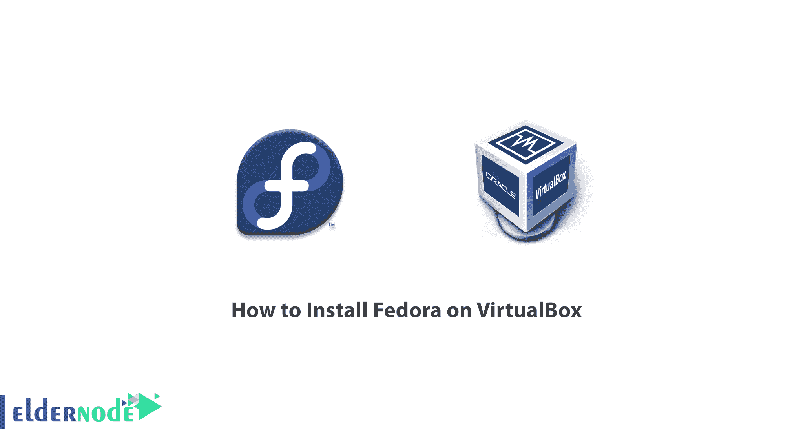

Fedora 最初作为 Fedora Core 发布，是由 Fedora 项目成员开发的 Linux 发行版。这个发行版得到了 RedHat 和其他公司的支持。这个项目的目标是建立一个多用途的操作系统，它通常由自由软件包组成。需要注意的是，每隔 6 到 8 个月，Fedora 就会发布一个新版本。在这篇文章中，我们将教你如何在 VirtualBox 上安装 Fedora。你可以访问 [Eldernode](https://eldernode.com/) 提供的包来购买 [Linux VPS](https://eldernode.com/linux-vps/) 服务器。

## **教程一步一步在 VirtualBox 上安装 Fedora**

在本节中，我们将一步一步地介绍在 Oracle VirtualBox 中安装 Fedora Linux 的步骤。下载 Fedora 的第一步是访问 [Fedora 网站](https://getfedora.org/)。打开此页面后，您将面临三个选项。 **Fedora 工作站**、 **Fedora 服务器、**和 **Fedora IoT** 。

Fedora 服务器用于服务器或数据中心。Fedora Workstation 是一个带有一组工具的映像，面向普通 GNOME 桌面环境中的桌面。Fedora IoT 也用于可扩展的基础设施。注意，如果 GNOME 不是你的首选，你可以下载一个 Fedora 桌面的 [spin](https://spins.fedoraproject.org/) 和一个可选的桌面环境。在本文中，我们选择了带有 GNOME 桌面环境的 Fedora 33。

### **如何创建一个空虚拟机**

安装和运行 Fedora 的最低要求是 20 GB 的磁盘空间和 2 GB 的 RAM。所以在第一步中，我们必须创建一个**虚拟机**并对其进行配置。为此，你需要启动**虚拟框**，点击**新建**。

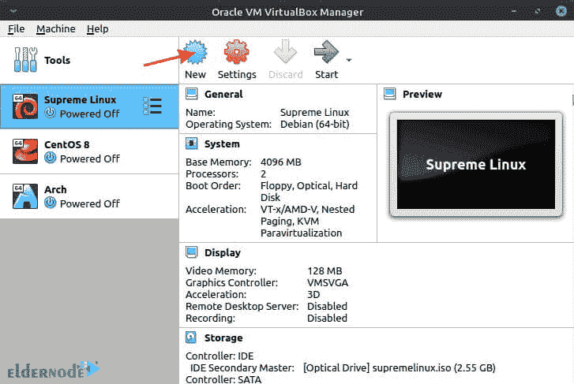

然后需要检查 Linux 的版本集和 Fedora 的版本(64 位)。需要注意的是，如果你开始在**名称字段**中输入 **Fedora** ，VirtualBox 会自动为你选择设置。如果你只有 32 位版本的权限，你必须在 **BIOS** 中**启用**虚拟化技术。注意，如果你有一个 **AMD CPU** ，它被称为 **SVM** 。

如下图所示进行设置后，点击**创建**。

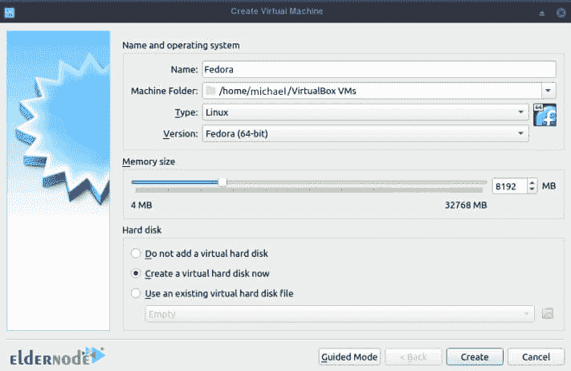

鉴于本教程中的系统内存量是 32 GB，因此分配了 8 GB 来完成这项工作。但是用 3 GB 的 RAM 就可以轻松做到。确认其他设置正确后，点击**创建**。

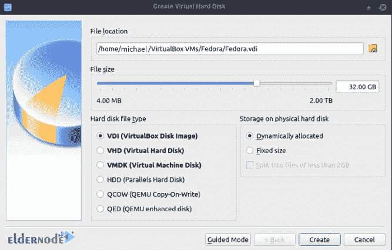

接下来，您需要下载 ISO，如下图所示。

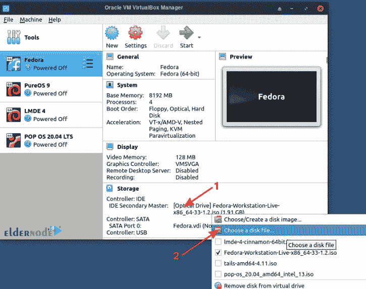

您将看到，当虚拟硬盘为空时，虚拟机将从该 ISO 启动。

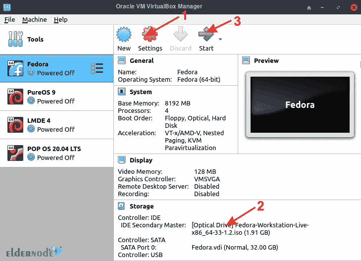

应该注意的是，如果您的处理器是多核处理器，它建议为您的虚拟机分配 2 个或更多内核。为此，您可以在**系统标签**下找到**处理器**。最后，点击**确定**启动你的虚拟机。

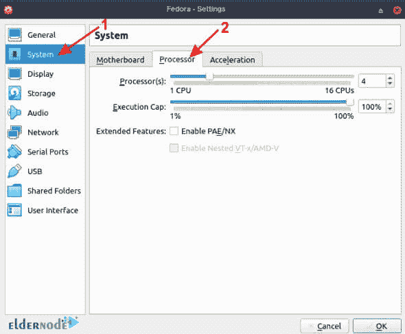

配置成功后，点击 **Start** 开始安装虚拟机。

### **在 VirtualBox 上安装 Fedora**

请注意，成功完成上一步后，您将在启动虚拟机时直接从 ISO 文件启动。选择**启动 Fedora** 通过选择一个与下图类似的页面，并按下 **enter** 键。

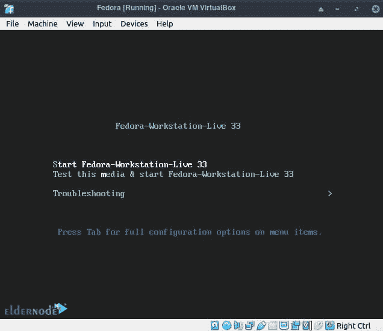

在下一步中，您必须点击**安装到硬盘**。这样做将启动对话框安装过程。

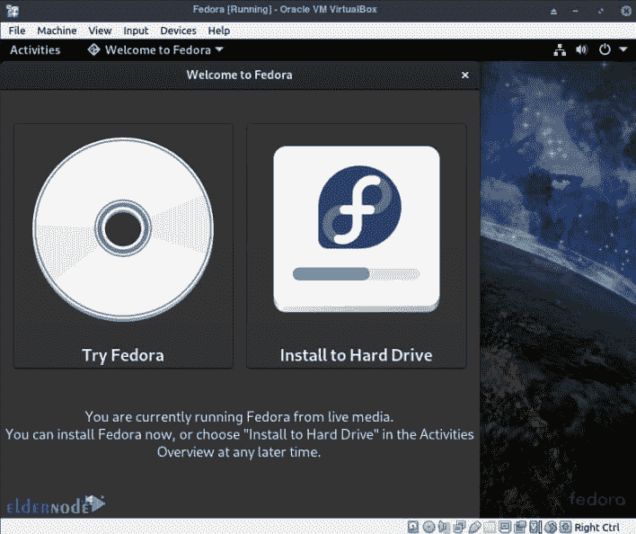

如下图所示，下一步与**键盘**设置、**安装目的地**和**时间&日期**相关。

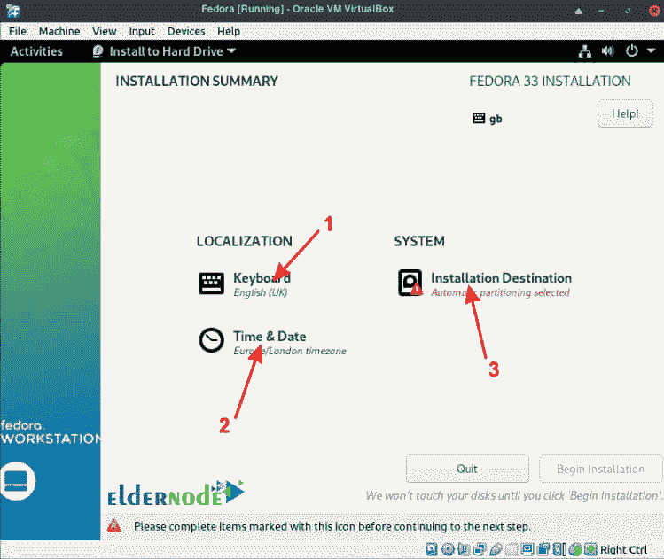

在下一步中，您必须首先选择您的**磁盘**，然后自动调整存储设置**。最后，点击**完成**应用更改。**

**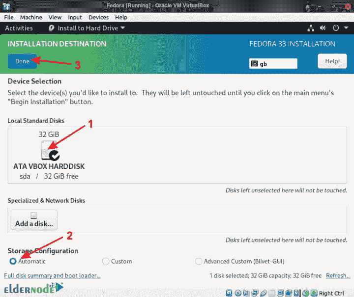**

**点击**完成**将进入下一页。所以只需点击**开始安装**。**

**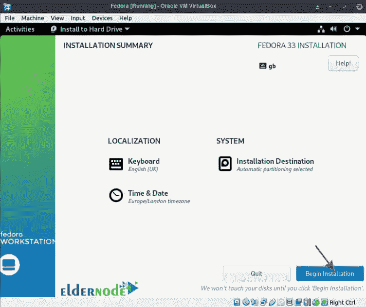**

**请注意，安装过程可能需要几分钟时间。最后，点击**完成** **安装**。你必须**关闭**系统电源才能在最后一步做出改变**

**在这一步中，您必须卸载 ISO 文件。**

**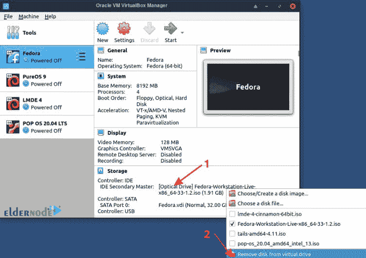**

**安装 ISO 文件后重要的一点是，下次用 Fedora 启动虚拟机时，会要求你**创建一个帐号**。通过为 Fedora 创建一个帐户并设置一个密码，在虚拟机器上安装 Fedora 的过程就完成了。**

## **结论**

**Fedora 是一个流行的 [Linux](https://blog.eldernode.com/tag/linux/) 发行版，在 RedHat 停产后发布，由 RedHat 提供支持。在本文中，我们讨论了如何在 VirtualBox 上安装 Fedora。如果你愿意，你也可以参考[如何在 VPS 服务器](https://blog.eldernode.com/install-fedora-on-vps-server/)上安装 Fedora。**