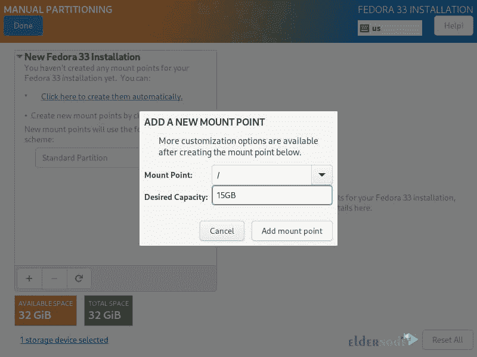

# 如何在 VPS 服务器上安装 Fedora-elder node 博客

> 原文：<https://blog.eldernode.com/install-fedora-on-vps-server/>

Fedora 项目，技术上称为 Fedora 核心，于 2003 年底正式启动。那时红帽 Linux 停止工作了。RedHat 的 Linux 版本是 RedHat 支持的唯一 Linux 版本，这个 Linux 发行版是收费出售的，也是商业性的。而 Fedora Core 是一个公开免费的 Linux。RedHat 决定投资 Fedora Core，被称为 RedHat Enterprise 的 RedHat Linux 的更新版本基于 Fedora Core。在这篇文章中，我们试图学习如何在 VPS 服务器上安装 Fedora。你可以访问 [Eldernode](https://eldernode.com/) 提供的包来购买 [Linux VPS](https://eldernode.com/linux-vps/) 服务器。

## **教程一步一步在 VPS 服务器上安装 Fedora**

2002 年，Warren Togami 开始了 Fedora 项目，作为一个学生项目。创建这样一个项目的主要目的是让其他人能够使用 RedHat 软件包。通过在单个套件中使用这些软件包，用户能够找到并开发与该操作系统相关的软件。

Fedora 和 RedHat 的主要区别在于，Fedora 项目与 RedHat 不同，它是一个自愿的公共项目。但是 RedHat 是一个商业产品，它的开发者也是 RedHat。最终，Fedora Core Linux 项目吸引了它的用户，并迅速传播开来。其发展的最重要原因是协作系统，这是开源软件所固有的。跟随我们这篇文章，学习如何在 VPS 服务器上安装 Fedora。

### **Fedora 33**的特点

在本节中，我们将讨论 Fedora 33 的 8 个特性:

1.它有一个 Linux 5.8 内核。

2.Btrfs 是默认的文件系统。

3.通过现代化的强大驾驶舱用户界面实现轻松管理。

4.您可以引入额外的模块化。

5.可以删除不必要的包。

6.较小的安装占地面积

7.服务器角色是这个版本的另一个特性。

### **在 VPS 服务器上安装 Fedora**

在本节中，我们将学习如何安装最新发布的 [Fedora](https://blog.eldernode.com/tag/fedora/) 版本，即 Fedora 33。第一步，你需要[下载 Fedora](https://getfedora.org/en/server/download/) 64 位 live image。

成功下载文件后，下一步是使用 **Unetbootin** 或 **dd** 命令创建 CD/DVD 或 USB 闪存驱动器。现在我们来看 Fedora 的安装步骤。

第一步是选择一个活动的**介质/端口。**完成此操作后，您必须插入可引导介质。现在，你面临两个选择。在第一个选项中，您可以立即安装 Fedora 33。在第二个选项中，您可以在开始安装过程之前测试安装介质是否有任何错误。

然后，您必须选择您的首选语言。然后点击**继续**。

下一步包括**安装总结**。您可以在此部分进行系统设置，如键盘布局、语言支持、系统时间和日期、安装源、安装软件、网络和主机名、安装目的地。

Fedora 的完全安装需要对上述所有内容进行调整。因此，在本文的后续部分，我们将向您解释如何设置和配置上图中的选项。

#### **如何设置键盘布局(在 VPS 上安装 Fedora)**

如下图所示，您可以使用 **+** 符号来添加键盘布局。所以你必须点击**添加**，然后简单地点击**完成**。

#### **如何配置语言支持**

在语言支持配置步骤中，您必须设置支持语言。因此，搜索您想要的语言，并从可用选项中进行选择。然后点击**添加**进行安装。最后点击 **Done** 完成设置。

#### **如何配置系统时间和日期**

这一步是关于配置时间和日期设置。鉴于服务器上时间管理的重要性，您需要对其进行微调。如下图所示，你必须从**地区**和**城市**部分选择你想要的位置。然后点击**完成**。

#### **在 VPS 上安装 Fedora**一文中如何配置安装盘

本节的重点是有两种方法来设置分区。第一种方法是使用自动设置，第二种方法是手动设置。在本节中，我们将手动配置。为此，点击**磁盘映像**。然后选择**自定义**。最后，点击**完成**。

在下一步中，您需要从下拉菜单中选择“**标准分区**，为您在系统中创建的各个分区创建安装点。

需要注意的是，可以使用“ **+** ”按钮来添加新的分区。要创建一个根( **/** )分区，可以指定以下内容。以下示例中的分区大小仅供参考，您可以根据磁盘大小调整系统容量。最后，你必须点击**添加挂载点**。

注意，每种类型的 Linux 系统分区都需要一个文件系统。所以我们使用 **ext4** 为上一步中创建的**根文件系统**建立一个文件系统。

接下来，您需要创建一个**主分区**和**安装点**。因此您可以简单地点击“**添加安装点**”设置来做到这一点。

需要注意的是，你还需要为分区系统设置**文件系统**类型，我们用的是 **ext4** 。

在下一部分，也是重要的一步，您必须在硬盘上创建一个交换分区。该分区专用于在系统 RAM 中临时存储额外的数据。完成此操作后，单击“ **Add Mount point** ”创建该分区。然后点击图像左上角的**完成**应用设置。

最后，查看下图后，点击“**接受更改**”。

#### **在 VPS 上安装 Fedora**一文中如何设置网络和主机名

在配置页面上点击**网络和主机名**。在这一步，你可以选择主机名，然后点击**应用**。您也可以点击**配置**按钮来配置系统网络设置。

如图所示，在此部分中，您可以配置许多网络设置。要执行配置，您必须点击手动调整方法的下拉菜单。进入**设置**设置其他功能。设置好所有项目后，点击**保存**，然后点击左上角的**完成**。

成功完成上述步骤后，在此步骤中，您需要设置主用户密码和一个附加系统帐户。所以点击 **ROOT 密码**。然后点击**完成**。

您可以点击**用户创建**来创建一个额外的账户。填写必填字段后，点击**完成**。

最后，您可以通过点击“**开始安装**”来开始安装 Fedora。

最后点击**重启系统**完成 Fedora 的安装和配置。

## 结论

不同操作系统的不同版本已经产生并发布，大多数用户可能并不熟悉。其中一个操作系统叫做 Fedora。Fedora 是一个基于 Linux 的操作系统。对 Linux 操作系统感兴趣的用户完全熟悉这个版本，它是 Linux 最流行的版本之一。在本文中，我们试图一步一步地向您介绍如何在 VPS 服务器上安装 Fedora。