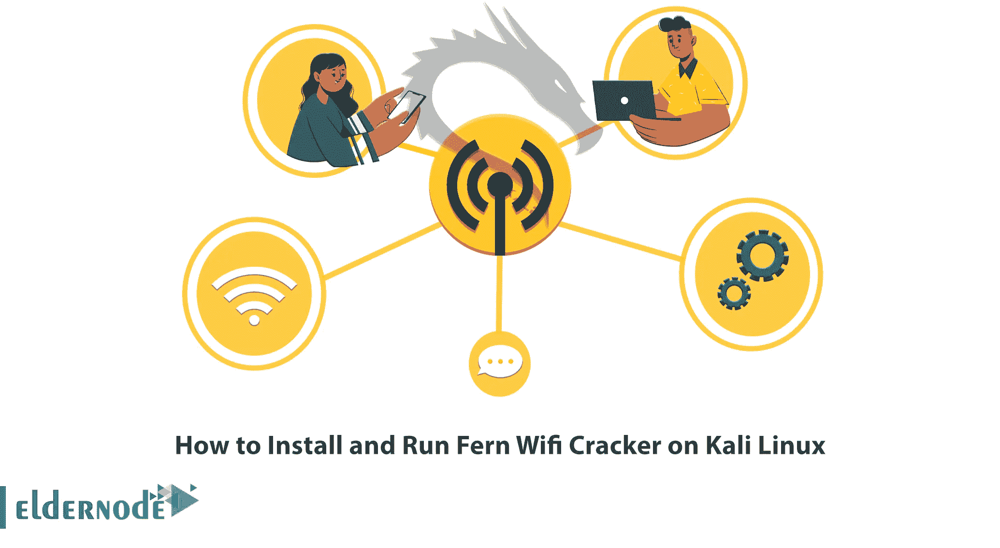
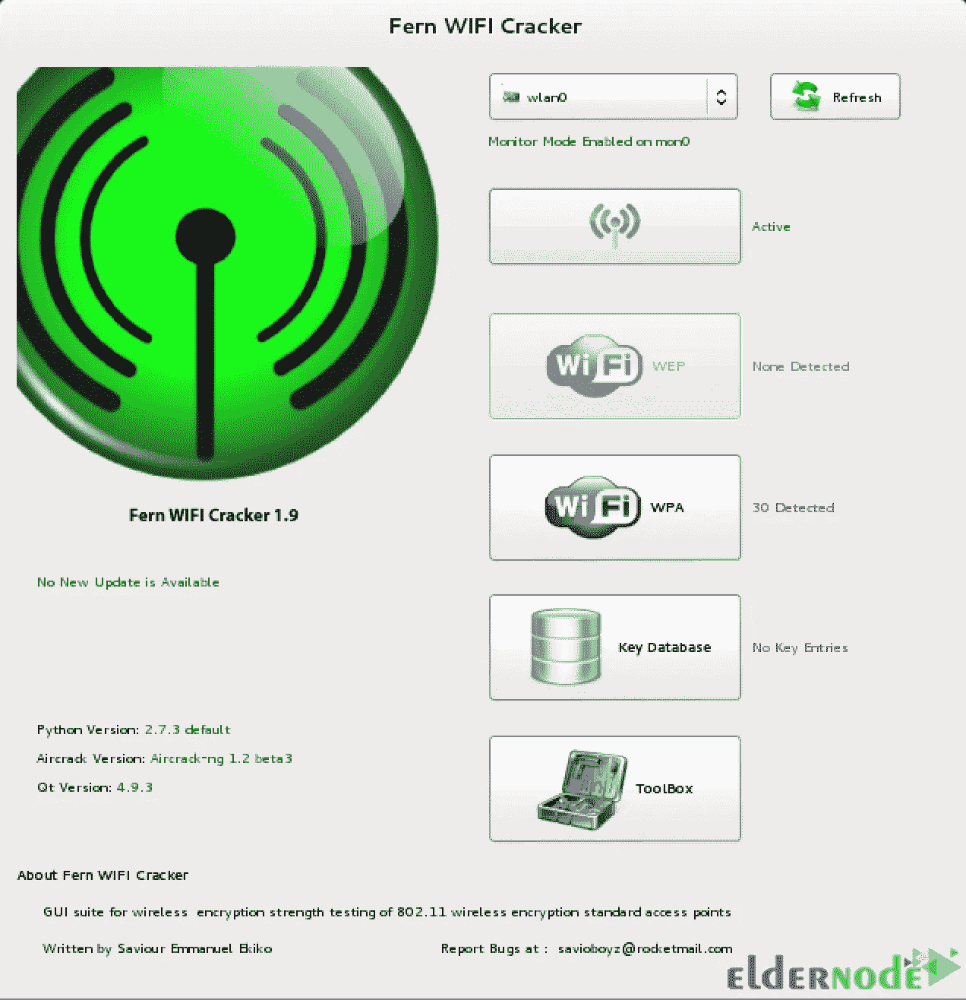

# 如何在 Kali Linux 上安装 Fern Wifi Cracker

> 原文：<https://blog.eldernode.com/install-fern-wifi-cracker-on-kali-linux/>



在资源共享之后，信息安全是建立网络最重要的因素，因为没有它，资源共享就没有用。如今，使用无线网络是共享资源(如互联网)的最常见方法。由于使用无线媒体涉及的风险最大，因此在使用无线方式共享资源之前，最好确保网络的安全性。本文将教你**如何在 Kali Linux** 2022 上安装 Fern Wifi Cracker，这关系到检查无线介质的安全性。如果你想购买一台 [**Linux VPS**](https://eldernode.com/linux-vps/) 服务器，你可以查看 [Eldernode](https://eldernode.com/) 网站上提供的软件包。

## **教程在 Kali Linux 上设置 Fern Wifi Cracker**

### **什么是 Fern Wifi Cracker？**

Fern Wifi Cracker 是一款无线安全试听和攻击软件程序，使用 Python 编程语言和 Python Qt GUI 库编写。你可以用它来破解无线连接和渗透测试用 [Kali Linux](https://blog.eldernode.com/tag/kali-linux/) 。该程序能够破解和恢复 WEP、WPA 和 WPS 密钥，以及通过无线或以太网执行其他基于网络的攻击。它设计用于测试和发现自己网络中的缺陷，并修复检测到的缺陷。

### **羊齿 Wifi 破解功能**

–带有碎片、Chop-Chop、咖啡-拿铁、Hirte、ARP 重复请求或 WPS 攻击的 WEP 破解

–WPA/WPA2 破解字典或 WPS 攻击

暴力袭击

–地理位置跟踪接入点 MAC 地址

–更新支持

–成功破解后，自动将密钥保存在数据库中

–自动接入点攻击系统

–会话劫持

–内置 MITM 发动机

## **在 Kali Linux 上安装 Fern Wifi Cracker**

在本节中，您将学习如何在 Kali Linux 上安装 Fern Wifi Cracker。只需按照下面的步骤，并输入以下命令。

首先，**通过运行以下命令更新您的系统**包:

```
sudo apt update
```

现在，您可以使用以下命令安装 Fern Wifi Cracker:

```
sudo apt install fern-wifi-cracker
```

### **如何在 Kali Linux 上运行 Fern Wifi Cracker**

现在，我们将解释如何在 Kali Linux 上使用 Fern Wifi Cracker。

要在 Kali Linux 上启动 Fern wifi cracker ,只需运行以下命令:

```
sudo fern-wifi-cracker
```

然后您可以看到以下屏幕:



就是这样！您已经成功地在 Kali Linux 上安装并运行了 Fern Wifi Cracker。

### **在 Kali 服务器上卸载 Fern Wifi Cracker**

如果您想**移除 Fern Wifi** ，您可以使用以下命令:

```
sudo apt remove fern-wifi-cracker
```

## 结论

Fern Wifi Cracker 是一个无线安全试听和攻击软件程序，使用 Python 代码生成软件[破解](https://blog.eldernode.com/how-to-crack-linux-vps/)并恢复他们的密钥。在本文中，我们教你如何在 Kali Linux 上安装和运行 Fern Wifi Cracker。我希望这篇文章对你有用。如果你有任何问题，可以在评论区联系我们。