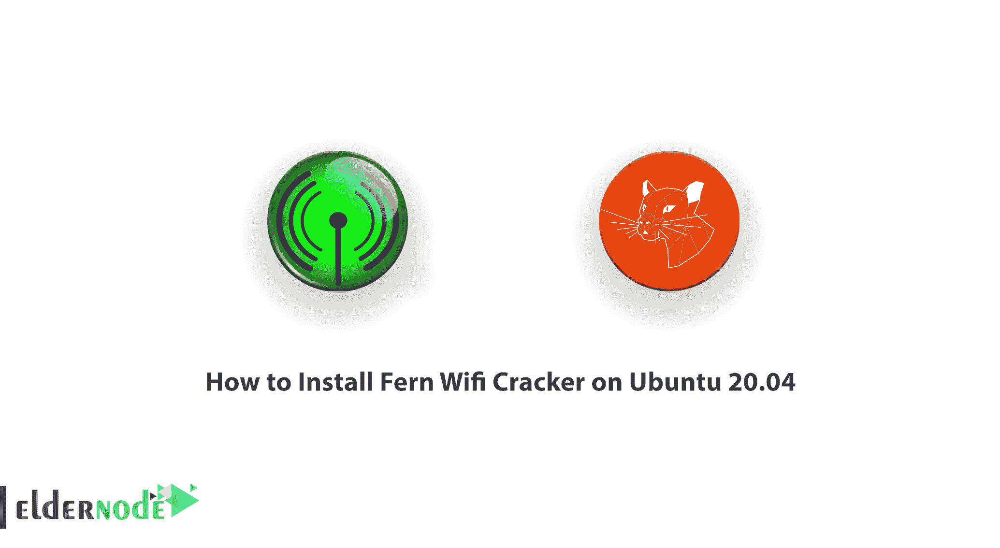
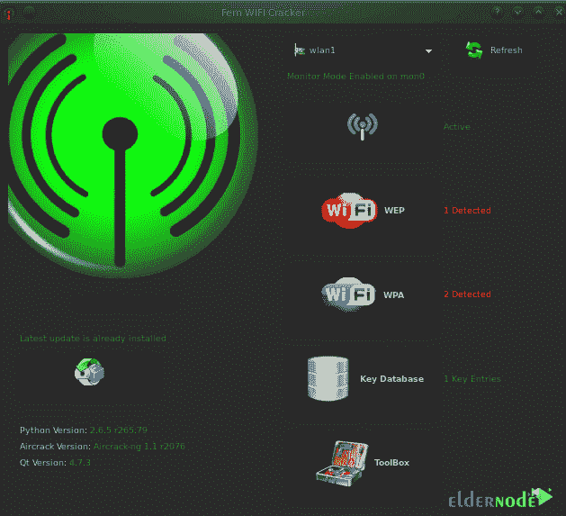

# 如何在 Ubuntu 20.04 上安装 Fern Wifi Cracker-elder node 博客

> 原文：<https://blog.eldernode.com/install-fern-wifi-cracker-on-ubuntu/>



Fern Wifi Cracker 是一个用于安全控制和无线攻击的程序。这个软件是用 Python 编程语言和 Python Qt 图形界面库编写的。应该注意的是，Fern Wifi Cracker 能够破解和恢复 WEP/WPA/WPS 密钥，以及对无线或基于以太网的网络的其他基于网络的攻击。请注意，Fern-Wifi-Cracker 旨在检测您的个人网络中的缺陷。因此，我们建议您不要在未经授权的网络上使用此程序。在这篇文章中，我们要教大家**如何在 Ubuntu 20.04** 上安装 Fern Wifi Cracker。你可以使用 [Eldernode](https://eldernode.com/) 中可用的软件包购买一台 **[Ubuntu VPS](https://eldernode.com/ubuntu-vps/)** 服务器。

## **教程在 Ubuntu 20.04 上一步一步安装 Fern Wifi Cracker**

### **羊齿 Wifi 破解功能**

Fern Wifi Cracker 最重要的功能包括:

1-更新支持

2-内置 MITM 发动机

3-自动接入点攻击系统

4-暴力攻击(HTTP、HTTPS、TELNET、FTP)

5-会话劫持(被动和以太网模式)

6-接入点 MAC 地址地理位置跟踪

7-使用基于字典或 WPS 的攻击进行 WPA/WPA2 破解

8-成功破解后自动将密钥保存在数据库中

9- WEP 破解与碎片，砍砍，咖啡拿铁，Hirte，ARP 请求重放或 WPS 攻击

在本文的续篇中，加入我们来教你如何在 [Ubuntu](https://blog.eldernode.com/tag/ubuntu/) 20.04 上安装 Fern Wifi Cracker。

### **在 Ubuntu 20.04 上安装 Fern Wifi Cracker | Ubuntu 18.04**

本节我们要安装的是如何在 Ubuntu 20.04 上安装 Cracker。为此，您必须按顺序执行以下步骤。在第一步中，您必须执行以下命令。通过执行以下命令，您的系统将得到更新:

```
sudo apt-get update
```

```
sudo apt-get upgrade
```

然后在下一步中，您必须运行以下命令来安装 [Aircrack-ng](https://blog.eldernode.com/aircrack-ng-on-ubuntu-20-10/) :

```
sudo apt-get install aircrack-ng
```

现在，您需要运行以下命令来安装 subversion:

```
sudo apt-get install subversion
```

成功安装 Aircrack-ng 和 subversion 后，您现在可以通过运行以下命令轻松使用 **Fern Wifi Cracker** :

```
sudo dpkg -i Fern-Wifi-Cracker_1.6_all.deb
```

### **如何在 Linux Ubuntu 上使用 Fern Wifi Cracker**

成功安装 Fern wifi 破解程序后，您现在应该在管理权限中打开它。为此，您必须在终端中运行以下命令:

```
sudo python /usr/local/bin/Fern-Wifi-Cracker/execute.py
```

重要的一点是，通过将 Sudo 放在命令的开头，我们尝试以 root 身份在管理界面中运行 Fern wifi Cracker。通过输入上述命令，您将被要求输入密码。输入密码后，您将看到下图。



点击**刷新**按钮，加载监视器界面。然后你应该点击**扫描或接入点(激活)**按钮，开始扫描。一旦找到 WIFI 网络，你必须按下 **WPA** 或 **WEP** 按钮来破解每个 WiFi 网络的密码。

## 结论

Fern Wifi Cracker 是一个无线安全审计和攻击软件程序，使用 Python 编程语言和 Python Qt GUI 库编写。该程序能够破解和恢复 WEP/WPA/WPS 密钥，还可以对无线或基于以太网的网络进行其他基于网络的攻击。在这篇文章中，我们在介绍了功能之后，试图教你如何在 Ubuntu 20.04 上安装 Fern Wifi Cracker。