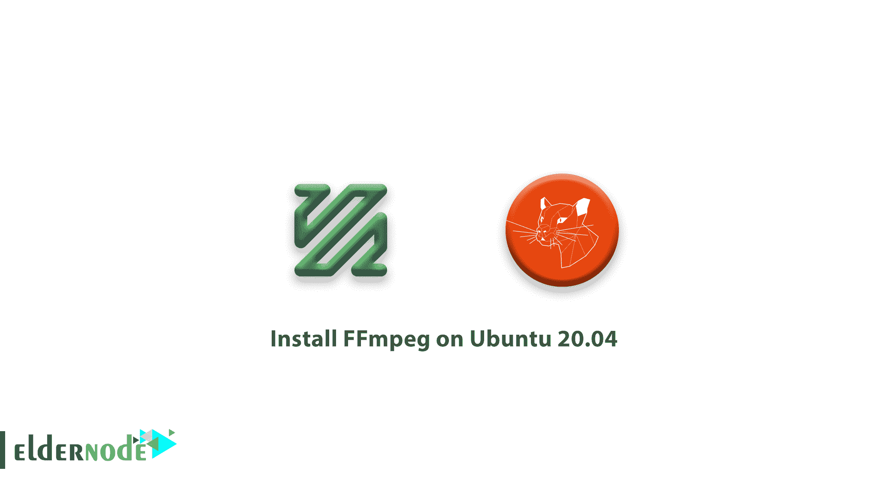

# 教程在 Ubuntu 20.04 上安装 FFmpeg-elder node

> 原文：<https://blog.eldernode.com/install-ffmpeg-on-ubuntu-20-04/>



FFmpeg 是一个免费的开源软件。通过其庞大的库，你将能够处理视频，音频和其他多媒体文件。由于它的核心是为基于命令行的处理而设计的，所以您可以轻松地将其用于格式[转码](https://en.wikipedia.org/wiki/Transcoding)，基本的编辑视频缩放，视频后期制作效果，以及符合标准。

MPEG 视频标准组的启发，FF 意味着快进。最近，FFmpeg 为 libavfilter 添加了一个实时明亮闪光消除滤镜，这似乎对光敏人看电视、玩视频游戏或甚至与 VR 耳机一起使用来阻挡意外触发因素(如在户外过滤阳光)很有用。

## 如何在 Ubuntu 20.04 上安装 FFmpeg

FFmpeg 允许音频和视频回放以及记录和转换。它还允许我们在不同格式之间转换多媒体文件。和我们一起完成在 Ubuntu 20.04 上安装 FFmpeg 的步骤。但是，如果您没有自己的[虚拟专用服务器](https://eldernode.com/ubuntu-vps/)，请相信我们会为您做到最好。

### 第一步:如何在 Ubuntu 上安装 FFmpeg

首先，你需要用下面的命令更新 ubuntu:

```
sudo apt-get update 
```

然后，使用下面的命令安装 FFmpeg:

```
sudo apt-get install ffmpeg 
```

### 第二步:如何在 Ubuntu 上查看 FFmpeg 版本

FFmpeg 完全安装后，用下面的命令检查安装的版本。

```
ffmpeg -version 
```

### 第三步:FFmpeg 基本命令:

以下是 FFmpeg 基本命令列表:

```
ffmpeg -version: show version  ffmpeg -formats: show available formats  ffmpeg -codecs: show available codecs  ffmpeg -decoders: show available decoders  ffmpeg -encoders: show available encoders  ffmpeg -bsfs: show available bit stream filters  ffmpeg -protocols: show available protocols  ffmpeg -filters: show available filters  ffmpeg -pix_fmts: show available pixel formats  ffmpeg -layouts: show standard channel layouts  ffmpeg -sample_fmts: show available audio sample formats 
```

### 步骤 4 : FFmpeg 示例

下面是一些 FFmpeg 命令行应用的例子。

减少。mov 文件大小 FFmpeg 命令行:

```
ffmpeg -i in.mov -c:v libx264 -c:a copy -crf 20 out.mov 
```

运行以下命令进行转换。移动到. mp4:

```
ffmpeg -i in.mov -vcodec copy -acodec aac -strict experimental -ab 128k out.mp4 
```

## 结论

在本文中，您了解了如何在 Ubuntu 20.04 上安装 FFmpeg。通过这些步骤后，你就可以在你的 Ubuntu 上成功运行它，并转换你的视频和音频文件。通过回顾 Ubuntu 20.04 的设置，更加了解它。