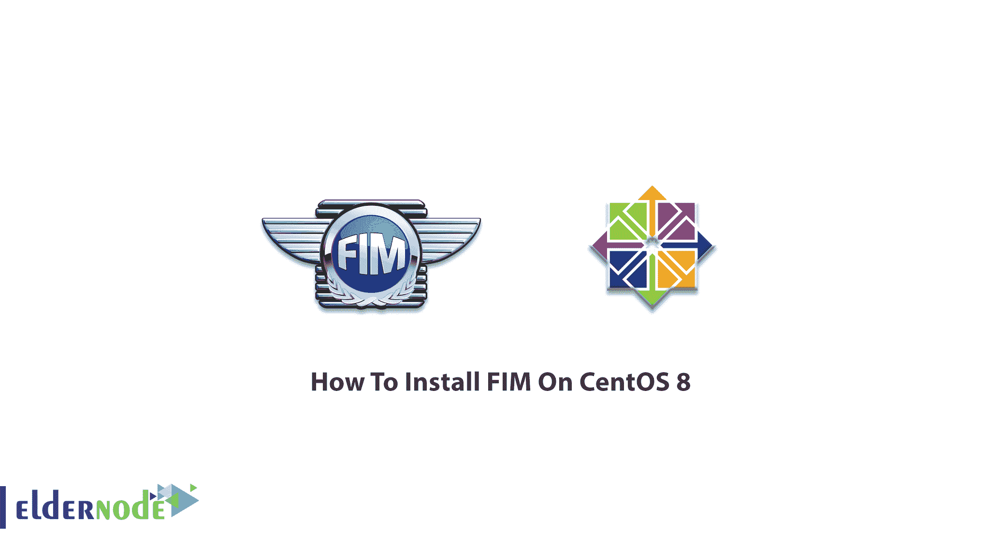

# 如何在 CentOS 8[完整版] - Eldernode 上安装 FIM

> 原文：<https://blog.eldernode.com/install-fim-on-centos-8/>



**职能指令手册**是一项安全实践，包括验证操作系统和应用软件文件的完整性，通过将它们与可信的“基准”进行比较来确定是否发生了篡改或欺诈。事实上，文件完整性监控能够保护敏感信息免遭盗窃、丢失和恶意软件的侵害。它必须提供足够的洞察力和可操作的情报。在本文中，你将学习**如何在 CentOS 8** 上安装 FIM。访问 [Eldernode](https://eldernode.com/) ，找到一个完美的套餐来购买您自己的 [CentOS VPS](https://eldernode.com/centos-vps/) 。

## **教程在 CentOS 8 上安装 FIM**

FIM 是一种安全控制措施，许多组织都围绕它建立了自己的[网络安全](https://blog.eldernode.com/the-importance-of-cybersecurity-for-digital-marketing/)计划，因为它是一种监控和检测文件中可能表明网络攻击的变化的技术。使用内部控制(如应用程序或流程)自动执行职能指令手册。这种监视可以随机执行，并以规定的轮询间隔执行，或者实时执行。

### **在 CentOS 上学习安装 FIM**

### **FIM 优势**

**FIM** 提醒您未经授权的变更，并帮助您保护 IT 基础设施。作为一种解决方案，FIM 监控服务器、数据库、网络设备、目录服务器、应用程序、云环境和虚拟映像上的文件更改。

**强大的 FIM 解决方案**使用变更智能仅在需要时通知您。所以，降噪是它的一大亮点。

**FIM** 允许您满足许多法规遵从性标准，如 PCI-DSS、NERC CIP、FISMA、SOX、NIST 和 HIPAA，以及 CIS 安全基准等最佳实践框架。

## **如何在 Linux 上使用 Osquery 设置 FIM**

最近，你读到了关于 [Osquery](https://blog.eldernode.com/install-osquery-on-ubuntu-20-04/) 的内容。它是一个多平台软件，可以安装在 Linux、Windows、macOS 和 FreeBSD 上。在下文中，您将学习如何使用 Osquery 设置文件完整性监控。让我们通过本指南的步骤来回顾安装过程。

### **如何在 Linux CentOS 上安装 Osquery**

因为 Osquery 为所有平台安装提供了自己的存储库，所以您可以从官方的 Osquery 存储库中安装 Osquery 包。因此，在系统中添加 Osquery 键。

```
curl -L https://pkg.osquery.io/rpm/GPG
```

```
sudo tee /etc/pki/rpm-gpg/RPM-GPG-KEY-osquery
```

现在，添加并启用 Osquery 并安装软件包。

```
sudo yum-config-manager --add-repo https://pkg.osquery.io/rpm/osquery-s3-rpm.repo
```

```
sudo yum-config-manager --enable osquery-s3-rpmsudo yum install osquery -y
```

```
sudo yum install osquery -y
```

您可能会遇到有关 yum-config-manager 命令的错误。

```
yum-config-manager: command not found
```

现在，通过运行以下命令安装' yum-utils '软件包:

```
yum -y install yum-utils
```

### **如何在 Osquery 中启用 Syslog 消费**

Osquery 提供了使用苹果系统日志(ASL)在苹果 macOS 上读取或使用系统日志的特性，而对于 Linux 则使用 Syslog。现在，您可以通过 rsyslog 为 Osquery 启用 Syslog 消耗。要安装 rsyslog 包，请运行以下命令:

```
sudo yum install rsyslog -y
```

安装完成后，转到“/etc/rsyslog.d”目录，创建一个新的配置文件 Osquery.conf。

```
cd /etc/rsyslog.d/
```

```
vim osquery.conf
```

接下来，将下面的配置粘贴到那里。

```
template(  name="OsqueryCsvFormat"  type="string"  string="%timestamp:::date-rfc3339,csv%,%hostname:::csv%,%syslogseverity:::csv%,%syslogfacility-text:::csv%,%syslogtag:::csv%,%msg:::csv%\n"  )  *.* action(type="ompipe" Pipe="/var/osquery/syslog_pipe" template="OsqueryCsvFormat")
```

现在，您可以保存并退出。

### **如何测试文件完整性监控**

在此步骤中，您可以通过在定义的目录“home”和“www”中创建新文件来测试 FIM 包。为此，请转到“/var/www/”目录，创建一个名为“eldernode.com.md”的新文件

```
cd /var/www/
```

```
touch eldernode.md
```

然后，转到“/home/youruser/”目录，创建一个名为 hakase-labs.md”的新文件。

```
touch hakase-labs.md
```

现在，您可以使用实时交互模式 Osquery 和 Psquery 结果的日志来检查所有日志监控。

## 结论

在本文中，您了解了如何在 CentOS 8 上安装 FIM。这是您在 Linux 服务器和 CentOS 上利用 Osquery 设置和配置文件完整性监控[的方式。](https://blog.eldernode.com/linux-server-monitoring-commands/)