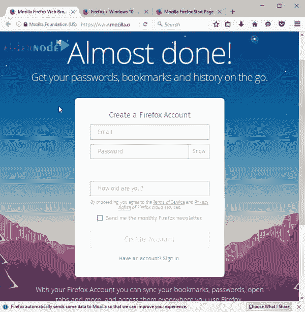

# 如何在 RDP 管理服务器上安装 Firefox-elder node 博客

> 原文：<https://blog.eldernode.com/install-firefox-on-rdp-admin/>

火狐浏览器是 [Mozilla](https://www.mozilla.org/en-US/) 的产品，作为开源提供。这款浏览器堪称世界上最受欢迎的浏览器之一。这款浏览器最初被 [Linux](https://blog.eldernode.com/tag/linux/) 用户广泛使用，但过了一段时间，随着 Internet Explorer 安全问题的出现，Windows 用户也开始使用这款浏览器，直到它成为最受欢迎的浏览器之一。在这篇文章中，我们将尝试教你如何在 RDP 管理员上安装 Firefox。如果需要，你还可以在 [Eldernode](https://eldernode.com/) 查看和[购买管理 RDP 服务器](https://eldernode.com/buy-rdp/)包。

这种浏览器的主要编程语言通常是 C ++、JavaScript、CSS、XBL 和 XUL。它还支持 75 种世界语言，支持 Windows、Mac 和 Linux 操作系统。用户选择这种浏览器的主要原因是因为它的搜索速度快、安全性高，并且有许多插件。

## 教程在 RDP 管理员上安装 Firefox

与 Internet Explorer 或 Safari 不同，Firefox 没有安装在您的操作系统上。要使用 Firefox，你必须先下载并安装在你的电脑上。这个过程非常简单，应该不会超过几分钟。以下是如何在 **RDP 管理员**上安装 Firefox。

**1。使用你当前的网络浏览器，去 www.mozilla.org 找到 Firefox 的下载链接。**

**2。将出现 Firefox 下载页面。选择下载位置和下载按钮。**

**3。**运行或下载安装或下载火狐安装程序。根据您的网络浏览器和操作系统，此过程可能会有所不同。如果您不确定如何继续，浏览器窗口中将会显示逐步说明。

**4。将会出现 Firefox 安装程序。点击**安装**。**

**5。完成后，安装程序将关闭，Firefox 将打开。**

如何访问火狐浏览器

### 如果你使用的是 RDP 管理，Firefox 会在你的桌面上添加一个快捷方式。当你想打开火狐浏览器时，只要双击图标就可以了。您也可以从「开始」菜单访问它，或者将它拖到任务栏。

***注意:*** 如果你想使用火狐作为你唯一的网页浏览器，你可以将其设置为你的默认浏览器。

除了其独特的工具，Firefox 还提供了许多与其他浏览器相同的功能。虽然 Firefox 使用起来相对简单，但你需要时常熟悉它的各种特性。

结论

## 广受欢迎的 Firefox 浏览器的 81 版本现已面向公众推出。此版本具有显示 PDF 文本文件的新外观；它还具有自动填写支付表单信息和支持媒体密钥的能力。

Firefox 最近的更新通常集中在用户隐私功能和开发者功能上。但是 Firefox 81 是少数几个主要集中在改进浏览器中的 Firefox UI 和用户体验(UX)元素的更新之一。

在本文中，我们讨论了如何在 RDP 管理中下载和安装 Firefox 浏览器。通过查看设置和选项，您可以轻松使用流行的 Mozilla Firefox 浏览器。通过学习和使用这些选项，使用这种流行的浏览器肯定会更加甜蜜和愉快。

In this article, we discussed how to download and install the Firefox browser in RDP admin. You can easily work with the popular Mozilla Firefox browser by reviewing the settings and options. By learning and using these options, using this popular browser will surely be sweeter and more enjoyable.