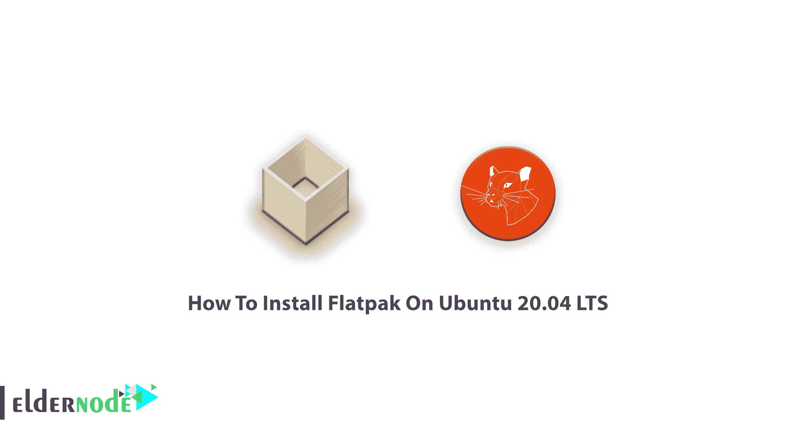

# 如何在 Ubuntu 20.04 上安装 flat pak LTS-elder node 博客

> 原文：<https://blog.eldernode.com/install-flatpak-on-ubuntu-20-04/>



如果你是一个 [Linux](https://eldernode.com/linux-vps/) 的粉丝，你可以启用 Flatpack 轻松安装很多 Linux 应用。在本文中，您将学习如何**在 Ubuntu 20.04 LTS 上安装 flat pak**在 Linux 上构建和分发桌面应用程序。如果你还没有购买你的 [VPS](https://eldernode.com/vps/) ，选择一个来更好的享受这个指南。

## 教程在 Ubuntu 20.04 LTS 上安装 flat pak

让我们熟悉一下最新的通用包格式；Flatpak。

它适用于所有的 Linux 发行版，在本教程中，你将学习如何在 T2 Ubuntu 20.04 上安装和使用 Flatpak。在下面的内容中，您将看到如何创建一个应用程序并将其分发到整个 Linux 桌面市场。如果您不是初学者，您可以使用“**软件中心**的方式，而不是使用安装应用程序容易得多的终端。

## 在 Ubuntu 20.04 LTS 上安装 flat pak

**首先**，你应该使用你的发行版的包管理器来安装 Flatpak。

```
sudo apt install flatpak
```

**注意**:基于 Debian 的发行版可以使用官方的 PPA 来安装 Flatpak:

```
sudo add-apt-repository ppa:Marilyn/flatpak
```

```
sudo apt update
```

```
sudo apt install flatpak
```

如上所述，您可以使用软件中心来代替命令行。你应该有 **GNOME** 软件插件，让你通过 **GUI** 安装 Flatpak，如果你没有访问 Flatpak 集成。在基于 **Ubuntu** 的发行版中，你需要运行以下命令来安装它:

```
sudo apt install gnome-software-plugin-flatpak
```

### 如何在 Linux 中添加 Flathub 仓库

是时候添加名为 ***Flathub*** 的流行存储库了，让您可以从那里下载和安装应用程序。Flathub 存储库中有大量的 Flatpak 应用程序。因此，使用下面的命令将 Flathub 添加到您的系统中:

```
flatpak remote-add --if-not-exists flathub https://flathub.org/repo/flathub.flatpakrepo
```

## 如何在 Ubuntu 20.04 LTS 上使用 flat pak

在这一部分，你将学习如何在[Linux](https://blog.eldernode.com/tag/linux/)T3 中使用 **Flatpak。因为您将从存储库中安装应用程序，所以您可以首先搜索它在 Flathub 上是否可用。因此，运行以下命令进行搜索:**

```
flatpak search application name
```

为了带来一个*示例*，您可以通过运行以下命令来搜索 Spotify:

```
flatpak search spotify
```

此外，您可以使用下面的命令从存储库中安装应用程序:

```
flatpak install [remotes] [Application ID]
```

之后，您就可以安装 Spotify 了，如下所示:

```
flatpak install flathub com.spotify.Client
```

### 如何运行 Flatpak

要运行 Flatpak 应用程序，请键入:

```
flatpak run <ApplicationID>
```

让我们再来看一个*的例子*:

```
flatpak run com.spotify.Client
```

您可能需要查看 flatpak 包的列表，请使用以下命令查看可用的包:

```
flatpak list
```

### 如何卸载 Flatpak 应用程序

任何时候您决定卸载 Flatpak 软件包，您只需运行以下命令即可完成:

```
flatpak uninstall <ApplicationID>
```

*例如*要删除 Spotify，请键入:

```
flatpak uninstall com.spotify.Client
```

### 如何更新 Flatpak 应用程序

如果您需要更新所有 Flatpak 应用程序，请使用以下命令一次性更新它们**:**

```
`flatpak update`
```

**最后，键入下面的命令来检查正在运行哪个版本的 **flatpak** :**

```
`flatpak --version`
```

## **结论**

**在本文中，您学习了如何在 Ubuntu 20.04 LTS 版上安装 Flatpak。你可以享受这个用 C 语言写的软件来管理你的软件包。您的目标是什么发行版并没有什么不同，您可以使用 Flatpak 来简化软件包的管理。**