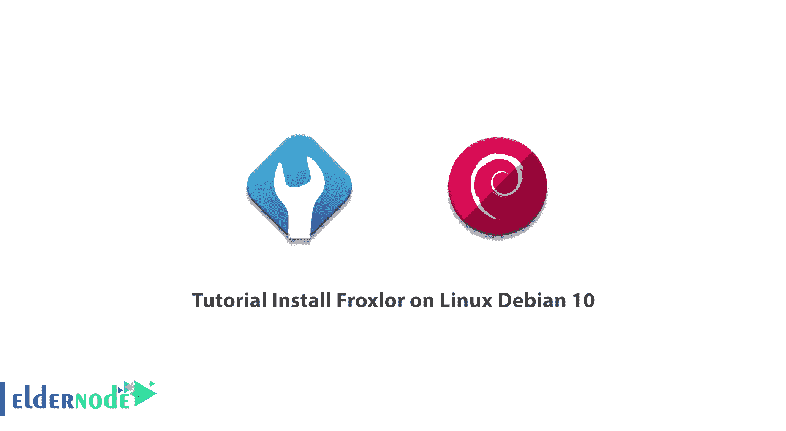

# 在 Linux Debian 10 - Eldernode 博客上安装 Froxlor 的教程

> 原文：<https://blog.eldernode.com/install-froxlor-on-linux-debian-10/>



Froxlor 是一个基于 web 的控制面板，它是开源的，有一个非常方便简单的用户系统。这个控制面板的功能包括 IPv6 支持，为客户提供主机管理部分，保存几个 PHP 文件的设置，web ftp 访问等等。这款 Froxlor 更适合 ISP 等互联网服务提供商，较少被 web 主机使用。在这篇文章中，我们试着学习你的教程在 Linux Debian 10 上安装 Froxlor。你可以访问 [Eldernode](https://eldernode.com/) 提供的包来购买 [Linux VPS](https://eldernode.com/linux-vps/) 服务器。

## **如何在 Linux Debian 上安装 Froxlor**

Froxlor 是 2009 年发布的一款轻量级主机控制面板。这个控制面板有 3 个访问级别:管理员，经销商，客户和支持该领域的在线用户。这个控制面板可以安装在 Debian、Gentoo 和 OS X 上，在这篇文章的续篇中，请和我们一起教你如何在 Debian 10 上安装 Froxlor。

## **在 Linux Debian 10 上安装 Froxlor**

如前所述，Froxlor 是一款开源的服务器管理软件。该软件旨在通过 web 界面简化服务器管理。在本教程的续篇中，我们将解释如何在 Debian 10 上安装 Froxlor。

安装 Froxlor 的先决条件是一个运行 Debian version 10 发行版的 [Linux](https://blog.eldernode.com/tag/linux/) 服务器，并且是一个拥有 SSH 管理员权限的用户。

第一步，您必须使用以下命令为高级打包工具( **APT** )和 1.5 之前的 APT 版本启用 **HTTPS 443** 。应该注意，默认情况下，较新版本支持 HTTPS。

```
sudo apt install apt-transport-https gnupg
```

然后，在第二步中，您必须使用以下命令添加 GNU 隐私保护(gpg)密钥:

```
wget -O - https://deb.froxlor.org/froxlor.gpg | sudo apt-key add -
```

在下一步中，您必须通过执行以下命令来激活存储库:

```
sudo echo "deb https://deb.froxlor.org/debian buster main" > /etc/apt/sources.list.d/froxlor.listdeb https://deb.froxlor.org/ubuntu $(lsb_release -sc) main" > /etc/apt/sources.list.d/froxlor.list
```

在第四步中，您必须通过键入并执行以下命令来更新软件包列表:

```
sudo apt update && apt-get upgrade
```

最后，您需要使用 apt 命令安装 Froxlor:

```
apt install froxlor
```

## 结论

Froxlor 是一个轻量级开源控制面板，用于 [VPS 服务器](https://eldernode.com/vps/)、[专用服务器](https://eldernode.com/dedicated-server/)，以及共享主机。该选项是 cPanel 和 Webmin 等流行软件的替代方案。使用 Froxlor，您可以为每个域选择 IPv4 和/或 IPv6 地址以及要使用的端口。您还可以指定哪些端口应该使用 SSL，并允许客户端在每个域中存储证书。在本文中，我们试图教你如何在 Linux Debian 10 上安装 Froxlor。