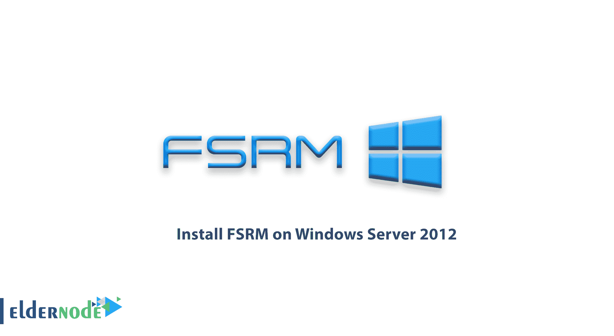
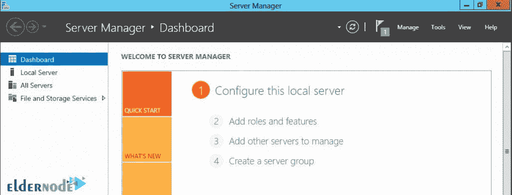
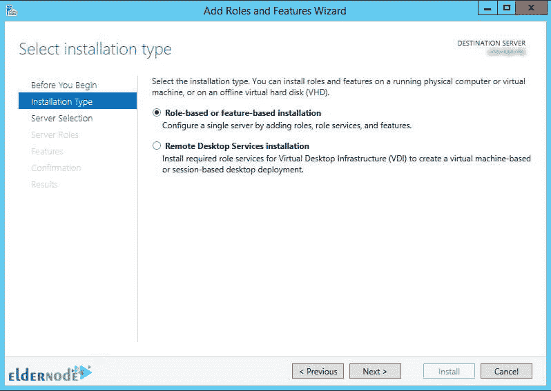
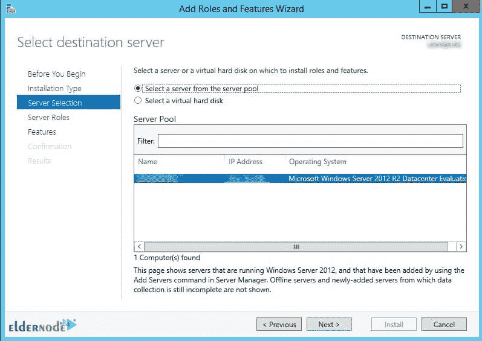
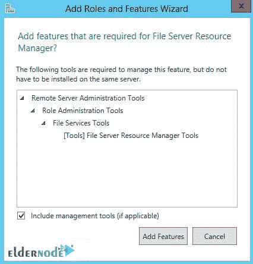
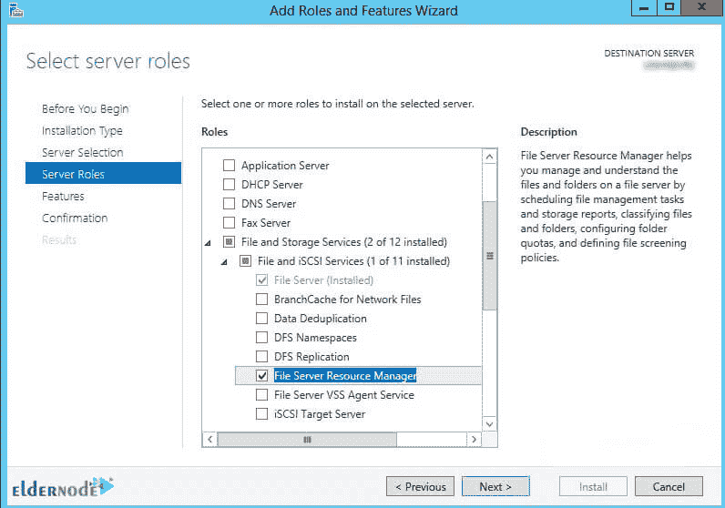

# 如何在 Windows Server 2012 上安装 FSRM-elder node 博客

> 原文：<https://blog.eldernode.com/install-fsrm-on-windows-server-2012/>

[更新日期:2021-02-01]在 Windows 服务器上创建任何文件管理策略之前，您必须在服务器上安装文件服务器资源管理器(FSRM)。**如何在 Windows Server 2012 上安装 FSRM**是与 Windows Server 相关的应用课题之一，本文将对此进行探讨。一旦安装了这个角色，您就可以使用它的各种工具来管理服务器文件。你可以访问 [Eldernode](https://eldernode.com/) 提供的包来购买 [Windows VPS](https://eldernode.com/windows-vps/) 服务器。请继续关注本文的其余部分。

## **教程在 Windows Server 2012 上安装 FSRM**

FSRM 是微软 [Windows](https://blog.eldernode.com/tag/windows/) 服务器中可用的功能之一。此功能使您能够更好地管理存储在文件服务器中的数据并对其进行分类。使用 FSRM，您可以对文件服务器上的文件进行分类，并为每个创建的类别分配特定的任务。您可以为创建的每个文件夹和宗卷设定特定的空间量，报告您拥有的储存空间量，并对其进行监控。

### **FSRM 可用工具**

**配额管理:**这允许管理员根据文件夹结构而不是驱动器结构来划分磁盘空间。

**文件筛选:**这允许管理员创建一个允许或未授权存储在服务器上的各种文件的黑名单。

**存储报告:**管理员可以立即或按计划从服务器接收报告。

**文件屏蔽报告:**文件屏蔽报告

**配额报告:**配额状态报告

**大文件报告:**报告大文件

**最常访问的文件报告:**报告最常访问的文件。

**最少访问的文件报告:**报告最少访问的文件。

**按所有者的文件报告:**按所有者对文件进行分组。

**文件分类基础设施:**允许管理员按内容对文件进行分类。

**文件管理任务:**使用此功能，您可以根据文件分类对具有特定标准的文件进行操作。

***注意:***FSRM 角色是文件和存储服务。

### **安装 FSRM 角色的分步教程**

1.在**服务器管理器**中，点击**添加角色和功能**。

2.在开始前的**页面，点击**下一个**。**

3.在**安装类型**页面，点击第一个选项**基于角色或基于功能的安装**，然后点击**下一步**。

4.在**选择目的服务器**页面中，选择**想要的服务器**，点击**下一步**。

***

5.在**文件和存储服务**页面上，选择**服务器角色**。然后打开**文件和 iSCSI 服务**。选择**文件服务器资源管理器**选项。

当添加角色和功能向导页面打开时，点击**添加功能**，然后点击**下一步**。

6.完成安装，点击**完成**。

## 结论

在解释了 FSRM 以及如何在 Windows Server 2012 中安装它之后，提到了在 FSRM 可用的工具。然后用相关图片解释了 FSRM 角色的逐步安装。