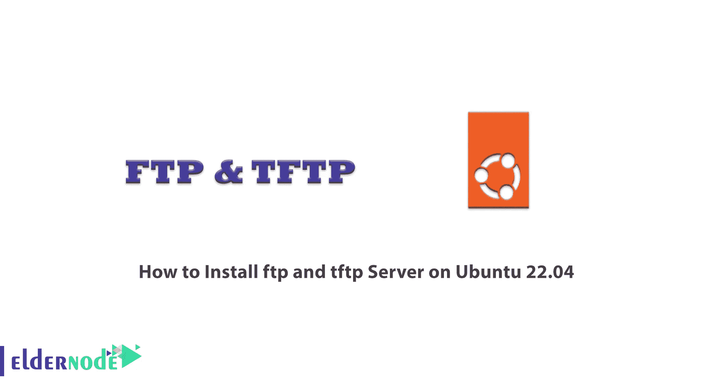
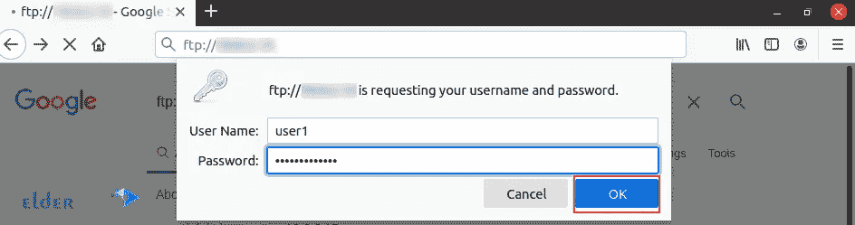
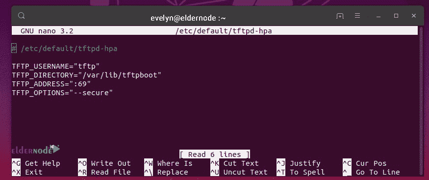
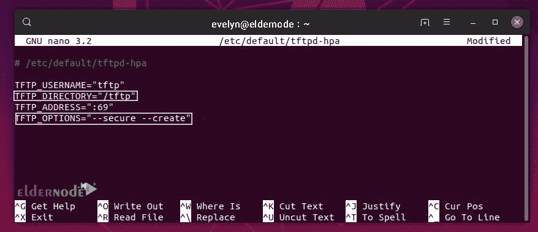

# 如何在 Ubuntu 22.04 - Eldernode 博客上安装 ftp 和 tftp 服务器

> 原文：<https://blog.eldernode.com/install-ftp-and-tftp-server-on-ubuntu-22-04/>



FTP 是至今仍被广泛使用的最古老的互联网协议之一，也是 TCP/IP 中的标准协议。FTP 是将文件从一台计算机传输到另一台计算机的最简单的方法。另一方面，文件传输协议之一是普通文件传输协议，简称 TFTP，它广泛用于小型网络。该协议类似于 FTP，但比 FTP 更轻便，消耗的资源更少，并且更受限制。在这篇文章中，我们将教你如何在 Ubuntu 22.04 上安装 ftp 和 tftp 服务器。如果你想购买一台 [**Ubuntu VPS**](https://eldernode.com/ubuntu-vps/) 服务器，你可以查看 [Eldernode](https://eldernode.com/) 网站上提供的软件包。

## **教程在 Ubuntu VPS 上设置 ftp 和 tftp 服务器**

### **FTP 服务器和 TFTP 服务器简介**

在计算机之间传输文件最常见的方法之一是通过 **FTP** (文件传输协议)。FTP 的使用可以追溯到计算机图形界面出现之前，它被用来连接远程计算机。一旦你连接到远程电脑，你就可以在上面**发送**或**接收**文件。通过 FTP 提供文件下载的计算机称为 FTP 服务器或 FTP 主机。

**TFTP** (普通文件传输协议)用于传输引导文件和配置本地网络上的路由器和交换机等设备。与 FTP 相比，TFTP 有许多限制，并且由于缺乏安全措施，建议在内部和私有网络中使用 TFTP，而不要在公共网络中以任何方式使用它。

### **FTP 的特性**

–> FTP 协议具有必要的灵活性，可根据网络协议的类型在不同的网络中使用。

–>该协议遵循客户端-服务器模型，有多种 FTP 客户端和服务器。

–>该协议使用户可以使用类似于 Unix shell 或 Windows 命令行的文件系统。

–>发送文件的类型由客户自行决定。

### **TFTP 的特色**

–>这是一种很轻的交流方式。这个系统占用很少的磁盘空间，对用户界面的性能要求很低，并且非常有效地使用内存。

–> TFTP 服务器会在启动时扫描连接的网络以查找可联系的设备。

–>为了使系统更加安全，安全限制之一是将服务器设置为仅接受或发送文件，或者您可以将其设置为上传或下载。

在这篇文章的续篇中，加入我们一步步教你如何在 [Ubuntu](https://blog.eldernode.com/tag/ubuntu/) 22.04 上安装 FTP 和 TFTP 服务器。

## **如何在 Ubuntu 22.04 上安装 FTP 服务器**

为了**安装 FTP** ，首先通过运行以下命令更新您的系统存储库:

```
sudo apt get update
```

然后**安装 vsftpd** 。Vsftpd 是一个用于 Linux 系统的安全、快速和方便的 FTP 服务器。运行以下命令进行安装:

```
sudo apt install vsftpd
```

安装后，运行以下命令**运行 vsftpd** :

```
sudo service vsftpd status
```

然后，您将看到以下消息:

“FTP 服务器运行正常。”

### **如何配置 FTP 服务器**

所有的 VSFTPD 配置都可以在 **/etc/vsftpd.conf** 文件中找到，所以你可以很容易地在更改它之前对它进行备份，以便我们在出现任何问题时可以回到原始版本。运行以下命令进行备份:

```
sudo cp /etc/vsftpd.conf /etc/vsftpd.conf.bak
```

系统地输入评论。

从主动监听服务器开始:

键入 **Listen = YES**

如果不需要 IPv6，请禁用它:

**listen_ipv6=No**

您不应该允许匿名用户访问:

**匿名 _ 启用=否**

默认设置是客户端只能下载文件，因此让它保持活动状态:

**local_enable=YES**

**write_enable=YES**

FTP 在端口 20 运行:

**connect_from_port_20=YES**

监听端口可以更改:

**listen_port=XX**

按“ **CTRL+o** 保存更改，按“ **CTRL+x** 关闭文件。

键入以下命令查看文件，不加注释:

```
sudo cat /etc/vsftpd.conf | grep –v “^#”
```

运行以下命令**创建一个新用户**来配置服务器:

```
sudo useradd –m user1
```

分配密码并输入密码:

```
sudo passwd user1
```

重新输入密码进行确认和更新。

这在 FTP 服务器上成功创建了用户。

## **如何访问 FTP 服务器**

现在，您可以通过两种方式访问 FTP 服务器:

**1)通过终端**进入

**2)通过浏览器访问**

使用以下命令检查您的 IP 地址，启动服务器配置:

```
ifconfig
```

### **通过**终端访问 FTP

打开终端，使用服务器的 IP 地址访问它:

```
ftp your_ip_address
```

***注意** :* 在上面命令的相应字段中输入**你的 IP 地址**。

### **通过浏览器**访问 FTP

打开**浏览器**，用以下命令访问 **FTP 服务器**:

```
ftp://your_ip_address
```

登录后，输入你的**用户名**和**密码**；然后点击**确定**，连接建立:



## **如何在 Ubuntu 22.04 上安装 TFTP 服务器**

首先**用下面的命令更新 APT 存储库**包:

```
sudo apt update
```

要安装 **tftpd-hpa** 包，请运行以下命令:

```
sudo apt install tftpd-hpa
```

输入以下命令检查 tftpd-hpa 服务的执行情况:

```
sudo systemctl status tftpd-hpa
```

### **如何配置 TFTP 服务器**

运行以下命令修改 **/etc/default/tftpd-hpa** 配置文件:

```
sudo nano /etc/default/tftpd-hpa
```

打开配置文件(默认 TFTP 服务器)进行编辑。

这里**TFTP _ 用户名**设置为 tftp: TFTP 服务器将作为用户 **tftp** 运行。

**TFTP 目录**设置为 **/var/lib/tftpboot** :可以通过 TFTP 访问。

**TFTP _ 地址**设置为 **69** : TFTP 运行于 **69** 端口。

**TFTP 选项**被设置为**-安全**:该变量设置 TFTP 选项。



现在将**TFTP _ 目录**更改为 **/ tftp** 并将**-创建**选项添加到**TFTP _ 选项**中，以创建或上传文件到 TFTP 服务器。

最终的配置文件如下:



按“ **CTRL+x** ”，然后按 **y** ，然后按**回车**保存更改。

现在要创建一个新的 **/tftp** 目录，运行以下命令:

```
sudo mkdir /tftp
```

现在输入以下命令来更改 **/tftp** 文件夹的所有者和组:

```
sudo chown tftp:tftp /tftp
```

输入以下命令**重启 tftpd-hpa** 服务:

```
sudo systemctl restart tftpd-hpa
```

输入以下命令检查 tftpd-hpa 服务的性能:

```
sudo systemctl status tftpd-hpa
```

tftpd-hpa 服务正在运行，并且配置已成功。

## 结论

在本文中，您了解了如何在 ubuntu 22.04 上安装 ftp 和 tftp 服务器，并研究了它的特性。这些服务器是通过网络传输文件的最常用方法。您还学习了如何在 Ubuntu 22.04 上配置和访问 ftp 服务器和 tftp 服务器。