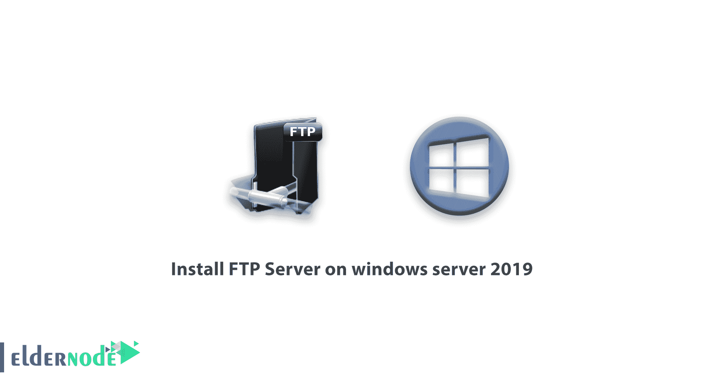
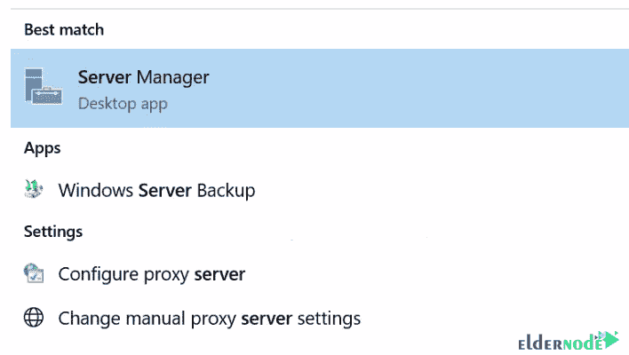
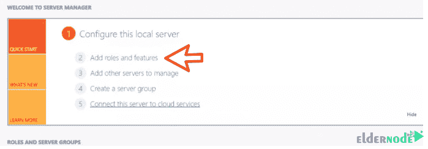
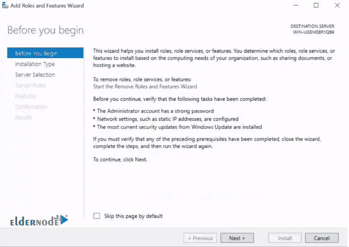
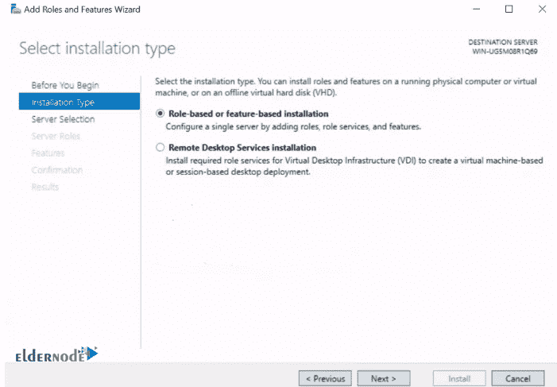
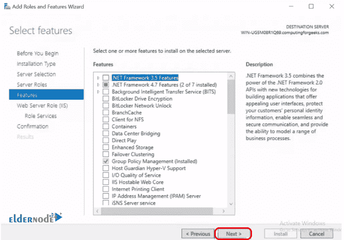
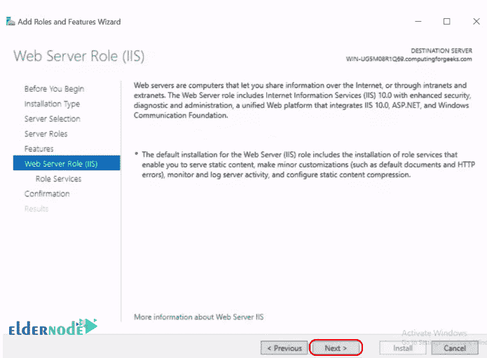
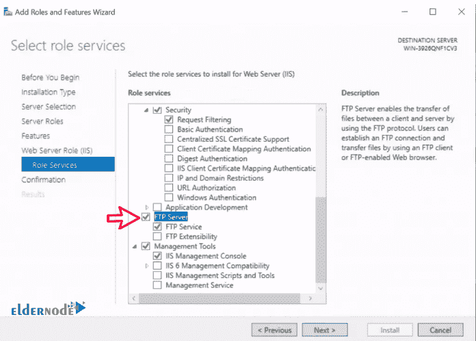
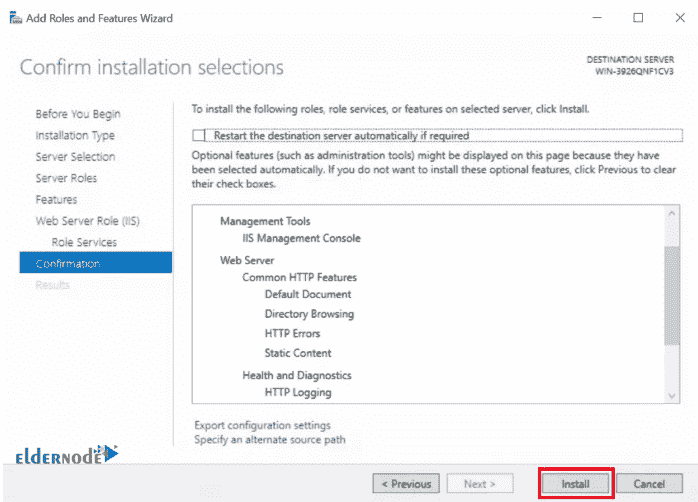

# 如何在 windows server 2019 - Eldernode 上安装 FTP 服务器

> 原文：<https://blog.eldernode.com/install-ftp-server-on-windows-server/>

如何在 windows server 2019 上安装 [FTP 服务器](https://en.wikipedia.org/wiki/File_Transfer_Protocol)。FTP 协议是网络和 TCP / IP 协议之一。此协议用于在两个系统之间的网络上传输信息和文件或对其进行更改。

FTP 协议不直接在 IIS web 服务器和 Windows 服务器上使用。如果您的 Windows 服务器上有一系列特殊功能，您可以在服务器上安装 FTP。在本文中，我们将教你如何在 Windows Server 2019 上安装 FTP 服务器。

您可以从 eldernode 选择您最理想的 [Windows VPS Server](https://eldernode.com/windows-vps/) 软件包。

## 教程在 windows server 2019 上安装 FTP 服务器

**1。**T3 第一步，按下窗口按钮，搜索服务器管理器。然后点击添加角色和功能。

*

**2。T3 在**添加角色和功能向导**页面，点击确定。**

**3。** 下一页是**安装类型**，在这里你要选择基于角色或者基于功能的安装选项，点击下一步。

**4。** 选择要安装 NFS 的服务器，点击下一步。

**5。** 在服务器角色页面，选择 Web 服务器(IIS) 复选框，点击弹出的 **添加特性** ，如下图所示。然后点击下一个。

**

***

**6。在**选择功能**阶段的** 只需点击下一步，在 Web 服务器角色(IIS) 阶段再次点击下一步。

****

**7。在角色服务页面的** 选择文件服务器一个，点击下一步。然后点击安装，等待您的服务器完成安装。

**8。T3 最后，点击安装。**

在下面的文章中，我们将教你如何在 Windows server 2019 上配置 FTP 服务器。跟随[长辈节点](https://eldernode.com/tag/windows-server-2019/)。

**尊敬的用户**，我们希望您能喜欢这个[教程](https://eldernode.com/category/tutorial/)，您可以在评论区提出关于本次培训的问题，或者解决[老年人节点培训](https://eldernode.com/blog/)领域的其他问题，请参考[提问页面](https://eldernode.com/ask)部分，并尽快提出您的问题。腾出时间给其他用户和专家来回答你的问题。

好运。