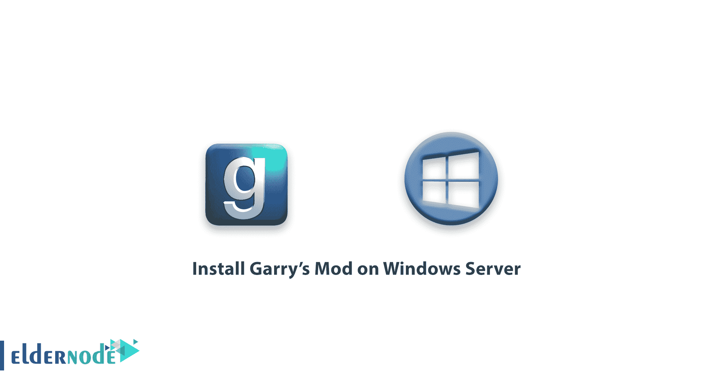

# 教程在 Windows Server - Eldernode 上安装 Garry 的 Mod

> 原文：<https://blog.eldernode.com/install-garrys-mod-on-windows-server/>



教程在 Windows Server 上安装 Garry 的 Mod。Garry 的 Mod 是在 Facepunch 游戏工作室创建的。它于 2004 年由 Valve Corporation 正式发布，适用于 Windows 、 Linux 和 Mac 平台。 Garry 的 Mod 是一个有趣的游戏，没有特定的目标，游戏的故事是非线性的或非线性的，沙盒。这个游戏的玩法是物理构建的，一般来说，这个游戏分为两个部分，单人和在线。

本文将解释如何在 Windows Server 2012 上下载并安装 Garry 的 Mod 服务器。

**先决条件:**

*   蒸汽 CMD。
*   端口转发能力。
*   创建收藏的 steam 帐户。

**[购买 Windows 虚拟专用服务器](https://eldernode.com/windows-vps/)**

### 安装 SteamCMD

为了确保你有最新版本的 Garry 的 Mod 专用服务器，你应该通过 SteamCMD 安装它。

**1。** 第一步，你必须通过下面的链接下载 SteamCMD:

[**下载 steam cmd**](https://steamcdn-a.akamaihd.net/client/installer/steamcmd.zip)

**2。** 然后在你想要的位置创建一个文件夹，把你下载的 zip 文件的内容放进去。

### 下载 Garry 的 Mod 专用服务器工具

**1。** 在解压下载文件的文件夹下运行 SteamCMD。

**2。** 下一步，登录匿名账号。

```
login anonymous
```

**3。** 然后创建一个文件夹来保存 Garry 的 Mod 服务器文件。

**4。** 在下面输入目录路径选择您的文件夹:

```
force_install_dir C:\my_example_directory\
```

**5。** 现阶段需要安装 Garry 的 Mod 专用服务器。

```
app_update 4020
```

**6。** 一旦等待进度达到 100%，确认下载内容:

```
app_update 4020 validate
```

**7。** 下载完成后，使用以下命令:

```
quit
```

### 配置设置

您可以从下面指定的配置文件中更改服务器设置。您还可以更改特定于服务器的参数，如主机名、密码和 tickrate 等等。

因为 Garry 的 Mod 有广泛的定制能力，所以推荐你有一个自动设置生成器。

### 定制你的游戏服务器

**1。** 打开服务器文件夹，选择 cfg 选项。

**2。** 然后找到 server.cfg ，通过记事本打开。

**3。** 根据下面的例子改变设置:

> **示例:** 使用以下命令选择您的主机名并打开内容下载:
> 
> ```
> hostname "Garry's Mod Server"  sv_allowdownload 1
> ```

### 创建启动批处理文件

**1。** 打开服务器文件所在的文件夹。创建一个新的文本文件，并添加以下内容:

```
@echo off  cls  :srcds  echo (%time%) srcds started.  start /wait srcds.exe -console -game garrysmod +map gm_flatgrass +maxplayers 32  echo (%time%) WARNING: Srcds closed. Restarting server.  goto srcds
```

**2。** 将文件作为批处理文件保存在服务器主目录的文件夹中。

**3。**要启动服务器，执行您在 Garry 的 Mod 服务器的主目录中创建的批处理文件。

### 端口转发

**1。** 要在 Windows 上打开一个端口，请参考这篇[文章](https://eldernode.com/open-a-port-on-a-windows-firewall/)。

**2。** 打开下面列出的端口以确保外部连接到服务器:

```
 27015 UDP
```

```
 27015 TCP
```

### 插件和内容

Garry 的 Mod 有一个 steam 工作室，里面有许多有用的工具，允许你创建复杂而有效的服务器。有两种在服务器上安装插件的方法，称为高级和手动。

在下文中，我们将分别解释这两种方法:

#### 1)高级方法

**a)** 创建车间集合。

**b)** 打开蒸汽车间，导航到盖瑞的 Mod 部分。

**c)** 在你的服务器上订阅你想要的插件。

**d)** 创建一个集合，其中包含您选择的所有插件。

**e)** 发布收藏。

> 注意:将收藏的 URL 记录在一个可以参考的地方。

**f)** 用你的 Steam 账号打开下面的链接。

> **[APIKEY](http://steamcommunity.com/dev/apikey)**

**g)** 创建一个 API key，选择【steamidfinder.com】的作为 API 域。

> **注意:** 将 API key 记录在一个可以查阅的地方。

##### 将收藏添加到服务器

**1。** 要添加收藏到服务器，打开你在服务器主目录下创建的批处理文件。

**2。** 在开始/等待 scrds.exe之后的一行，添加以下代码。

```
 +host_workshop_collection WORKSHOP_URL_ID -authkey API_KEY
```

**3。** 用您收藏的网址中的数字替换 WORKSHOP_URL_ID 。然后用您之前创建的 API 键替换 API_KEY 。

该批处理文件将类似于以下代码:

```
@echo off  cls  :srcds  start /wait srcds.exe -console -game garrysmod +map gm_flatgrass +maxplayers 32  +host_workshop_collection 123456789 -authkey 12345678901234567890  echo (%time%) WARNING: Srcds closed. Restarting server.  goto srcds
```

#### 2)手动方法

导航到您服务器的主目录。在里面，你会发现一个 addons 文件夹，如果没有，那么创建一个名为 addons 的文件夹。

在插件文件夹中，你可以放置你所有的插件文件，这些文件会在运行你的服务器时自动安装和执行。

### 更新服务器

**A)** 要更新服务器，先登录到 SteamCMD 。

**B)** 选择你的安装目录。

**C)** 通过键入以下命令，您可以更新和/或验证您的服务器文件:

```
app_update 4020 validate
```

**尊敬的用户**，我们希望您能喜欢这个[教程](https://eldernode.com/category/tutorial/)，您可以在评论区提出关于本次培训的问题，或者解决[老年人节点培训](https://eldernode.com/blog/)领域的其他问题，请参考[提问页面](https://eldernode.com/ask)部分，并尽快提出您的问题。腾出时间给其他用户和专家来回答你的问题。

好运。