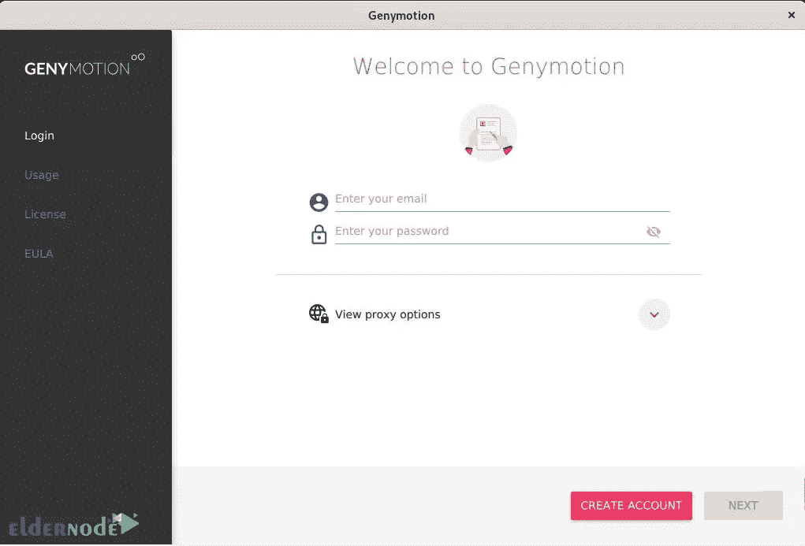

# 如何在 Fedora 34 - Eldernode 博客上安装 Genymotion

> 原文：<https://blog.eldernode.com/install-genymotion-on-fedora-34/>


移动开发人员和程序员需要的最重要的工具之一是模拟器，它消除了在真实和物理设备上对项目和应用程序进行测试和故障排除的需要。Genymotion 是这些模拟器中的一个，它将向您介绍。在本文中，我们将教你如何在 Fedora 34 上安装 Genymotion。如果你想购买 [**Linux VPS**](https://eldernode.com/linux-vps/) 发行版，可以查看 [Eldernode](https://eldernode.com/) 网站上提供的软件包。

## **教程在 Fedora 上安装 Genymotion 34**

### **什么是 Genymotion？**

Genymotion 是桌面环境下的 Android 跨平台模拟器。它允许开发者在不同版本的 Android 上测试和调试项目，而不需要提供不同的真实和物理设备。该仿真器提供了各种用于开发、测试和演示目的的虚拟设备，并带有两个免费和商业许可证，免费版本为您提供了必要的功能，您无需购买商业许可证。

Genymotion Emulator 有一个非常简单的用户界面，只需安装一个插件，就可以直接在 Android Studio 中使用。它为各种 Android 设备预定义了虚拟设备，您可以使用这些设备来测试您的 Android 应用程序。

在本文的续篇中，我们将一步步教你如何在 [Fedora](https://blog.eldernode.com/tag/fedora/) 34 上安装 Genymotion。

## **在 Fedora 34 上安装 Genymotion**

首先，您应该通过输入以下命令**安装所有需要的依赖项**:

```
dnf -y install @development-tools
```

```
sudo dnf -y install kernel-headers kernel-devel dkms elfutils-libelf-devel qt5-qtx11extras
```

现在运行下面的命令来**添加 VirtualBox RPM 存储库**:

```
cat <<EOF | sudo tee /etc/yum.repos.d/virtualbox.repo
```

要**导入 Virtualbox GPG 密钥**,只需执行以下命令:

```
dnf search virtualbox
```

现在，您可以使用以下命令安装 VirtualBox :

```
dnf install VirtualBox-6.1
```

接下来，您需要**将您的用户**添加到 vboxusers 组。为此，请运行以下命令:

```
usermod -a -G vboxusers $USER && newgrp vboxusers
```

记得验证用户:

```
id $USER
```

这一步，去 [Genymotion 官网](https://www.genymotion.com/)和**创建账号**:


现在你应该进入[下载页面](https://www.genymotion.com/download/)，向下滚动找到适合 Fedora 的**版本。第二个版本是通用的 Linux。也在 Fedora 系统上使用的 bin 文件。点击**下载 Linux(64 位)**:**


然后，您应该通过运行以下命令来列出目录:

```
ls  genymotion-3.2.1-linux_x64.bin
```

请注意，您应该将执行权限更改为 Genymotio。为此，请输入以下命令:

```
chmod +x genymotion-3.2.1-linux_x64.bin
```

现在是时候**安装 Genymotion** 了:

```
./genymotion-3.2.1-linux_x64.bin
```

最后，您将看到 Genymotionsnap3snap4 的欢迎页面:



最好下载 **libjpeg8** 和 **libdouble-conversion** ，因为 Genymotion 需要它们。你可以从 [RPMPbone](http://rpm.pbone.net/info_idpl_23363141_distro_opensuse_com_libjpeg8-8.4.0-6.23.x86_64.rpm.html) 和 [RPMFind](https://www.rpmfind.net/linux/rpm2html/search.php?query=libdouble-conversion.so.1%28%29%2864bit%29) 下载。

## 结论

Genymotion Android 模拟器运行在 Virtualbox 虚拟化平台上，可以模拟特定的设备。它允许你在不影响性能的情况下安装应用程序。在本文中，我们教您如何在 Fedora 34 上下载和安装 Genymotion。我希望这篇教程对你有用。如有疑问，可在评论中联系我们。