# 如何在 Windows VPS - Eldernode 博客上安装 Genymotion

> 原文：<https://blog.eldernode.com/install-genymotion-on-windows/>

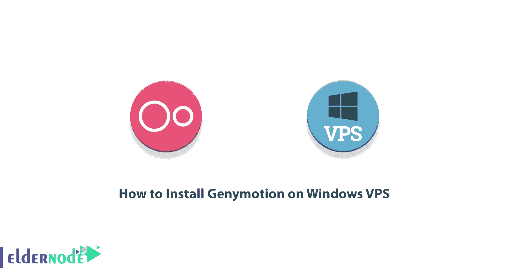

移动开发人员和程序员(尤其是 Android)需要的最重要的工具之一是模拟器，它消除了在真实和物理设备上测试和排除项目和应用程序故障的需要。Genymotion 是桌面环境中最强大的 Android 操作系统模拟器之一，它允许开发人员在不同版本的 Android 上测试和调试项目，而无需提供不同的真实和物理设备。在本文中，我们将一步一步地教你如何在 Windows VPS 服务器上**安装 Genymotion。**

## **如何在 Windows VPS 上安装 Genymotion**

GenyMotion 是一个专用的独特的 Android 仿真程序。由于其高速度和灵活性，它已经成为 Android 最流行的模拟设备之一。在下一节中，我们将向您介绍 GenyMotion。然后我们会完整的教你如何在 [Windows VPS](https://eldernode.com/windows-vps/) 服务器上安装 Genymotion。加入我们继续本教程。

### **什么是 Genymotion？**

Genymotion 软件用于在计算机上模拟 Android 应用程序。有了这个软件，你可以在不同的手机以及不同版本的 Android 上测试你的 Android 应用。

Genymotion 软件的某些功能是付费的，您只能通过购买其原始许可证来使用它们。但是同样的免费部分满足了我们的需求。当然，如果您是第一次使用这个软件，它的所有功能在 15 天内都是活动的，在这 15 天结束后，有些部分会变为非活动状态。

要使用 Genymotion 软件，您必须首先在您的计算机上安装 **Oracle VM VirtualBox** 软件，因为这是 Genymotion 的先决条件。但是 Genymotion 软件网站本身就有一个软件包，安装 Oracle VM VirtualBox 和 Genymotion。在本文的后续部分，请加入我们，教您如何在 Windows VPS 上安装 Genymotion。

## **在 Windows VPS 上安装 Genymotion**

在本节中，我们将教您如何安装 Genymotion。只需按照下面的步骤。

要开始在 [**Windows 虚拟服务器**](https://eldernode.com/windows-vps/) 上安装 Genymotion，需要先进入 [Windows](https://blog.eldernode.com/tag/windows/) VPS 环境，然后再做其他事情。为此，您可以在 windows 的开始菜单中键入并运行**远程桌面连接**。

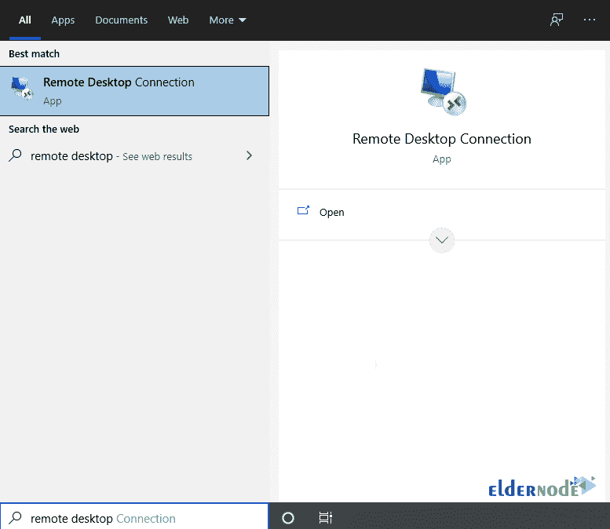

在打开的窗口中，输入想要进入服务器的 IP，点击**连接**。

进入 Windows server 环境后，你必须打开一个你**喜欢的浏览器**。

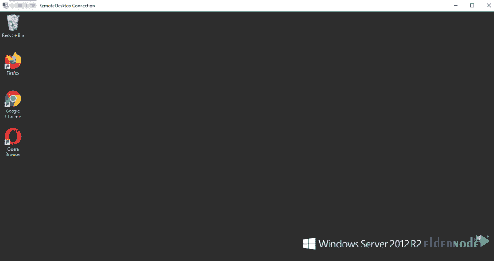

现在你应该进入 [Genymotion 下载页面](https://www.genymotion.com/download/)。

在打开的页面上，我们建议您下载即可运行的 Genymotion Windows 安装程序。应该注意的是，该软件包包括 Oracle VM VirtualBox 安装程序。注意，如果你愿意，可以选择第二种方法，下载并安装[VirtualBox 6 . 1 . 14](https://download.virtualbox.org/virtualbox/6.1.14/VirtualBox-6.1.14-140239-Win.exe)for Windows。在这种方法中，您下载没有 VirtualBox 的 Windows 软件包。

***注意:*** 在您开始下载和安装 Genymotion 之前，您必须在中点击**为自己创建一个帐户。**

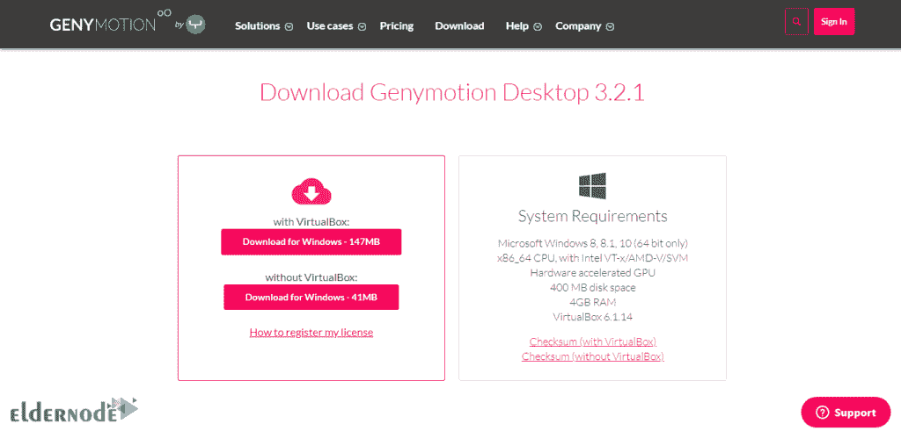

转到下载文件的位置。然后双击它开始安装过程。

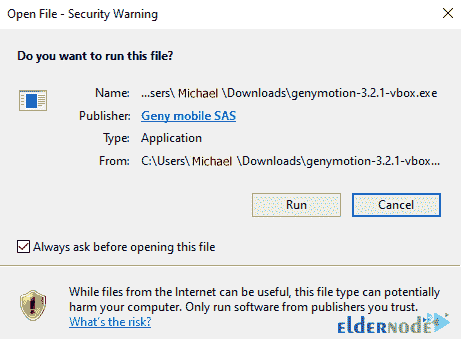

现在你需要选择你想要的语言并点击 **OK。**然后 Genymotion 设置向导将打开，您必须点击**下一步**。

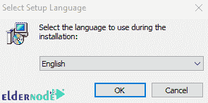

在下一步中，您必须指定文件的安装位置，然后点击**下一个**。

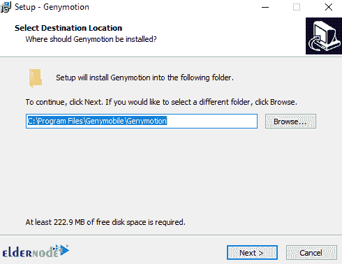

在这里，您必须选择开始菜单文件夹。也可以勾选**不创建开始菜单文件夹**，点击**下一步**。

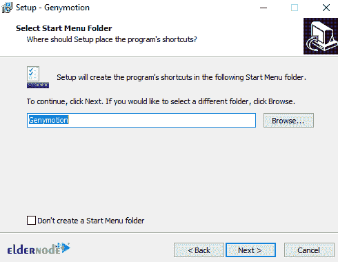

然后，您可以选择在桌面上创建 Genymotion 图标。然后点击下一个的**。**

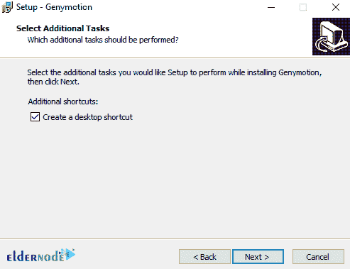

最后点击**安装**开始安装 Genymotion。

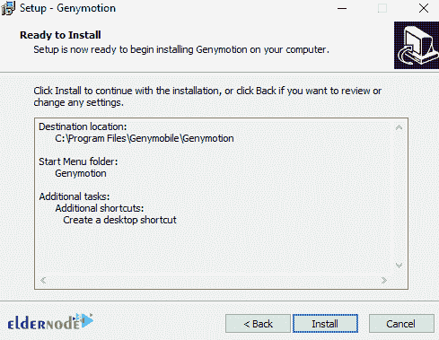

*

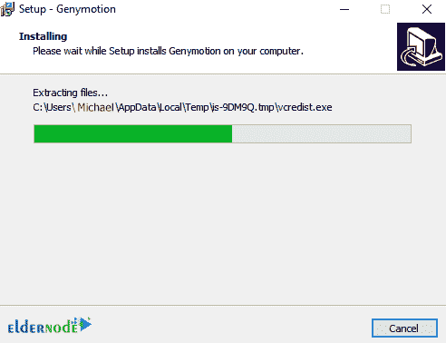

您将看到 Oracle VM VirtualBox 安装窗口出现。点击**旁边安装**。

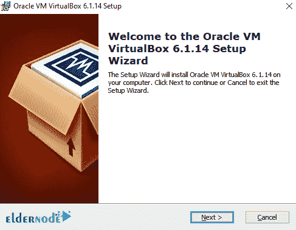

在下一步中，完成所需的定制设置后，点击**下一步**。

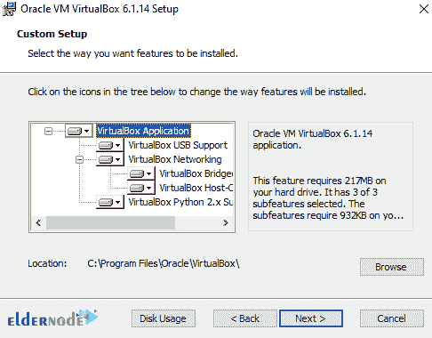

勾选您想要的选项，然后点击下一个的**。**

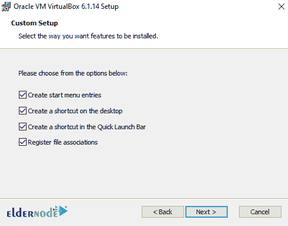

最后点击**安装**开始安装 Oracle VM VirtualBox。

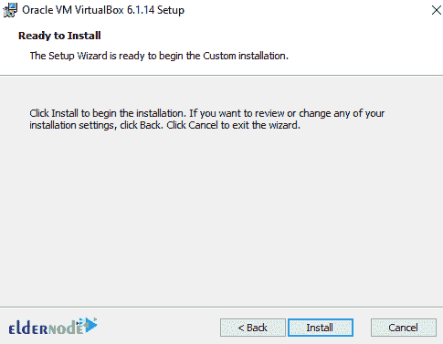

*

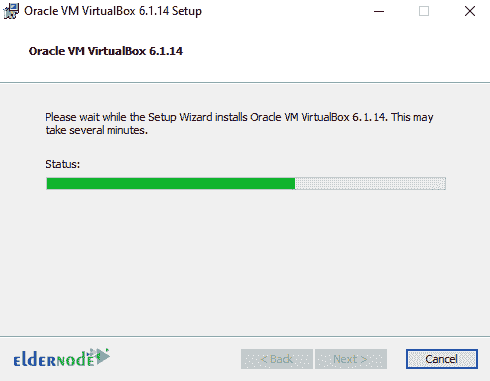

最后，点击**完成**。

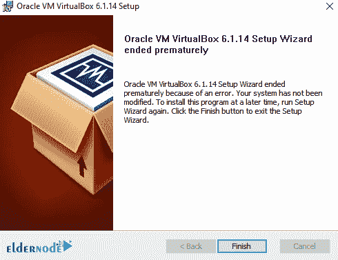

点击**完成**，Genymotion 的安装将成功完成。

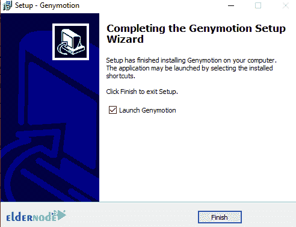

### **如何在 Windows VPS 上使用 Genymotion**

在安装了上一节中的 Genymotion 之后，您现在可以按照下面的步骤开始使用 Genymotion Desktop 并在您的虚拟设备上运行您的 Android 应用程序。

第一步，你必须从你的应用程序或桌面列表中点击 Genymotion 图标。您也可以通过键入 Genymotion 从“开始”菜单运行它。在下图中，您可以看到主要的 Genymotion 环境。您需要输入您的帐户凭证，然后点击**下一步**。如果您尚未在 Genymotion 网站上创建帐户，在此步骤中，您必须点击**创建帐户**来创建新帐户。

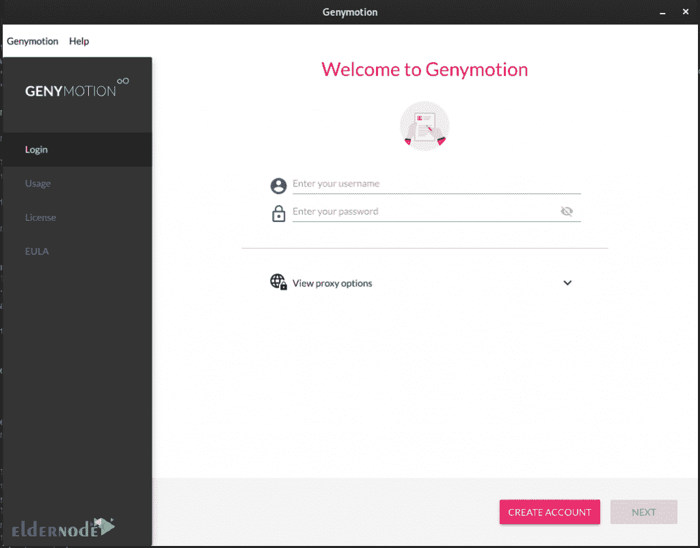

在下一步中，您必须点击**添加设备**。然后从列表中选择一个虚拟设备，点击**下一步**。

如您所见，一个新页面打开了。您必须在此页面上输入名称和/或调整新虚拟机的设置。然后点击**安装**。

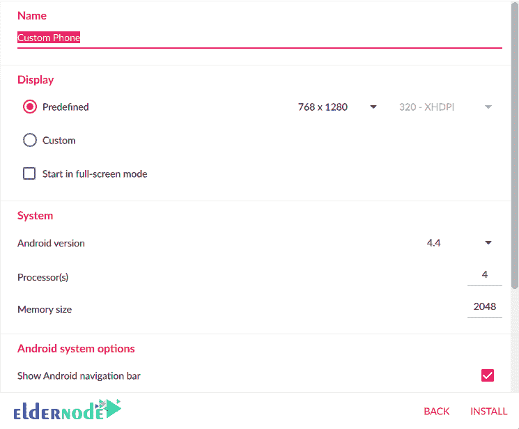

最后，您将看到您的虚拟设备正在加载，并将出现在**我已安装的设备**部分:

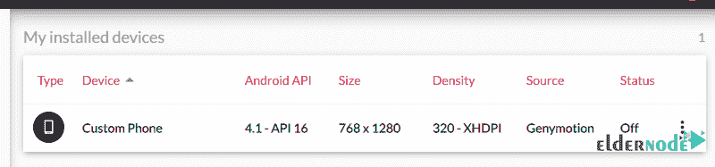

现在是时候双击您新创建的虚拟设备并选择 **Start** 了。

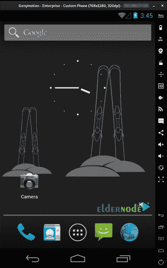

## 结论

对于任何程序员来说，在最终输出之前测试和调试应用程序是很重要的。GenyMotion 是一个有用的工具。在本文中，我们首先向您介绍了 Genymotion。然后我们试着教你如何在 Windows VPS 服务器上安装 Genymotion。在最后一步，我们解释了如何使用它。