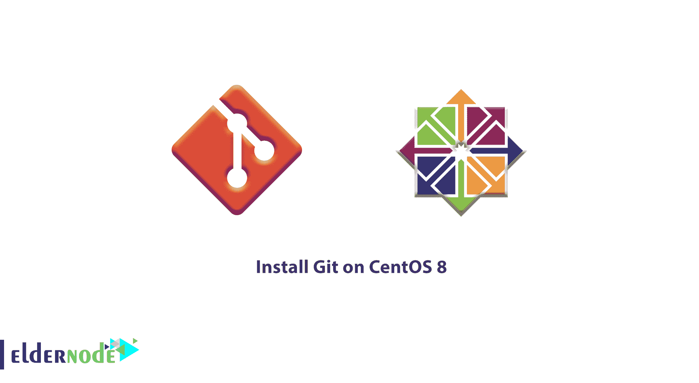

# 教程在 CentOS 8 - Eldernode 上安装 Git

> 原文：<https://blog.eldernode.com/install-git-centos-8/>



Git 是最流行、最容易使用、最合适的版本控制系统之一。为了更好地进行现代软件开发，你必须了解版本控制系统，你会发现它是不可或缺的一部分。如果您需要在源代码级别跟踪您的软件，请继续阅读本教程。在您的[私有服务器](https://eldernode.com/vps/)上使用这个工具，您将能够更改、恢复到以前的阶段，并分支创建文件和目录的备用版本。

使用 Git，您可以看到许多项目的文件是如何在其中维护的。然后，您可以随意使用 **GitHub** 、 **GitLab** 和 **Bitbucket** 来帮助您促进软件开发项目共享和协作。

为了让本教程更好地发挥作用，请考虑以下**先决条件**:

## 教程在 CentOS 8 上安装 Git

加入我们在 CentOS 8 上安装 Git 的教程，向您展示如何在 [CentOS 8 服务器](https://eldernode.com/centos-vps/) 上安装和配置 Git。继续学习安装软件的两种不同方法，并验证哪一种更有用，最后，你会选择更能体现你的优势的方法。

### 如何用默认包在 CentOS 8 上安装 Git

假设您需要快速启动并运行 Git。在这种情况下，最好的选择是通过 CentOS 的默认包安装 Git is。有了这个，你就有了一个广泛使用的稳定版本，而不需要寻找最新的可用选项。在下文中，您将看到如何使用开源软件包管理器工具 **DNF** ，它代表 Dandified YUM yellow dog Updater 的下一代版本，Modified。但是什么是 DNF 呢？它是一个软件包管理器，现在是基于 RedHat 的 Linux 系统(如 CentOS)的默认软件包管理器。使用 DNF，您可以在服务器上安装、更新和删除软件包。

但是，要使用 **DNF** 包管理工具来更新您的本地包索引，请运行下面的命令。

```
sudo dnf update -y
```

正如您所猜测的，为了提醒系统注意您正在进行更改，并防止终端提示您确认，需要使用 **-y** 标志。

更新完成后，开始 Git 安装。

```
sudo dnf install git -y
```

使用以下命令确认您已经正确安装了 Git。

```
git --version
```

输出

```
git version 2.18.2
```

如何在 CentOS 8 上从 Source 安装 Git

从源代码编译软件是一种更灵活的安装 Git 的方式。虽然你可能会觉得这需要更长的时间，不会通过你的软件包管理器来维护。相反，你将被允许下载最新的版本，并给你一些控制选项，如果你想定制。

安装 Git 所依赖的软件，然后就可以开始了。要更新您的本地软件包索引，然后安装软件包，请使用以下命令。

### 您应该创建一个临时目录，并转移到您最近安装的必要的依赖项中。看看你将在哪里下载你的 **Git** tarball。

**请注意**您可以使用 [Git 项目网站](https://git-scm.com/) 导航到 RedHat Linux 发行版 tarball 列表下载您想要的版本。

但是，您可以使用 curl，将我们下载的文件输出到git.tar.gz。

```
sudo dnf update -y  sudo dnf install gettext-devel openssl-devel perl-CPAN perl-devel zlib-devel gcc autoconf -y
```

然后解压缩压缩的 tarball 文件:

```
mkdir tmp  cd /tmp
```

现在，进入新的 Git 目录:

此外，您可以通过键入以下两个命令来制作并安装软件包:

```
curl -o git.tar.gz https://mirrors.edge.kernel.org/pub/software/scm/git/git-2.26.0.tar.gz
```

直到这里，如果你看到一切正常，你可以通过检查版本来确定你的安装是成功的。

```
tar -zxf git.tar.gz
```

输出

```
cd git-*
```

如何设置 Git

```
make prefix=/usr/local all  sudo make prefix=/usr/local install
```

成功安装 Git 后，就该配置它了。并且生成的提交消息将包含您的正确信息。首先，使用 git config 命令。请记住，您必须考虑一个名字和电子邮件地址，因为 Git 将这些信息嵌入到您所做的每个提交中。所以使用下面的命令来达到这个目的。

```
git --version
```

**注意**:不要忘记在命令的提示行中替换您考虑的姓名和电子邮件。

```
git version 2.26.0
```

接下来，键入下面的命令来显示已经设置的所有配置项。

输出

Git 已经将您的信息存储在其配置文件中。您可以选择使用文本编辑器手工编辑，如下所示:

### **最后**，按 ESC 然后T5:q退出文本编辑器。

```
git config --global user.name "Your Name"  git config --global user.email "[[email protected]](/cdn-cgi/l/email-protection)"
```

```
git config --list
```

结论

```
user.name=Your Name  [[email protected]](/cdn-cgi/l/email-protection) 
```

在本文中，您了解了 Git 以及为什么需要使用它。我们向您展示了如何在 CentOS 8 上安装 Git，如果您有兴趣了解更多关于它的功能，可以看看我们的相关文章，如[如何在 Debian 10 上安装 Composer](https://blog.eldernode.com/install-composer-debian-10/)**或** [如何在 Ubuntu 18.04 上安装 Django](https://blog.eldernode.com/install-django-ubuntu-18/)。

```
vi ~/.gitconfig
```

```
[user]    name = Your Name    email = [[email protected]](/cdn-cgi/l/email-protection)
```

**最后**，按 ESC 然后T5:q退出文本编辑器。

## 结论

在本文中，您了解了 Git 以及为什么需要使用它。我们向您展示了如何在 CentOS 8 上安装 Git，如果您有兴趣了解更多关于它的功能，可以看看我们的相关文章，如[如何在 Debian 10 上安装 Composer](https://blog.eldernode.com/install-composer-debian-10/)**或** [如何在 Ubuntu 18.04 上安装 Django](https://blog.eldernode.com/install-django-ubuntu-18/)。