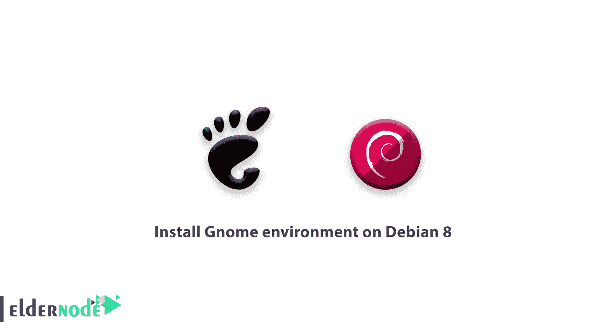

# 在 Debian 8 上安装 Gnome 环境-什么是 Gnome

> 原文：<https://blog.eldernode.com/install-gnome-environment-on-debian-8/>



最近我们确实发表了一篇关于 Debian 的文章。今天我们将学习如何在 [Debian](https://www.debian.org/) 8 上安装 Gnome 环境。所以首先让我们多了解一下 Gnome 本身。 **Gnome 桌面环境**是一个流行的开源图形环境。该公司于 1999 年发布了第一个版本。Gnome 桌面环境可以安装在大多数 Linux 上，也支持 BSD 的 Unix 发行版。Gnome 支持 40 种不同的语言。第一家正式将其作为桌面环境的公司是 Redhat。在 **Debian 环境**中，默认安装 Gnome 环境。它与 Debian 操作系统高度兼容。但是在最小模式下，安装 Debian 或者 Gnome 桌面环境服务器是默认不安装的。要在 Debian 8 上安装 Gnome 环境，你必须输入想要的命令，在确认之后，Gnome 包将被自动下载并安装。

## 在 Debian 8 上安装 Gnome 环境

**1**–首先，连接到您的服务器终端环境。
**2**–输入以下命令下载并安装 **Gnome** 图形环境。

```
apt-get install task-gnome-desktop
```

检查并确认先决条件后，您应该确认 Gnome 下载。

**注意**:8 版 Debian 的完整 Gnome 桌面包大约 2600 MB。安装 Gnome 时，Debian DVD 可能会要求您安装 DVD。

到目前为止，你已经学会了如何在 Debian 8 上安装 Gnome，我们将教你如何清理 Gnome。

### 从 Debian 8 中清除 Gnome 环境

输入下面的命令来清除 Debian 中的 Gnome 环境。

```
apt-get remove gnome
```

完成上述命令后，输入以下命令清除所有下载的包。

```
apt-get autoremove
```

您已经在这里完成了在 Debian 8 上安装和清理 Gnome 的教程。**观看**不要错过我们未来的相关文章。

亲爱的用户，我们希望这篇教程能对你有所帮助，如果你有任何问题或想查看我们的用户关于这篇文章的对话，请访问[提问页面](https://eldernode.com/ask)。也为了提高你的知识，这里有很多关于[老年节点训练](https://eldernode.com/blog/)的有用教程。